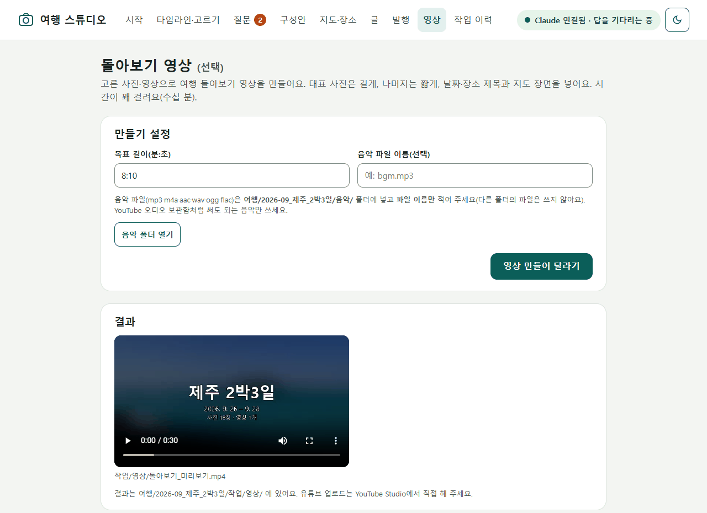

> [!info] 일상 실습 정보
> **실습**: 일상 실습 ① 네이버 블로그 자동화 — **B 선택: 돌아보기 영상** · **형식**: 선택 심화(B를 한 번 끝낸 뒤)
> **걸리는 시간**: ① 실습 약 1~1.5시간 + 렌더 시간(PC마다 다름) · ①+ HyperFrames 실습은 따로 1시간 이상 · ②③은 읽기 15~20분
> **먼저 할 것**: [B_여행블로그_스튜디오.md](B_여행블로그_스튜디오.md) Part 5(고르기)·Part 6(지도·장소)까지 · FFmpeg(Claude가 설치, 승인 창 허용) · **결과 폴더**: 스튜디오의 `여행/<여행ID>/작업/영상/`

# B 선택: 돌아보기 영상 — 고른 사진과 지도로 몇 분짜리 여행 영상 만들기

> 사진을 고르고 장소를 확인해 두었다면, 영상은 그 재료를 시간 위에 늘어놓는 일입니다.
> Claude는 영상을 직접 그리지 않습니다. 장면표를 짜고, 편집 프로그램(FFmpeg)을 돌리는 코드를 씁니다.

## 🗺️ 지금 어디쯤?

```
B 여행 블로그 스튜디오(Part 1~9) → ▶ 선택: 돌아보기 영상(이 문서) — 스튜디오 화면 ⑧ 영상
```

B에서 고른 사진(사용·대표), 확인한 장소 이름, 동선 지도를 그대로 씁니다. 그래서 **B의 Part 6까지 끝낸 뒤**에 하는 것이 좋습니다. 영상을 만드는 길은 세 갈래이고, 이 문서는 ①을 실습하고 ①+·②·③은 고를 수 있게 설명합니다.

| 갈래 | 한 줄 | 이 문서에서 |
|---|---|---|
| ① Claude Code만 | 사진 천천히 확대·이동 + 전환 + 날짜·장소 제목 + 지도 + 음악 + 챕터. **잘 만든 추억 슬라이드쇼** | **실습** (Part 2) |
| ①+ HyperFrames | 같은 방식인데 제목·지도 애니메이션을 더 세련되게(공개 오픈소스 플러그인) | 선택 실습 (Part 3) |
| ② AI 영상 사이트 | 사진 한 장 → 몇 초짜리 '움직이는' 클립. 대표 장면 몇 개에만 | 설명 + 끼워 넣는 법 (Part 4) |
| ③ 내 PC의 GPU + 오픈소스 모델 | ②와 같은 클립을 내 컴퓨터에서. 고사양 그래픽카드 필요 | 설명만 (Part 5) |

## 🎯 학습 목표

- [ ] 8:10이라는 길이가 언제 의미가 있는지 설명하고, 소재에 맞는 길이를 고를 수 있다
- [ ] Claude가 만든 영상 도구로 계획 → 30초 미리보기 → 전체 영상까지 만들 수 있다
- [ ] ①②③이 각각 무엇을 할 수 있고 무엇을 못 하는지 비교할 수 있다
- [ ] 유튜브에 올리기 전에 음악·챕터·썸네일·개인정보를 점검할 수 있다

## 📋 구성

| Part | 내용 | 방식 | 시간 |
|---|---|---|---|
| 1 | 길이부터 정하기 — 8:10의 뜻, 소재가 충분한가 | 개념 | 10분 |
| 2 | ① Claude Code만으로 — 영상 도구 만들기, 계획 → 미리보기 → 전체 | 실습 | 50~70분 + 렌더 |
| 3 | ①+ HyperFrames(선택) | 선택 실습 | 1시간 이상 |
| 4 | ② AI 영상 사이트 — 하이라이트 3~5컷 끼워 넣기 | 설명 + 선택 | 10분 |
| 5 | ③ 로컬 GPU 오픈소스 | 설명 | 5분 |
| 6 | 올리기 전에 — 유튜브 사실과 개인정보 | 점검 | 10분 |

모든 가격·버전은 **2026년 10월 기준**이며 자주 바뀝니다.

---

## Part 1: 길이부터 정하기 — 8:10의 뜻과 소재 판단

### 1.1 8분 10초는 어디서 나온 숫자인가

🧩 **비유**: 광고를 넣을 수 있는 **방송 편성 시간**입니다. 프로그램이 일정 길이를 넘어야 중간 광고 자리가 생기지만, 그 방송국과 광고 계약(파트너 프로그램)이 없으면 길게 만들어도 광고는 붙지 않습니다.

- 유튜브 공식 도움말은 **8분 이상인 수익 창출 동영상**에 중간 광고(미드롤)를 넣을 수 있다고 합니다(2026-10 현재 유효).
- 수익 창출은 **유튜브 파트너 프로그램(YPP)** 에 가입한 채널만 됩니다. 광고 수익 조건은 구독자 1,000명 + 최근 12개월 공개 시청 4,000시간(또는 90일 Shorts 조회 1,000만 회) + 심사입니다.
- **'+10초'는 공식 근거가 없습니다.** 업로드 뒤 문제 구간을 잘라 내면 8분 밑으로 떨어질 수 있어 두는 여유로 보입니다.
- 그래서 처음 여는 채널이라면 8:10은 "긴 영상 구성 연습" 목표일 뿐입니다. **소재가 적으면 3~5분도 정답**입니다. 억지로 늘리면 지루해집니다.

💭 **확인 질문**: 구독자 30명인 우리 단체 채널에 8:10짜리 영상을 올리면 중간 광고 수익이 생길까요?

### 1.2 소재가 충분한가 — 시간 배분

8:10(490초)은 이렇게 나뉩니다.

```
490초 = 고정 장면(오프닝 · 전체 동선 지도 · 일차 제목과 그날 지도 · 끝 카드)
      + 영상 클립(앞부분 하이라이트, 기본 8초까지)
      + 사진(대표 사진은 일반 사진의 2배 길이)
```

- 일반 사진 한 장이 **2.5~5초**면 보기 좋습니다. 5초를 넘으면 '소재 부족'으로 봅니다.
- 강사 리허설(샘플 키트: 사진 47장·영상 3개, 숙소 사진은 빠짐)에서 8:10을 채우려면 사진 한 장이 **13.6초**가 되어 '소재 부족'이었습니다. 그래서 도구가 **제안 길이 3:00**(일반 4.5초, 대표 9초)으로 만들고 이유를 알려 주었습니다. 8:10을 직접 고집하면 사진 한 장을 7초로 막고 **4:24**에서 끝내며 경고를 냅니다.
- 소재가 적을 때 할 수 있는 일: ① 길이를 3~5분으로 ② 사진마다 이야기 자막 ③ 지도·일정표 같은 정보 장면 ④ (선택) 대표 장면 몇 개만 ②로 움직이게.
- 대표 사진이 너무 길게 느껴지면 대표를 2~3장으로 줄입니다.

💭 **확인 질문**: 사진 40장으로 8:10을 채우면 사진 한 장이 몇 초쯤 될지, 그 영상을 끝까지 볼지 생각해 보세요.

---

## Part 2: ① Claude Code만으로 — 영상 도구 만들기와 렌더

> 🔧 **이번에 익히는 Claude Code 기능**: 장면표로 다시 만들 수 있는 편집(재현), 미리보기 후 전체 실행, 작업 이력으로 이어 하기

### 2.1 무엇이 되고 무엇이 안 되나

🧩 **비유**: **슬라이드 영사기와 편집 기사**입니다. 편집 기사(Claude)는 필름을 새로 찍지는 못하지만, 어떤 사진을 몇 초 비출지, 어디서 장면을 넘길지, 언제 음악을 줄일지를 정확히 적은 **장면표**를 짜고 영사기(FFmpeg)를 돌립니다.

| 됩니다 | 안 됩니다 |
|---|---|
| 사진을 천천히 확대·이동(켄 번스), 세로 사진은 흐린 배경으로 채우기 | 정지 사진 속 사람·파도·구름을 **새로 움직이게** 하기(→ ②③) |
| 전환: 같은 장소는 부드럽게(fade), 장소가 바뀌면 밀기(slideleft), 날이 바뀌면 검은 화면(fadeblack) | 전문 편집자의 감각적인 한 컷 한 컷 |
| 오프닝·일차 제목 카드, 동선 지도 장면, 끝 카드 | 영상 속 대화를 이해해 '웃긴 장면' 자동 찾기 |
| 음악 앞 2초 페이드 인·끝 3초 페이드 아웃, 영상 클립의 현장음 겹치기 | |
| 유튜브 챕터 문구(`챕터.txt`) 자동 작성 | |

Claude는 영상 파일을 직접 '시청'하지 못합니다. 그래서 확인할 때는 영상에서 장면 몇 개를 뽑아 **콘택트 시트**로 봅니다. 고칠 때는 장면표만 고쳐 다시 만들면 되고, 바뀌지 않은 장면은 다시 만들지 않아 빠릅니다.

### 2.2 FFmpeg 준비

| PC | 할 일 | 주의 |
|---|---|---|
| Windows | 스튜디오 창에 "FFmpeg가 있는지 확인하고 없으면 설치해줘" → 승인 창 허용 | 설치 직후 같은 창에서 인식되지 않으면 Claude 앱을 다시 켜거나 "ffmpeg 경로 확인해줘" |
| Mac | 같은 부탁. Homebrew가 없으면 그것부터 설치(시간이 걸림) | **함정**: Homebrew 기본 `ffmpeg`에는 글자 넣기(drawtext)·자막·손떨림 보정 기능이 빠져 있습니다. 그 기능이 필요하면 `ffmpeg-full`인데, 이것은 경로가 자동으로 잡히지 않으므로 "ffmpeg-full 경로 설정해줘"라고 부탁합니다 |

아래 2.3의 부탁처럼 **글자를 Pillow로 그림으로 만들어 얹으면** Mac 기본 `ffmpeg`로도 됩니다(참고 구현의 방식, Mac 실기는 미확인). Claude가 drawtext·자막 필터를 쓰는 코드를 만들면 Mac에서 위 함정에 걸립니다.

### 2.3 실습: 영상 도구 만들기

🎯 **목표**: 스튜디오의 `도구/영상만들기.py`를 만들어 화면 ⑧ 영상과 연결한다.

🛠 **준비**: 스튜디오 창(연결됨), B Part 5·6을 마친 여행

스튜디오 창에 붙여 넣습니다.
```
규약 4절의 영상만들기.py를 만들어줘. 화면 ⑧ 영상의 [영상 만들어 달라기]와 연결되게 해줘.
- 재료: 화면에서 '사용'·'대표'로 고른 사진과 영상. 숨긴 장소(숙소 등) 사진은 빼고, 확인 안 된 장소 이름은 제목에 쓰지 마.
- 구성: 오프닝 제목 → 전체 동선 지도 → [일차 제목 카드 → 그날 지도 → 사진·영상] × 일차 → 끝 카드.
- 시간: 목표 길이(기본 490초=8:10)에서 고정 장면과 영상 클립을 빼고 사진에 나눠. 대표는 일반의 2배. 일반 사진이 5초를 넘으면 '소재 부족'으로 보고 3~5분 제안 길이를 알려줘. 목표를 직접 주지 않았으면 제안 길이로 만들고 이유를 남겨.
- 화면: 켄 번스, 세로 사진은 흐린 배경 채우기. 전환은 같은 장소 fade, 장소 바뀜 slideleft, 날 바뀜 fadeblack. 글자는 Pillow로 그림을 만들어 얹어(ffmpeg 글자 기능을 쓰지 말 것).
- 소리: 음악 앞 2초 페이드 인·끝 3초 페이드 아웃, 항상 스테레오, 영상 클립 현장음은 겹쳐 넣고 끌 수 있게.
- 결과: 여행/<여행ID>/작업/영상/돌아보기.mp4, 챕터.txt(첫 줄 00:00, 챕터마다 10초 이상), 장면표.json.
- 옵션 이름: --계획만(렌더 없이 시간 배분·제안 길이·장면표), --미리보기(약 30초, 640×360), --목표초(초 또는 분:초), --음악(여행/<여행ID>/음악/ 폴더 안의 mp3·m4a·aac·wav·ogg·flac만 받고, 다른 경로나 소리 없는 파일은 멈춤).
- 장면마다 짧은 조각을 만든 뒤 이어 붙여서, 다시 만들 때는 바뀐 장면만 새로 만들어. 작업 이력과 로그도 남겨.
다 만들면 돌리지는 말고 알려줘.
```

### 2.4 실습: 계획 → 30초 미리보기 → 전체

👣 **단계**

1. **음악 준비**(선택): YouTube Studio의 **오디오 보관함**에서 '저작자 표시 불필요' 곡을 내려받아, 스튜디오 창에 `다운로드 폴더의 (곡 파일 이름)을 이 여행 폴더의 음악/ 폴더로 복사해줘.` (위치는 `여행/<여행ID>/음악/` — 다른 곳에 둔 음악은 도구가 받지 않습니다.) 음악이 없으면 무음 트랙으로 만듭니다.
2. **계획 보기**: 스튜디오 창에 `영상 계획만 보여줘(렌더하지 마). 장면 수, 일반·대표 사진 길이, 소재 판단, 제안 길이를 표로.`
3. **30초 미리보기**: `30초 미리보기를 만들어서 파일 위치를 알려줘.` → 열어서 제목 글자·전환·지도를 봅니다(강사 PC 약 4초).
4. **전체 만들기**: 화면 **영상** → 목표 길이(기본 8:10)와 음악 파일 이름(예: `음악/bgm.mp3`)을 적고 **[영상 만들어 달라기]**. 소재가 적으면 질문 카드로 "제안 길이로 만들까요?"를 묻습니다. 고르면 렌더가 시작되고 오른쪽 위에 진행이 보입니다.
5. **확인**: 결과가 화면 ⑧에 나오면 처음부터 끝까지 봅니다. Claude에게도 확인을 맡깁니다.
   ```
   만든 영상에서 오프닝·지도·일차 제목·전환이 보이는 장면을 몇 장 뽑아 콘택트 시트로 보여주고, 음악이 앞뒤로 페이드되는지, 숙소 사진이 빠졌는지, 챕터가 유튜브 규칙(00:00 시작, 3개 이상, 각 10초 이상)에 맞는지 점검해줘.
   ```
6. 고칠 점이 있으면 "2일차 제목 카드 문구를 ○○로", "대표를 3장만" 처럼 말하고 다시 만듭니다. 바뀐 장면만 새로 만들어 빨리 끝납니다.



**강사 리허설 시간**(Intel Core Ultra 16코어·RAM 32GB, NVIDIA 그래픽카드 없음, 사진 47·영상 3)

| 작업 | 걸린 시간 | 결과 |
|---|---|---|
| 30초 미리보기(640×360) | 약 4초 | |
| 제안 길이 3:00 전체(1080p 30fps, 장면 42·전환 41) | 약 2분(122~126초) | 102.7MB |
| 같은 영상 다시 만들기(바뀐 장면 없음) | 28초 | |
| 8:10 전체 | **미측정** — 같은 속도라면 6분 안팎(추정) | |
| (조사 때 다른 방식) 사진 98장 8:11 — 조각 4개씩 동시에 만든 뒤 전환·제목·음악과 함께 한꺼번에 합침 | 19분 33초(조각 5분 50초 + 합치기 13분 43초, 다른 프로그램이 함께 돌던 느린 쪽 값) | 215MB |

보통 PC에서 8분 1080p는 대략 10~40분, 오래된 노트북은 1시간 이상도 걸릴 수 있습니다(추정). 렌더 중에는 **절전 모드와 덮개 닫기**를 피하세요. 장면 조각이 3분 영상에 약 280MB 쌓이니, 끝난 뒤 디스크가 모자라면 "장면 조각 지워줘"라고 합니다(다음에는 처음부터 다시 만듦).

✅ **이렇게 되면 성공**
- `돌아보기.mp4`가 끝까지 재생되고, 한글 제목이 네모(□)로 깨지지 않는다
- 숙소 사진·확인 안 된 장소 이름이 없다
- 음악이 앞뒤로 부드럽게 들어오고 나간다
- `챕터.txt`가 00:00으로 시작하고 3개 이상이다

🆘 **막히면**

| 증상 | 해 볼 것 |
|---|---|
| ffmpeg를 못 찾음 | Claude 앱을 다시 켠 뒤 `ffmpeg 경로를 확인해줘` |
| 한글이 □로 나옴 | `글자를 Pillow로 그리게 고치고, 글꼴은 Windows 맑은 고딕(Mac은 Apple SD Gothic Neo)으로 해줘.` |
| '크기·fps가 맞지 않음' 오류 | 세로 사진·폰 영상이 섞여서입니다. `모든 장면을 1920×1080·30fps로 맞춘 뒤 전환을 넣어줘.` |
| 중간에 멈춤 | 화면 **작업 이력** → [다시 시도]. 이미 만든 장면은 다시 쓰고 실패한 단계부터 이어 갑니다 |
| 결과가 한쪽 귀에서만 들림 | `음악을 항상 스테레오로 만들어줘.` |

---

## Part 3: ①+ HyperFrames — 제목과 지도를 더 세련되게 (선택)

🧩 **비유**: 같은 영사기에 **애니메이션 타이틀 장비**를 하나 더 다는 일입니다. 본편은 그대로 두고 오프닝과 지도 장면만 공들여 만듭니다.

| 항목 | 사실(2026-10) |
|---|---|
| 정체 | 영상 회사 HeyGen이 만든 **공개 오픈소스**(GitHub `heygen-com/hyperframes`), **Apache 2.0** — 렌더당 요금·상업 이용 기준 없음 |
| Claude Code | 공식 **플러그인·스킬** 제공 |
| 필요한 것 | **Node.js 22 이상**, FFmpeg, 렌더용 Chrome(처음에 자동으로 내려받음) |
| 비용 | 내 PC에서 렌더하면 HeyGen 크레딧을 쓰지 않음. 단 Claude 사용량은 들고, BGM 카탈로그·음성 기능은 HeyGen 로그인이 필요 |
| 버전 | 0.8.x — 하루에도 새 버전이 나올 만큼 **자주 바뀜**. 화면·명령·스킬 이름이 이 교재와 다를 수 있음 |
| 속도 | 공식 수치 없음. 화면을 한 장씩 찍어 만드는 방식이라 ①보다 느릴 가능성이 큼(추정) |

**설치** (8회차 방식): **+** → **Plugins** → **Add plugin** → 마켓플레이스 추가에 `heygen-com/hyperframes` → `hyperframes` 플러그인 설치(화면 문구는 조금 다를 수 있습니다). 설치 전에 8회차의 **안전 체크 5가지**로 무엇이 설치되는지 확인하고, 익명 사용 통계가 기본으로 켜져 있으니 원하면 "HyperFrames 사용 통계 꺼줘"라고 합니다.

**써 보기** (스튜디오 창)
```
HyperFrames로 이 여행의 오프닝 10초와 동선 지도 애니메이션(장소를 순서대로 잇는 선)만 만들어줘. 장소는 여행 폴더의 확인된 장소만 쓰고 숙소는 빼. 미리보기는 낮은 화질로 먼저 보여 주고, 내가 좋다고 하면 고화질로 만들어서 ① 영상의 오프닝·지도 장면 대신 넣어줘. 음악은 HeyGen 카탈로그 말고 내 음악/ 폴더 것만.
```
- 지도 애니메이션은 HyperFrames의 모션 그래픽 스킬에 '지역 강조·장소 연결·확대'가 있습니다. 스킬 이름은 버전마다 바뀔 수 있으니 "HyperFrames 스킬 중 지도 애니메이션 하는 것을 찾아서 써줘"라고 해도 됩니다.
- 지도 배경을 OpenStreetMap에서 가져온다면 B Part 6의 이용 규칙과 출처 표시를 똑같이 지킵니다.

---

## Part 4: ② AI 영상 사이트 — 하이라이트 3~5컷만 끼워 넣기

🧩 **비유**: 앨범 사이에 끼우는 **움직이는 엽서** 몇 장입니다. 앨범 전체를 엽서로 만들지는 않습니다.

- **정체**: Higgsfield 같은 사이트는 **사진 한 장 → 몇 초짜리 클립**을 만듭니다(카메라가 돌거나 물결이 움직이는 모습). Higgsfield의 자체 모델은 한 번에 3초 또는 5초, 긴 장면 도구도 한 번에 최대 30초입니다. Higgsfield 공식 안내도 "장면을 내려받아 다른 편집기에서 이어 붙이라"고 합니다. **8분 영상 전체를 만드는 도구가 아닙니다.** Runway, Kling, Google Veo, Luma, Pika도 모두 짧은 클립 생성기입니다(OpenAI Sora는 종료).
- **요금(Higgsfield, 부가세 별도, 2026-10 재확인 필요)**: Starter 월 $19(270크레딧) · Plus 월 $59 · Ultra 월 $129. Starter로 5초 클립 약 38개 정도입니다(추정, 다시 뽑기 제외).
- **사람 사진은 조심**: 이용약관상 얼굴이 나오는 **모든 사람의 동의**를 받았다고 사용자가 보증해야 하고, 미성년자를 부적절하게 그리는 것은 금지입니다. 얼굴이 뭉개지거나 딥페이크로 오해받을 수 있으니 **풍경·건물·음식 사진**만 권합니다. 가입은 18세 이상이고, 올린 콘텐츠가 모델 학습에 쓰일 수 있습니다(Enterprise 제외).
- **상업 이용**: 약관은 상업 이용을 제한하지 않는다고 하지만 요금 비교표는 무료 요금제에 '상업적 이용' 미포함으로 표시되어 서로 다릅니다. 수익 채널이면 유료 요금제가 안전합니다.

**끼워 넣는 법** (사이트는 사람이 직접 씁니다)

1. 대표 사진 가운데 **사람이 없는 풍경** 3~5장을 고릅니다.
2. 사이트에 올려 3~5초 클립을 만들고 내려받습니다. 결과가 이상하면(사물이 다른 것으로 변함, 글자 뭉개짐) 쓰지 않습니다.
3. 클립 파일 이름을 원래 사진 이름 + `_ai`로 바꿉니다(예: `DSC01525_ai.mp4`).
4. 스튜디오 창에 부탁합니다. 이것은 **참고 구현에 없는 기능**이라 Claude에게 더해 달라고 하는 것입니다.
   ```
   여행 폴더에 AI클립/ 폴더를 만들 테니, 그 안의 '사진이름_ai.mp4' 클립을 같은 이름 사진의 장면 자리에 대신 넣는 기능을 영상 도구에 더해줘. 장면표에 'AI 생성'을 표시하고, 끝 카드에 'AI 영상: (서비스 이름)'을 넣어줘. 원래 사진 장면은 지우지 말고 옵션으로 되돌릴 수 있게.
   ```
5. 유튜브에 올릴 때 업로드 화면의 **'AI 사용'** 항목에 체크하기를 권합니다(실제 사진을 AI로 움직인 장면이 공개 대상인지 공식 예시는 없음). 블로그에 넣으면 네이버 'AI 활용 설정'도 켭니다.

Claude Code가 Higgsfield를 직접 부르는 공식 방법(CLI·스킬·MCP)도 있지만, 크레딧이 자동으로 빠지므로 처음에는 **사이트에서 직접 만들고 파일만 폴더에 넣는 방법**이 안전합니다.

---

## Part 5: ③ 로컬 GPU 오픈소스 — 이런 길도 있다 (설명만)

🧩 **비유**: 엽서 인쇄소를 **집에 차리는 일**입니다. 장비(그래픽카드)가 비싸고, 설치에 하루가 걸리고, 한 장 찍는 데도 시간이 걸립니다.

| 항목 | 사실(2026-10) |
|---|---|
| 무엇 | ②와 같은 '사진 → 몇 초 클립'을 내 PC에서. ComfyUI라는 프로그램에 공식 템플릿을 불러와 돌림 |
| 한국 사용자에게 무난한 모델 | **Wan 2.2**(Alibaba, Apache 2.0 — 상업 이용 가능, 지역 제한 없음) |
| 필요한 장비 | **NVIDIA 그래픽카드 12GB 이상**이 사실상 최저선(RTX 3060 12GB). 내장 그래픽·대부분의 노트북은 어려움. Mac은 실험적(추정) |
| 내려받기 | 모델 한 세트 35GB 이상 → SSD 여유 200GB 권장 |
| 시간 | RTX 3060 12GB에서 5초 클립 하나에 약 15분(커뮤니티 측정). 15개면 생성만 약 4시간 |
| 결과 | 대개 480p~720p, 16~24fps → 유튜브용으로 키우고 부드럽게 하는 단계가 더 필요 |
| 라이선스 함정 | **HunyuanVideo**(Tencent)는 라이선스에 "한국에서는 적용되지 않는다"고 적혀 있어 한국 사용자는 피합니다. 그 위에 만든 FramePack 가중치도 같은 문제가 미칠 수 있습니다(확인 필요) |
| 강사 PC | NVIDIA가 없어 시연하지 못했습니다 |

게이밍 PC(RTX 4070급 이상)가 이미 있고 주말 하루를 쓸 수 있는 분에게만 심화 과제로 권합니다.

### ①②③ 한눈에 비교

| | ① Claude Code만 | ② + AI 영상 사이트 | ③ + 로컬 GPU |
|---|---|---|---|
| 결과 모습 | 사진 확대·이동, 전환, 제목, 지도, 음악, 챕터. 사진 속 대상은 안 움직임 | ①에 대표 장면 몇 개가 3~15초 '살아 움직임' | ②와 같은 클립을 내 PC에서, 화질은 비슷하거나 낮음 |
| 비용 | 지금 쓰는 Claude 요금제(추가 0) + 무료 도구 | ① + 월 $19~59 | ① + NVIDIA 12GB 이상 PC(없으면 구입비가 가장 큼) |
| 난이도 | 중하 — 설치 1~3개, 대화로 진행 | 중하 — 웹 클릭, 단 동의·AI 표시·크레딧 판단 | 상 — 드라이버·ComfyUI·수십 GB 모델·오류 |
| 첫 1편 시간 | 준비 1시간 + 구성·수정 1~3시간 + 렌더(강사 PC 3분 영상 약 2분) | ① + 클립 만들기·다시 뽑기 1~2시간(추정) | 설치 반나절~하루 + 클립당 약 15분 |
| 한 줄 평가 | 가족·지인 공유와 연습에 충분, **기본** | 하이라이트 '양념' | 설명만 |

---

## Part 6: 올리기 전에 — 유튜브 사실과 개인정보

### 6.1 유튜브 점검표

| 항목 | 사실 | 우리 규칙 |
|---|---|---|
| 업로드 | 감사를 받지 않은 API 프로그램으로 올린 영상은 **비공개로 잠김** | **업로드는 사람이 YouTube Studio에서.** Claude는 제목·설명·챕터·태그 문구까지 |
| 음악 | 유명 가요는 저작권자가 광고 수익을 가져가거나, 음소거·차단될 수 있음. **YouTube 오디오 보관함** 곡은 Content ID 주장을 받지 않음 | 오디오 보관함의 '저작자 표시 불필요' 곡만. CC 곡을 쓰면 설명란에 아티스트 표기. 여행지에서 녹음된 거리 공연도 걸릴 수 있음 |
| 설명 없는 슬라이드쇼 | 유튜브는 '설명·해설·교육적 가치가 거의 없는 이미지 슬라이드쇼'를 수익화 불가 예시로 듭니다 | 사진마다 이야기 자막, 장소 설명, (가능하면) 내 목소리 |
| 챕터 | 첫 타임스탬프 00:00, 3개 이상, 오름차순, 각 10초 이상 | `챕터.txt`를 설명란에 붙여 넣기 |
| 썸네일 | 권장 3840×2160(16:9), 최소 너비 640px, 모바일 업로드 2MB·데스크톱 50MB. 맞춤 썸네일은 전화번호 인증(중급 기능) 필요 | 대표 사진 + 큰 한글 제목을 Claude에게 만들어 달라고 하기(글자는 그림 위에 얹기) |
| AI 사용 표시 | 실제처럼 보이는 장면을 AI로 바꾸거나 만들면 공개 대상. ①의 확대·전환·색 보정은 AI 생성이 아님(추정) | ②③ 장면이 있으면 업로드 화면의 'AI 사용'에 체크 |

```
이 영상의 유튜브 제목 후보 3개, 설명(여행 이야기 3문단 + 챕터.txt + 음악 출처 + 사진 출처), 태그 10개를 만들어줘. 영상에 없는 사실은 넣지 마. 썸네일은 대표 사진 1장에 큰 한글 제목을 얹어 3840×2160 JPG로 만들어줘.
```

### 6.2 개인정보와 권리

- **아이 얼굴**: 만 14세 미만은 보호자 동의가 필요합니다. 동의를 확인하지 않은 얼굴은 영상에서 빼거나 먼 사진만 씁니다. ②③에 올리지 않습니다.
- **숙소·집**: 숨긴 장소의 사진은 영상에서 자동으로 빠집니다. 지도 장면에도 숙소가 없는지 눈으로 확인합니다.
- **현장음**: 영상 클립 소리에 이름·대화·전화번호가 들릴 수 있습니다. 걱정되면 "현장음은 빼고 만들어줘".
- **다른 여행객·차량 번호판**: 크게 나오면 그 장면을 빼거나 가립니다.
- **샘플 키트로 만든 영상은 올리지 않습니다.** 키트 안내가 실습 결과를 인터넷에 올리지 말라고 하고, 키트 사진 상당수가 CC BY-SA라 영상도 같은 조건과 출처 표기가 필요합니다.

---

## 💬 딸깍 프롬프트 카드

**길이를 정하기 전에**
```
이 여행 재료로 영상 계획만 보여줘(렌더하지 마). 8:10이면 사진 한 장이 몇 초인지, 소재 판단과 제안 길이를 알려줘.
```
**고치고 다시 만들 때**
```
대표 사진을 3장으로 줄이고 2일차 제목을 '일출과 우도'로 바꿔서 다시 만들어줘. 바뀐 장면만 새로 만들어.
```
**렌더가 멈췄을 때**
```
로그/오늘 날짜.log의 마지막 오류를 분석해서 원인을 고치고, 영상 작업을 실패한 단계부터 다시 해줘. 이미 만든 장면은 다시 만들지 마.
```
**올리기 직전 점검**
```
돌아보기.mp4를 올리기 전에 점검해줘: 숙소 사진·확인 안 된 장소 이름이 있는지, 아이 얼굴이 크게 나온 장면이 있는지(장면 몇 장을 뽑아 시트로), 챕터 규칙, 음악 출처. 영상은 고치지 말고 목록만.
```

## 📝 이해 점검 퀴즈

1. (OX) 8분 이상 영상이면 어느 채널이든 중간 광고 수익이 생긴다.
2. (객관식) Higgsfield 같은 AI 영상 사이트의 가장 알맞은 쓰임은? ① 8분 영상 전체 만들기 ② 대표 장면 몇 개를 몇 초짜리 움직이는 클립으로 ③ 흐린 사진 고르기 ④ 유튜브 자동 업로드
3. (상황) 고른 사진이 40장뿐인데 8:10을 꼭 채우고 싶다고 합니다. 무엇을 권하겠어요?
4. (짧은 서술) 업로드를 Claude가 대신하지 않고 사람이 YouTube Studio에서 하는 까닭은?
5. (객관식) 한국에서 내 PC로 돌릴 영상 모델로 라이선스 걱정이 가장 적은 것은? ① HunyuanVideo ② Wan 2.2 ③ HunyuanVideo 기반 FramePack 가중치

## 📌 요약

- 8:10은 파트너 프로그램 채널에서만 의미가 있습니다. 소재가 적으면 3~5분이 더 좋은 영상입니다.
- ①은 Claude가 장면표와 코드로 만드는 '잘 만든 슬라이드쇼'. 계획 → 30초 미리보기 → 전체 순서로, 고칠 땐 바뀐 장면만.
- ②는 대표 장면 몇 개의 양념, ③은 고사양 PC가 있을 때의 심화. 사람 사진, 특히 아이 사진은 올리지 않습니다.
- 업로드는 사람이 Studio에서, 음악은 오디오 보관함, 챕터 규칙과 AI 사용 표시를 지킵니다.

## ✅ 완료 체크리스트

- [ ] 내 소재로 적당한 길이를 정했다(제안 길이 또는 이유가 있는 8:10)
- [ ] 영상 도구를 만들고 계획 → 30초 미리보기 → 전체 영상까지 만들었다
- [ ] 한글 제목, 전환, 지도, 음악 페이드, 숙소 제외를 확인했다
- [ ] `챕터.txt`가 유튜브 규칙에 맞는다
- [ ] ①②③의 차이를 한 줄씩 말할 수 있다
- [ ] (올린다면) 음악 출처·AI 사용 표시·아이 얼굴·샘플 키트 여부를 점검했다

---

## 🧑‍🏫 튜터용 노트

> 이 절은 튜터(Claude)가 참고하는 내용입니다. 학습자에게 통째로 보여주지 말고 필요할 때 풀어서 쓰세요.

### 진행 규칙
- 위치 표시 `🗺️ 일상 실습 ① · B 선택 영상 · Part 2/6 · 미리보기`. B Part 6 전이면 "고르기·장소 확인을 먼저 하면 영상이 훨씬 좋아진다"고 B로 돌려보냅니다(재료가 없으면 영상 도구가 고른 사진 대신 '제외 후보가 아닌 것'을 씀).
- Part 2만 실습 필수, Part 3은 🌳 또는 원하는 학습자만, Part 4·5는 읽기. 학습자가 ②를 하고 싶어 하면 결제·로그인은 학습자가 직접 하게 합니다.
- 렌더는 시간이 걸리므로 **미리보기 30초 → 확인 → 전체**를 꼭 지킵니다. 전체 렌더 중에는 다른 Part(4·5·6)를 읽게 합니다.

### 수준별 설명 가이드
- 🌱 입문: 영사기·편집 기사 비유 하나로. 길이는 제안 길이 그대로, 음악 없이 시작해도 됩니다. Part 3 생략, Part 4·5는 비교표만.
- 🌿 기초: 음악·챕터·썸네일까지. 고치고 다시 만들기를 한 번 해서 '바뀐 장면만'의 빠름을 체감하게 합니다.
- 🌳 중급: 장면표.json을 직접 읽고 고쳐 다시 만들게 합니다. HyperFrames로 오프닝·지도 애니메이션, ② 클립 끼워 넣기 기능 추가까지.

### 자주 막히는 지점과 대응 (조사 04 + 강사 리허설 2026-10-07)
| 상황 | 원인 | 대응 |
|---|---|---|
| 8:10을 채우려 하니 지루함 | 소재 부족(샘플: 사진 한 장 13.6초) | 제안 길이(샘플 3:00). 고집하면 사진당 7초로 막고 4:24에서 끝남 — 학습자에게 선택하게 |
| 대표 사진이 너무 김 | 대표 = 일반의 2배(제안 3:00에서 9초 : 4.5초) | 대표를 2~3장으로 |
| 여러 장면을 동시에 만들다 첫 실행 실패 | Windows 잠금 파일 `PermissionError`(참고 구현에서 고침) | 작업 이력 [다시 시도] — 실패한 장면 단계부터 이어서 성공(리허설 1.8초) |
| 결과가 모노 | 음악 파일이 모노 | 항상 스테레오로 |
| 디스크가 빨리 참 | 장면 조각 캐시(3분 영상 약 280MB, 설정을 바꿀 때마다 쌓여 490MB까지) | 안 쓰는 옛 조각 자동 정리, 필요하면 장면 지우기 |
| 한글 □, 크기·fps 오류, 절전으로 중단 | 글꼴·세로 사진·폰 영상 혼합·노트북 절전 | 🆘 표대로. 글자는 Pillow로 |
| Mac에서 글자·자막 필터 오류 | Homebrew 기본 ffmpeg에 해당 기능 없음 | Pillow 방식, 또는 `ffmpeg-full` + 경로 설정 |
| 영상 1편 대화가 너무 길어짐 | 렌더 오류를 반복 해결 | 오류는 작업 이력·수리 프롬프트로, 대화가 길면 인수인계 후 새 세션 |

### 리허설 확인 결과 (샘플 키트, 참고 구현 도구)
- 제안 길이 3:00, 1080p 30fps, 장면 42·전환 41, 122~126초, 102.7MB(H.264 High + AAC 48kHz 스테레오). 다시 만들기 28초, 30초 미리보기 4.4초.
- 전환 사용: 같은 장소 fade 23, 장소 바뀜 slideleft 14, 날 바뀜 fadeblack 4. 음악 앞 2초 페이드 인·끝 페이드 아웃 측정으로 확인.
- 챕터 예: `00:00 오프닝 · 여행 경로` / `00:10 1일차 · 9/26(토) 제주국제공항 · 협재해수욕장 · 오설록 티뮤지엄` / `01:08 2일차 …` / `02:30 3일차 …`.
- 숙소 사진 3장은 자동 제외(넣으려면 '숨긴 장소 포함' 옵션), 확인 안 된 장소 이름은 제목 카드에 안 씀.

### 퀴즈 정답과 해설
1. **X.** 중간 광고는 8분 이상 '수익 창출' 동영상에만 들어가고, 수익 창출은 YPP(구독자 1,000명 + 시청 4,000시간 등 + 심사) 채널만 됩니다.
2. **②.** 한 번에 몇 초~최대 30초 클립을 만드는 도구이고, 공식 안내도 내려받아 다른 편집기에서 이어 붙이라고 합니다.
3. 제안 길이(3~5분)를 먼저 권하고, 그래도 8:10이 필요하면 이야기 자막·정보 장면 추가, 대표 장면 몇 개만 ②로 움직이게 하기를 제안합니다. 사진을 13초씩 늘리는 것은 오답.
4. 감사를 받지 않은 API 프로그램으로 올린 영상은 감사를 통과하기 전까지 비공개로 잠기고(초보자에게는 사실상 풀기 어려움 — 추정), 공개 게시는 사람이 최종 확인한다는 원칙(블로그 '발행'과 같음) 때문입니다.
5. **②.** Wan 2.2는 Apache 2.0입니다. HunyuanVideo 라이선스는 한국을 적용 지역에서 제외하고, FramePack 가중치도 그 영향을 받을 수 있습니다.

### 검수 기준 (돌아보기.mp4를 공개해도 되는지)
- [ ] 숙소·집 사진과 지도 장면의 숙소가 없다(숨긴 장소 제외 확인)
- [ ] 확인 안 된 장소 이름('추정')이 제목 카드·챕터·설명에 없다
- [ ] `챕터.txt`가 00:00 시작, 3개 이상, 오름차순, 각 10초 이상
- [ ] 음악이 오디오 보관함 등 쓸 수 있는 곡이고, 필요한 출처 표기가 설명란에 있다
- [ ] 아이·다른 사람 얼굴이 크게 나온 장면은 동의를 확인했거나 뺐다(14세 미만은 보호자 동의)
- [ ] 샘플 키트로 만든 영상이 아니다(키트 영상은 공개하지 않음)
- [ ] ②③ AI 장면이 있으면 끝 카드에 'AI 영상: 서비스 이름', 업로드 화면 'AI 사용' 체크

### 안전·권리 주의
- ②③에 사람(특히 아이) 사진을 올리지 않게 합니다. 학습자가 원하면 동의·딥페이크 오해 위험을 먼저 말합니다.
- 음악은 오디오 보관함 곡만 권합니다. HeyGen 카탈로그 음악을 수익 영상에 써도 되는지는 확인하지 못했습니다.
- 샘플 키트 영상은 공개하지 않습니다(키트 README, CC BY-SA).
- 업로드·결제·로그인은 학습자가 직접 합니다.

### 확인 필요로 남긴 것
- 8:10 전체 1080p 렌더 시간(리허설 미측정, 3:00 실측으로 6분 안팎 추정), HyperFrames 렌더 속도(공식 수치 없음).
- Mac 실기(Homebrew `ffmpeg`·`ffmpeg-full`, 글꼴, mediapipe Apple Silicon)는 시험하지 않았습니다.
- 실제 사진을 AI로 움직인 장면의 유튜브 'AI 사용' 공개 의무(공식 예시 없음), Higgsfield 무료 요금제의 상업 이용(약관과 요금표 불일치), FramePack 가중치의 라이선스 적용.
- ② 클립 끼워 넣기(Part 4의 4번)는 참고 구현에 없는 기능이라 학습자 Claude의 구현에 따라 모양이 다를 수 있습니다.
- HyperFrames 플러그인 설치 화면(데스크탑 앱의 마켓플레이스 추가 문구)과 현재 스킬 이름은 버전에 따라 다를 수 있습니다.
