> [!info] 일상 실습 정보
> **실습**: 일상 실습 ① 네이버 블로그 자동화 — **유형 B 여행 블로그 스튜디오** · **형식**: 독립 심화(Part 1~9, 3번에 나눠서)
> **걸리는 시간**: 총 약 5~6시간 — ① 스튜디오 만들기 약 2시간 · ② 사진에서 이야기로 약 1.5~2시간 · ③ 글과 발행 약 1.5~2시간 · 멈출 때는 `/handoff`
> **먼저 할 것**: [00_시작_블로그확인.md](00_시작_블로그확인.md) ①·③ · 3회차(세션·인수인계) 필수 · 5회차(개인정보)·8회차(skill-creator·도구 설치) 권장 · **작업 폴더**: `실습공간/여행스튜디오/`
> **함께 보는 문서**: [공통_네이버연동_블로그도우미.md](공통_네이버연동_블로그도우미.md)(Part 8) · [B_선택_돌아보기영상.md](B_선택_돌아보기영상.md)(끝난 뒤 선택) · [여행스튜디오_규약.md](여행스튜디오_규약.md)(Claude에게 건네는 약속)

# 유형 B: 여행 블로그 스튜디오 — 사진 폴더 하나로 일자별 여행기까지, 내 PC 안의 작은 작업실

> 여행 사진 수백 장 앞에서 막막했던 일을 버튼 몇 개와 질문 카드 몇 장으로 바꿉니다.
> 신입 동료 Claude는 정리·고르기 후보·지도·초안을 맡고, '무엇을 남길지'와 '발행'은 늘 선생님이 정합니다.

## 🗺️ 지금 어디쯤?

```
일상실습/README.md → 00_시작_블로그확인.md → ▶ B 여행 블로그 스튜디오(이 문서) → 공통: 블로그 도우미 연결 → (선택) 돌아보기 영상
```

B는 회차와 상관없이 **한 번 크게 시간을 내서** 처음부터 끝까지 하는 실습입니다. 단체 블로그(A)가 회차마다 조금씩 키우는 편집국이라면, B는 한 번 차려 두고 여행마다 꺼내 쓰는 **작업실**입니다. 끝나면 바탕화면 아이콘 하나로 열리는 '여행 스튜디오'와, 다음 여행에 그대로 쓸 스킬·꿀팁 노트가 남습니다.

**여행 스튜디오가 하는 일 한눈에** (✋ = 사람이 정하는 곳)

```
[사진 폴더 — 원본, 읽기만]
  ↓ ② 사진 목록   촬영 시각·기기·위치 읽기, HEIC 미리보기, 기기 시계 차이 → 질문 카드
  ↓ ② 고르기      흐림·연사 후보(스크립트) → 콘택트 시트(Claude가 봄) → ✋ 사람이 확정
  ↓ ④ 구성안      컨셉 인터뷰 → 세 가지 안 → ✋ 하나 고르기
  ↓ ⑤ 지도·장소   동선 지도, 장소 이름 ✋ 확인, 숙소 숨기기 · 꿀팁 인터뷰 → 꿀팁노트.md
  ↓ ⑥ 글          편마다 배치·미리보기(PC/모바일) → [고쳐줘] → ✋ [이 글 승인]
  ↓ ⑦ 발행        GPS 지운 사본 → 블로그 도우미 확장이 채우고 '저장' → ✋ 모바일 확인 후 사람이 '발행'
  (⑧ 영상 — 선택 문서 / ⑨ 작업 이력 — 멈춘 단계부터 다시)
```

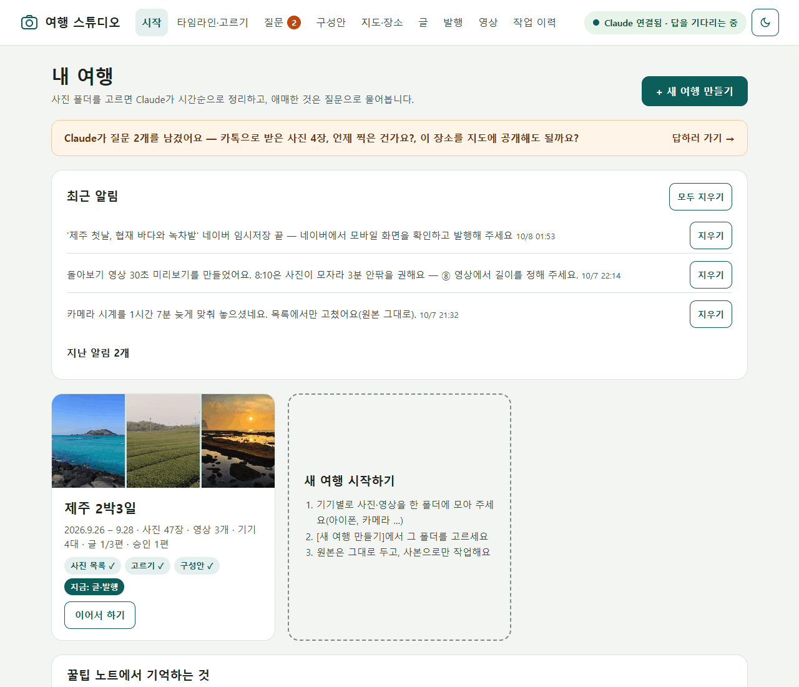

### 두 창으로 일합니다

| 창 | 어느 폴더 | 하는 일 | 언제부터 |
|---|---|---|---|
| **튜터 창** | `gea-claude-tutor`(이 튜터 폴더) | 교재 안내, 질문, 진도 기록, `/handoff` | Part 1부터 |
| **스튜디오 창** | `실습공간/여행스튜디오` | 스튜디오를 만들고, **켜 두면** 화면 버튼에 반응하는 동료 | Part 1 끝에서 열고 Part 2부터 |

3회차에서 배운 "업무마다 세션 하나, 여러 업무는 세션을 나란히"를 그대로 씁니다. 교재의 프롬프트 위에는 어느 창에 붙여 넣는지 적어 두었습니다.

## 🎯 학습 목표

- [ ] 원본을 고치지 않는 사진 작업 규칙(기기별 폴더·사본·개인정보 점검)을 세울 수 있다
- [ ] `/design` 시안 → Claude Design에서 고치기 → Hand off → Plan 모드 → 구현의 왕복을 한 번 해 볼 수 있다
- [ ] 화면 버튼·질문 카드로 Claude와 함께 사진 목록·고르기·구성안·지도를 만들 수 있다
- [ ] 스크립트(정확한 계산)와 Claude의 눈(콘택트 시트)과 사람의 확정을 나눠 맡기는 이유를 설명할 수 있다
- [ ] 블로그 도우미 확장으로 임시저장까지 하고, 모바일 화면을 확인한 뒤 직접 발행할 수 있다
- [ ] 이 흐름을 `travel-blog` 스킬·GPS 확인 훅·꿀팁 노트로 남겨 다음 여행에 다시 쓸 수 있다

## 📋 구성

| 묶음 | Part | 내용 | 이번에 익히는 Claude Code 기능 | 어디서 | 시간 |
|---|---|---|---|---|---|
| 1. 스튜디오 만들기 | 1 | 준비, 사진 모으기 규칙, 실습 데이터 | 위임 브리핑·인터뷰, 개인정보 원칙 | 튜터 창 | 20분 |
| | 2 | 화면 시안: `/design` → Claude Design에서 고치기 | `/design`, Claude Design 캔버스 | 스튜디오 창 | 30~40분 |
| | 3 | Hand off → Plan → 구현 → 공용 가져오기 → 바탕화면 아이콘 → 다시 Design | Plan 모드, 백그라운드 대기, 허용 규칙·CLAUDE.md, 딥링크(누르면 앱의 특정 화면을 여는 주소) | 스튜디오 창 | 60~70분 |
| 2. 사진에서 이야기로 | 4 | 사진 목록: 시각·기기·HEIC, 시계 차이 질문 카드 | 스크립트로 정확히, 질문 카드 | 스튜디오 창 + 화면 | 25분 |
| | 5 | 고르기: 스크립트 후보 → 콘택트 시트 → Claude 판단 → 사람 확정 | 이미지 읽기, 서브에이전트 | 스튜디오 창 + 화면 | 35분 |
| | 6 | 컨셉·구성안 3개·지도와 장소 이름·꿀팁 노트 | 인터뷰, 기억(파일 + CLAUDE.md), 외부 서비스 규칙 | 스튜디오 창 + 화면 | 40분 |
| 3. 글과 발행 | 7 | 배치 규칙·미리보기·[고쳐줘]·[이 글 승인] | 미리보기로 반복 수정, 지적한 곳만 고치기 | 화면 | 40분 |
| | 8 | 확장 연결 → [네이버 임시저장] → 사람이 확인·발행, 실패 시 [다시 시도] | 역할 나누기, 작업 이력·재시도 | 화면 + 브라우저 | 40분(+확장 설치 30분) |
| | 9 | `travel-blog` 스킬, GPS 확인 훅, 꿀팁 재사용, 내 문서로 옮기기 | skill-creator, 훅 | 스튜디오 창 | 30~40분 |

**나눠서 하는 법**: 묶음 하나가 끝날 때마다(또는 대화가 길어지면) 인수인계 메모를 남깁니다. 튜터 창은 `/handoff`, 스튜디오 창은 8회차에 gea-toolkit을 설치했다면 `/gea-toolkit:handoff`, 아니면 "지금까지 한 일·결정·남은 일을 인수인계 메모로 정리해서 이 폴더의 인수인계/에 저장해줘". 다음에는 튜터 창에서 "블로그 실습 이어서 하자", 스튜디오 창에서 "인수인계/의 최신 메모 읽고 이어서 하자"(또는 "여행 스튜디오 연결해줘")로 시작합니다.

### 실습 데이터 고르기

| 선택 | 무엇으로 | 먼저 할 일 |
|---|---|---|
| ① 연습 샘플 키트(추천) | `실습자료/일상_여행사진_제주2박3일/` — 가상의 가족이 아이폰·갤럭시·카메라로 찍은 제주 2박3일(사진 47장·영상 3개, 카톡으로 받은 사진 포함) | 없음. 시계가 틀린 카메라, 흐린 사진, 연사, 숙소 사진 같은 함정이 일부러 들어 있습니다 |
| ② 내 여행 사진 | 내 폰·카메라 사진 폴더 | **개인정보 점검 먼저**(1.3) — 아이·다른 사람 얼굴, 숙소·집 위치, 보안국가 관련 사진 |

처음이라면 ①로 한 바퀴 돌고, 두 번째에 ②를 권합니다. 샘플 키트는 공개 라이선스 사진이라 블로그에 쓰면 출처를 밝혀야 하고, 키트 안내대로 **실습 결과를 인터넷에 공개하지 않습니다**(Part 8에서 임시저장까지만).

다 만들면 `실습공간/여행스튜디오/`에 화면(`서버/`), 사진 도구(`도구/`), 화면↔Claude 쪽지함(`작업함/`), 여행별 데이터(`여행/`), 날짜별 기록(`로그/`), 스킬(`.claude/skills/`), 규칙(`CLAUDE.md`), `꿀팁노트.md`가 생깁니다. 자세한 모양은 규약 1절에 있습니다.

---

## Part 1: 준비와 사진 모으기 규칙

> 🔧 **이번에 익히는 Claude Code 기능**: 위임 브리핑과 인터뷰 받기(2회차), 개인정보 원칙(5회차)

### 1.1 여행 스튜디오란

🧩 **비유**: 옛날 사진관의 **현상실과 편집실**입니다. 원본 필름은 금고에 두고, 인화한 사본으로 고르고 앨범을 엮습니다. 편집실 벽에는 **주문 쪽지함**이 있어서, 쪽지를 꽂으면(화면 버튼) 신입 동료가 와서 처리하고, 애매한 것은 쪽지 뒷면에 물어봅니다(질문 카드).

여행 스튜디오는 **내 PC 안에서만 열리는 웹 화면**과 Code 탭의 Claude가 짝을 이룬 도구입니다. 화면은 사진을 보여 주고 버튼을 받아 적는 일을, Claude는 스크립트를 만들고 돌리고 글을 쓰는 일을 맡습니다. 원본 사진은 읽기만 하고, 모든 작업은 `여행/<여행ID>/작업/`의 사본으로 합니다.

**우리 단체 예**: 다니엘칼리지 여름 캠프, 엘리온 현장학습, 다교연 케냐 학교 방문 사진도 여러 간사가 각자 폰으로 찍어 섞이기 쉽습니다. 이 스튜디오로 시간순 정리와 일자별 소식 글을 같은 방법으로 만들 수 있습니다(얼굴 동의는 아래 1.3).

💭 **확인 질문**: 원본 사진을 고치지 않고 사본으로만 작업하면 어떤 점이 좋을까요?

### 1.2 사진 모으기 규칙

| 규칙 | 왜 | 어떻게 |
|---|---|---|
| **기기별 폴더** | 폴더 이름이 곧 기기 이름이 됩니다. 기기마다 시계가 달라 기기 단위로 맞춥니다 | `제주여행/아이폰/`, `갤럭시/`, `카메라/`, `카톡으로받은사진/` |
| **원본 그대로** | 촬영 시각·위치가 담긴 꼬리표(메타정보)가 지워지면 순서를 못 맞춥니다 | 아이폰은 PC로 옮길 때 '원본 유지'(설정 > 앱 > 사진), iCloud.com은 '수정되지 않은 원본'으로 받기 |
| **받은 사진은 따로** | 카톡으로 받은 사진은 촬영 정보가 없을 수 있고, 파일 이름의 시각은 '받은 시각'일 수 있습니다 | 따로 폴더에, 가능하면 '원본'으로 받기 |
| **한 여행 = 한 폴더** | 스튜디오는 여행 하나를 폴더 하나로 봅니다 | 다른 여행 사진은 섞지 않기 |
| **원본은 손대지 않기** | 스튜디오는 원본을 읽기만 합니다. 시계가 틀려도 고치는 곳은 목록뿐입니다 | 원본 폴더는 지우거나 옮기지 않기 |

**다음 여행 전에 해 두면 좋은 일**: 카메라 시계를 현지 시각에 맞추거나, 출발 날 각 카메라로 **휴대폰 시계 화면을 한 장씩** 찍어 두세요. 나중에 시계 차이를 계산하기가 훨씬 쉬워집니다.

### 1.3 내 사진을 쓸 때 — 개인정보 점검

| 점검 | 이유 | 이 스튜디오에서 |
|---|---|---|
| 아이 얼굴 | 만 14세 미만은 보호자 동의가 필요합니다(개인정보 보호법 제22조의2) | 얼굴이 크게 나온 사진은 대표로 고르기 전에 질문 카드로 묻습니다 |
| 다른 사람 얼굴 | 그림으로 바꿔도 알아보면 초상권은 남습니다 | 뒷모습·먼 풍경 사진을 대표로 |
| 숙소·집 위치 | 사진의 GPS로 위치가 드러납니다 | 지도에서 숨기고, 올리는 사본은 GPS를 지웁니다 |
| 보안국가 선교 관련 | 얼굴·위치·교회명이 함께 드러나면 위험합니다 | **이 스튜디오에 넣지 않습니다** |
| Claude가 사진을 봄 | 학습에 쓰지 않도록 설정해도 전송·처리는 일어납니다(5회차) | 보여 주기 싫은 사진은 원본 폴더에서 빼고 시작합니다 |

### 1.4 실습: 작업 폴더 준비

🎯 **목표**: 스튜디오 폴더와 사진 폴더를 준비하고, 스튜디오 창을 연다.

🛠 **준비**: 튜터 창(이 튜터 폴더). 블로그 확인 카드가 없으면 00 문서 ①을 먼저 짧게 합니다.

👣 **단계**

1. 튜터 창에 붙여 넣습니다.
   ```
   여행 블로그 만들자. 일상실습/01_네이버블로그/B_여행블로그_스튜디오.md의 Part 1을 진행해줘. 블로그 확인 카드가 내_학습기록/일상실습_블로그.md에 없으면 00 문서의 블로그 확인 인터뷰를 먼저 짧게 해줘.
   그다음 실습공간/여행스튜디오/ 폴더를 만들고 일상실습/01_네이버블로그/여행스튜디오_규약.md를 그 안에 복사해줘.
   연습 샘플을 쓸 거야. 실습자료/일상_여행사진_제주2박3일 폴더를 실습공간/여행사진_제주2박3일로 복사하고, 기기별 폴더와 사진·영상 개수를 표로 보여줘. 사진은 열어 보지 말고 파일 목록만 봐줘.
   ```
2. 내 사진을 쓴다면 3번째 문단 대신 이렇게 말합니다(폴더 위치는 내 것으로).
   ```
   내 여행 사진 폴더 D:\사진\2026_부산여행 을 쓸 거야. 사진은 열어 보지 말고 파일 목록만 봐서, 기기별 폴더로 나뉘어 있는지와 사진·영상 수를 표로 보여줘. 그리고 1.3의 개인정보 점검표를 만들어 내가 하나씩 체크하게 해줘. 원본 폴더는 절대 고치지 마.
   ```
3. Code 탭에서 새 세션(**Ctrl+N**, Mac **Cmd+N**) → **Select folder** → `gea-claude-tutor/실습공간/여행스튜디오` 를 엽니다. 처음 여는 폴더라 '신뢰' 창이 뜨면 허용합니다. 세션 이름은 `여행스튜디오_작업`으로 바꿔 둡니다. 이 창이 **스튜디오 창**입니다.

✅ **이렇게 되면 성공**
- `실습공간/여행스튜디오/여행스튜디오_규약.md`가 있다
- 사진 폴더가 기기별 하위 폴더로 나뉘어 있다(샘플은 4개)
- 내 사진이라면 개인정보 점검표의 모든 칸을 체크했다
- 튜터가 `일상실습_블로그.md` 진행 기록에 "B Part 1"을 한 줄 남겼다

🆘 **막히면**
- 사진이 한 폴더에 섞여 있으면: `원본은 그대로 두고, 기기(카메라 제조사·모델)별로 나눈 '사본' 폴더를 만들어줘.`
- HEIC 사진이 Windows에서 안 열려도 정상입니다. 스튜디오가 JPG 미리보기를 따로 만듭니다(Part 4).

---

## Part 2: 화면 시안 — `/design`으로 그리고, Claude Design에서 고치기

> 🔧 **이번에 익히는 Claude Code 기능**: `/design`(Code 탭에서 디자인 캔버스 만들기), Claude Design 캔버스(직접 고치기·내보내기)

### 2.1 왜 시안부터인가

🧩 **비유**: 인테리어 공사 전에 보는 **도면과 모형**입니다. 도면에서 문 위치를 고치면 지우개 한 번이지만, 벽을 세운 뒤에 고치면 공사를 다시 해야 합니다.

Code 탭 입력창에 `/design`과 설명을 적으면 Claude가 **Claude Design 캔버스**를 만듭니다. 캔버스는 내 claude.ai 계정에 저장되고 공유하기 전에는 나만 봅니다. 화면 한 장 한 장이 **아트보드**로 놓입니다. 아트보드의 요소를 골라 고치면 저절로 저장되고, 아트보드마다 PNG·PDF로 내보낼 수 있습니다([공식 안내](https://code.claude.com/docs/en/artifacts) 'Draft a design canvas'). 다 고친 뒤에는 **Export → Hand off to Claude Code**로 Code 탭에 넘깁니다(Part 3, [공식 튜토리얼](https://academy.claude.com/tutorials/using-claude-design-for-prototypes-and-ux)). 정확한 메뉴 모양은 강사 실측 전이라 화면 문구는 조금 다를 수 있습니다.

**우리 단체 예**: 미션펀드 모금 페이지 개편이나 다니엘칼리지 학부모 안내 화면도 "시안 → 고치기 → 넘기기" 순서면 개발자와 말이 덜 엇갈립니다.

💭 **확인 질문**: 코드로 만들기 전에 시안을 먼저 보면 무엇을 아낄 수 있을까요?

### 2.2 실습: 시안 만들기

🎯 **목표**: 아트보드 6장(화면 5장 + 아이콘)의 시안을 내 계정에 만든다.

🛠 **준비**: 스튜디오 창. 팀 플랜에서는 관리자가 디자인 기능을 꺼 두었을 수 있습니다(안 보이면 2.3 아래 'Design이 안 될 때').

👣 **단계**

1. 스튜디오 창에 붙여 넣습니다.
   ```
   /design 내 PC에서만 여는 '여행 스튜디오' 웹 화면 시안을 만들어줘. 여행 사진 폴더 → 시간순 정리 → 사진 고르기 → 구성안 → 지도 → 글 미리보기 → 네이버 임시저장까지 돕는 도구야. 사용자는 컴퓨터가 서툰 40~60대라 글자와 버튼은 큼직하게, 밝게/어둡게 전환을 넣어줘.
   아트보드 6장: ① 시작(여행 카드, [+ 새 여행 만들기], 오른쪽 위 '● Claude 연결됨 / 연결 안 됨' 표시와 [Claude 연결하기]) ② 타임라인·고르기(날짜별 사진 격자, 사진을 누를 때마다 사용→대표→제외, 제외 후보는 빨간 테두리, 대표는 별표, [Claude에게 골라 달라기]) ③ 질문 카드(사진 썸네일 2장 + 선택지 + 짧은 입력칸) ④ 구성안(세 안 비교 카드, [이 안으로 정하기]) ⑤ 글 미리보기(PC/모바일 전환, 블록마다 [고쳐줘], [이 글 승인]) ⑥ 앱 아이콘(카메라와 지도 핀, 256px).
   위쪽 메뉴: 시작 · 타임라인·고르기 · 질문 · 구성안 · 지도·장소 · 글 · 발행 · 영상 · 작업 이력.
   버튼 이름은 이대로 써줘(교재 안내와 같게): [+ 새 여행 만들기] [폴더 고르기] [사진 목록 만들어 달라기] [기기 시계 확인 부탁] [Claude에게 골라 달라기] [추천대로 정하기] [고르기 끝 → 구성안 받기] [구성안 받기] [이 안 고르기] [고칠 점 반영해 다시 받기] [이 안으로 정하기] [꿀팁 알려 주기] [동선 지도 만들어 달라기] [이 편 글쓰기] [고쳐줘] [Claude에게 고쳐 달라기] [이 글 승인] [발행 패키지 만들어 달라기] [네이버 임시저장] [확장 연결(연결 코드 받기)] [Claude 연결하기] [다시 시도] [처음부터] [로그 보기] [수리 프롬프트 복사] [영상 만들어 달라기].
   ```
2. Claude가 캔버스를 만들고 링크를 알려 줍니다. 링크를 눌러 브라우저에서 엽니다.
3. 아트보드 6장을 하나씩 봅니다. 미리 보기(재생) 기능이 있으면 메뉴를 눌러 화면이 넘어가는지도 봅니다(화면 문구는 조금 다를 수 있습니다).

> 🖼️ **화면 모습**: 넓은 캔버스 위에 화면 시안 6장(시작·타임라인·질문·구성안·미리보기·아이콘)이 두 줄로 놓입니다. 각 시안을 눌러 글자·색을 바로 고칠 수 있고, Play를 누르면 위쪽 메뉴를 눌러 화면 사이를 오갈 수 있습니다. 화면 문구는 조금 다를 수 있습니다.

### 2.3 실습: 직접 고치기

1. 아트보드에서 **최소 세 곳**을 직접 고칩니다(예: 강조 색, 타임라인 사진 칸 크기, 시작 화면 안내 문장). 손으로 어려운 것은 캔버스 안에서 Claude에게 말로 부탁합니다(예: "② 타임라인 날짜 제목을 더 크게").
2. 버튼 이름은 되도록 시안 그대로 둡니다. 참고 구현과 같은 이름을 쓰도록 시안 프롬프트에 넣었고, 이 교재의 안내도 그 이름을 씁니다. 바꿨다면 Part 3에서 Claude에게도 알려 주세요. 내 화면의 이름이 조금 달라도 같은 일을 하는 버튼을 누르면 됩니다. (선택) 아이콘 아트보드를 PNG로 내보내 둡니다.

**Design이 안 될 때**: `/design`이 목록에 없거나(팀 관리자가 꺼 둔 경우 등) 캔버스가 열리지 않으면 시안 없이 넘어갑니다. Part 3에서 핸드오프 프롬프트 대신 "규약 6절의 화면 목록대로, B 교재 2.2의 설명을 참고해 화면을 만들어줘"로 시작하면 되고, 디자인 왕복(3.5)만 빠집니다.

✅ **이렇게 되면 성공**: 내 계정에 캔버스 1개(아트보드 6장) · 직접 고친 곳 3곳 이상 · 아이콘 시안

🆘 **막히면**: 시안이 마음에 안 들면 처음부터 다시 만들지 말고 "④ 구성안 아트보드만 다시"처럼 한 장씩 부탁합니다. 대화가 길어지면 캔버스는 저장되어 있으니 안심하고 새 세션에서 이어 갑니다.

---

## Part 3: 핸드오프 → 구현 → 바탕화면 아이콘 → 다시 Design으로

> 🔧 **이번에 익히는 Claude Code 기능**: Plan 모드, 백그라운드 작업(대기), 프로젝트 설정(허용 규칙)과 CLAUDE.md, 스킬(studio-connect), 딥링크

### 3.1 화면과 Claude는 어떻게 이야기하나

🧩 **비유**: 식당의 **주문 쪽지함과 벨**입니다. 손님이 주문서를 꽂으면 주방 벨이 울리고, 요리사가 요리를 마치면 **다시 벨 앞에서 기다립니다**. 요리사가 퇴근(창을 닫음)하면 주문서는 쌓이기만 합니다.

```
화면 버튼 → 작업함/요청/<시각>_<종류>.json → (도구/대기.py가 알아채고 끝남 → Claude가 깨어남) → 처리
Claude 질문 → 작업함/질문/ → 화면의 질문 카드 → 작업함/답변/ → Claude
Claude 진행 → 작업함/상태.json → 화면 오른쪽 위 표시
```

- Claude는 `도구/대기.py`를 **뒤에서(백그라운드로)** 켜 둡니다. 쪽지가 생기면 대기.py가 끝나면서 Claude를 깨우고, Claude는 처리한 뒤 다시 대기.py를 켭니다. 강사 리허설에서 Code 탭이 132초 동안 기다리다가, 요청 쪽지가 생기자 곧바로 깨어나 처리하는 것을 확인했습니다.
- 그래서 **스튜디오 창은 켜 두기만** 하면 됩니다. 창을 닫으면 화면이 '● Claude 연결 안 됨'으로 바뀝니다.
- 그때 화면의 **[Claude 연결하기]** 를 누르면 Claude 앱이 열리며 폴더 확인 창이 뜨고, 새 세션 입력칸에 "여행 스튜디오 연결해줘"가 **미리 채워집니다**(저절로 보내지지는 않음). 확인하고 Enter를 누릅니다.
- 처음 한 번은 실행 승인 창이 뜰 수 있습니다. 대기 스크립트는 쪽지가 올 때마다 다시 실행되므로, 무엇을 실행하는지 읽고 **'항상 허용'**(Yes, and don't ask again)을 골라야 다음부터 자동으로 돕니다. 이 폴더의 `.claude/settings.json`에 대기·도구·서버 명령만 좁게 허용해 두면 대부분 다시 묻지 않습니다.

💭 **확인 질문**: 스튜디오 창을 닫아 둔 채로 화면 버튼을 누르면 무슨 일이 생길까요? 다시 연결하면 그 버튼은 어떻게 될까요?

### 3.2 실습: Hand off → Plan 모드로 계획 받기

🎯 **목표**: 시안과 규약을 함께 건네, 단계별 구현 계획을 받고 승인한다.

🛠 **준비**: Part 2 캔버스, 스튜디오 창, 권한 모드 선택기(전송 버튼 옆)

👣 **단계**

1. Claude Design 캔버스에서 **Export → Hand off to Claude Code**를 고르고, 나오는 프롬프트를 복사합니다. 프롬프트에는 번들 주소(디자인 파일·대화·안내문을 묶은 꾸러미를 받는 주소)가 들어 있습니다([공식 튜토리얼](https://academy.claude.com/tutorials/using-claude-design-for-prototypes-and-ux)).

   > 🖼️ **화면 모습**(강사 실측 전): 공식 튜토리얼에 따르면 **Export**를 누르고 **Hand off to Claude Code**를 고르면, 내 컴퓨터의 Claude Code에 붙여 넣을 프롬프트를 받습니다(Claude Code Web으로 넘기는 선택지도 있음 — 여기서는 내 컴퓨터 쪽). 화면 문구는 조금 다를 수 있습니다.

2. 스튜디오 창의 권한 모드를 **Plan**으로 바꿉니다(파일은 고치지 않고 계획만 제안).
3. 복사한 프롬프트를 붙여 넣고, **그 아래에 이어서** 아래 문장을 붙여 넣은 뒤 보냅니다.
   ```
   이 디자인으로 이 폴더에 '여행 스튜디오'를 만들 거야. 폴더·파일·버튼 연결은 이 폴더의 여행스튜디오_규약.md(규약 v2.1)를 따라줘. 튜터 폴더(이 폴더에서 두 단계 위)의 일상실습/01_네이버블로그/참고구현/여행스튜디오 는 열어 보지 마.
   이번에는 뼈대까지만 만들자.
   ① 서버(127.0.0.1:8765, Python 표준 라이브러리만)와 화면 9개 — 시안이 있는 화면은 시안대로, 나머지(지도·장소, 발행, 영상, 작업 이력)는 같은 스타일로. 버튼 이름은 시안 그대로(규약 6절 목록), 밝게/어둡게 전환
   ② 작업함 다리 — 도구/대기.py와 studio-connect 스킬(규약 3절), 질문 카드
   ③ 이 폴더의 CLAUDE.md(규약 7절)와 .claude/settings.json(대기·도구·서버 실행만 좁게 허용)
   ④ 스튜디오실행.pyw(Mac은 .command), 바탕화면아이콘만들기.py, 아이콘(시안의 아이콘으로)
   ⑤ 공용가져오기.py — 미리보기·템플릿·발행서버(공용 발행 모듈)·발행API 문서는 직접 만들지 말고 튜터 폴더의 일상실습/01_네이버블로그/참고구현/공용 에서 복사. 서버의 확장 연결·발행 기능은 이 공용 모듈을 가져다 써
   사진 도구(목록·고르기·지도·발행 패키지·영상)는 다음 Part들에서 하나씩 만들 거야. 단계별 계획을 먼저 보여주고, 단계가 끝날 때마다 멈춰서 내가 확인하게 해줘.
   ```
   시안 없이 왔다면 1번 대신 "규약 6절의 화면 목록대로, B 교재 2.2의 설명을 참고해 화면을 만들어줘"를 맨 앞에 씁니다.
4. 계획에 다섯 가지가 있는지 봅니다 — **원본은 읽기만** · **서버는 내 컴퓨터(127.0.0.1)에서만** · **버튼 → 작업함, 대기.py는 백그라운드로, 처리 후 다시 대기** · **사진 결정·구성안 선택·글 승인은 화면에서 사람만** · **공용 모듈은 복사해서 씀**. 빠진 것이 있으면 말로 고쳐 달라고 합니다.
5. 괜찮으면 계획을 승인합니다(승인 버튼 또는 "이 계획대로 진행해줘"). 파일이 많이 생기므로 권한 모드는 **Accept edits**가 편합니다. 명령 실행(Python 설치 확인 등)은 여전히 물어봅니다.
6. 단계가 끝날 때마다 Claude가 멈추면 결과를 보고 "다음 단계"라고 합니다. 꽤 오래 걸리는 작업이니 모델 선택기 옆 **사용량 링**을 가끔 확인하고, 길어지면 인수인계 메모를 남기고 끊어 갑니다(📋 구성 아래 '나눠서 하는 법').

> 🖼️ **화면 모습**: Plan 모드에서는 Claude가 파일을 고치지 않고, 만들 폴더·파일과 순서를 계획으로 보여 준 뒤 "이대로 진행할까요?"를 묻습니다.

### 3.3 실습: 처음 켜 보기와 공용 가져오기

1. 스튜디오 창에 붙여 넣습니다.
   ```
   공용가져오기.py로 튜터 폴더의 참고구현/공용 파일을 가져온 다음, 여행 스튜디오 연결해줘.
   ```
2. 승인 창이 뜨면 무엇을 실행하는지 읽고 **'항상 허용'**(Yes, and don't ask again)을 고릅니다. 대기 스크립트는 쪽지마다 다시 실행되므로, 이번 한 번만 허용하면(Yes) 버튼을 누를 때마다 승인 창이 떠서 자동 처리가 멈춥니다. Claude가 서버를 켜고 기다리기 시작합니다.
3. 브라우저 주소창에 `http://localhost:8765` 를 열어(또는 Claude에게 "스튜디오 화면 열어줘") 오른쪽 위가 **● Claude 연결됨**인지 봅니다.
4. 시작 화면 **[+ 새 여행 만들기]** → **[폴더 고르기]** → `실습공간/여행사진_제주2박3일`(내 사진이면 그 폴더) → 여행 이름 `제주 2박3일` → 여행 카드가 생깁니다. 여행 이름의 괄호·& 같은 기호는 폴더 이름(여행ID)에서 `_`로 바뀝니다(명령이 깨지지 않게, 2026-10-08 실측). 여행 기간을 잘못 적었으면 다음 Part의 사진 화면 위 **[기간 고치기]** 로 고칩니다.
5. 연결이 끊겼을 때를 시험합니다. 스튜디오 창 세션을 닫고(**Ctrl+W**) 화면이 **● Claude 연결 안 됨**으로 바뀌면 **[Claude 연결하기]** → 앱의 폴더 확인 창에서 허용 → 입력칸에 미리 채워진 "여행 스튜디오 연결해줘"를 확인하고 Enter → 다시 연결됨. 새 세션이라 앞 대화는 없지만, 이 폴더의 CLAUDE.md와 studio-connect 스킬 덕분에 그대로 이어집니다.

> 🖼️ **화면 모습**: Claude 앱이 앞으로 나오면서 "이 폴더를 작업 폴더로 쓸까요?" 같은 확인 창이 뜨고, 확인하면 새 Code 세션의 입력창에 `여행 스튜디오 연결해줘`가 미리 적혀 있습니다. Enter만 누르면 됩니다(자동 전송되지 않음).

### 3.4 실습: 바탕화면 아이콘

스튜디오 창에 붙여 넣습니다.
```
바탕화면에 '여행 스튜디오' 아이콘을 만들어줘. 더블클릭하면 서버가 뒤에서 켜지고 브라우저로 화면이 열리게. 이미 켜져 있으면 화면만 다시 열리게 해줘.
```
바탕화면의 **여행 스튜디오** 아이콘을 더블클릭해 화면이 열리면 성공입니다. 서버는 검은 창 없이 뒤에서 돕니다. 화면이 열려도 Claude 쪽은 스튜디오 창이 켜져 있어야 연결됨이 됩니다.

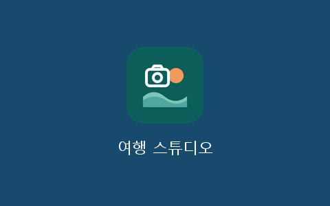

### 3.5 실습: 다시 Design으로 — 왕복 한 번

실제로 띄운 화면을 보면 시안에서 몰랐던 점이 보입니다. 그것을 다시 Design에서 고쳐 넘기는 것이 **왕복**입니다.

1. 마음에 안 드는 곳 하나를 고릅니다(예: 타임라인 사진 칸이 작다).
2. Claude Design 캔버스에서 그 아트보드를 고칩니다.
3. 다시 **Export → Hand off to Claude Code** → 스튜디오 창에 붙여 넣고 이어서 보냅니다.
   ```
   이번 핸드오프에서 바뀐 부분만 반영해줘. 버튼이 하는 일·작업함 연결·규약은 그대로 두고, 바꾼 파일 목록을 보여줘.
   ```
4. 화면을 새로고침해 바뀐 곳을 확인합니다.

✅ **이렇게 되면 성공 (묶음 1 끝)**
- 화면 9개가 메뉴로 오가고, 밝게/어둡게가 바뀐다
- 스튜디오 창이 켜져 있으면 ● 연결됨, 닫으면 ● 연결 안 됨 → [Claude 연결하기]로 다시 연결된다
- 여행 카드 '제주 2박3일'이 있다
- 바탕화면 아이콘으로 화면이 열린다
- 디자인 왕복을 한 번 해서 바뀐 곳이 화면에 보인다
- 튜터 창에서 `/handoff`로 묶음 1을 마무리했다

🆘 **막히면**

| 증상 | 해 볼 것 |
|---|---|
| 승인 창이 매번 뜸 | 승인 창에서 **'항상 허용'** 을 골랐는지, 폴더를 처음 열 때 '신뢰'를 허용했는지 봅니다. 그다음 `settings.json의 허용 규칙과 실제 실행하는 명령 모양이 같은지 대조해줘(상대경로·python 이름).` |
| Bash/PowerShell 도구 차이로 승인 창이 계속 뜸 | `명령을 Bash 도구로, 허용 규칙과 같은 글자 모양으로 실행했는지 대조해줘. PowerShell 도구로 냈다면 Bash 도구로 다시 해줘.`(리허설에서 PowerShell 도구로 낸 명령이 규칙에 안 맞은 일이 있었습니다) |
| '● Claude 연결 안 됨'이 계속 | 스튜디오 창이 켜져 있는지 → `여행 스튜디오 연결해줘` |
| 버튼이 '요청 보냄 · Claude 기다리는 중'에서 안 바뀜 | 연결돼 있는데도 그대로면 `스튜디오 요청 처리해줘` |
| 아이콘을 눌러도 화면이 안 열림 | 단체 블로그의 발행서버가 같은 자리(8765)를 쓰고 있지 않은지 → `스튜디오 서버가 왜 안 켜지는지 서버 기록을 보고 알려줘` |
| [Claude 연결하기]를 눌러도 앱이 안 열림 | Code 탭에서 이 폴더를 직접 열고 "여행 스튜디오 연결해줘" |
| Hand off 메뉴를 못 찾음 | 화면 문구가 다를 수 있습니다. 캔버스의 내보내기(Export·공유) 메뉴를 찾아보고, 없으면 시안을 PNG로 내보내 스튜디오 창에 끌어다 놓고 "이 시안대로"라고 합니다 |
| 같은 곳에서 두 번 고쳐도 안 됨 | 튜터 창에서 "참고 구현의 그 부분만 비교해줘"(튜터용 노트 참고) |

---

## Part 4: 사진 목록 — 시각·기기·HEIC, 그리고 시계 차이

> 🔧 **이번에 익히는 Claude Code 기능**: AI 암산 대신 스크립트로 정확히(6회차), 질문 카드(선택지로 묻기)

### 4.1 보이지 않는 꼬리표와 세 가지 시계

🧩 **비유**: 세 사람이 쓴 여행 일기를 **한 권으로 합치는 일**입니다. 그런데 한 사람의 손목시계가 한 시간쯤 늦었다면, 그 사람의 일기는 엉뚱한 자리에 끼어듭니다.

사진 파일에는 촬영 시각·시간대·위치·기기가 적힌 **보이지 않는 꼬리표(메타정보)** 가 붙어 있습니다. Claude는 사진을 볼 수는 있지만 이 꼬리표는 받지 않으므로, **읽는 일은 스크립트**가 합니다. 함정은 이렇습니다.

| 함정 | 무슨 일이 생기나 | 스튜디오의 처리 |
|---|---|---|
| 카메라 시계 | 휴대폰과 달리 시계를 저절로 맞추지 않습니다 | 같은 순간을 찍은 두 기기의 사진을 찾아 **차이를 계산** → 질문 카드로 확인 |
| 영상 시각 | 휴대폰 영상은 세계 표준시(UTC)로 적히는 경우가 많아 그대로 읽으면 9시간 어긋납니다(카메라·액션캠은 현지 시각을 넣기도 함) | 기기별 규칙으로 현지 시각으로 바꿈 |
| 받은 사진 | 카톡 사진은 꼬리표가 없을 수 있고, 파일 이름의 시각은 '받은 시각'일 수 있습니다 | '시각 확인 필요(⚠)' 표시 → 질문 카드 |
| HEIC | Windows와 Claude가 바로 보지 못하는 아이폰 형식입니다 | JPG 미리보기·썸네일을 따로 만듦(원본은 그대로) |
| 보정 위치 | 원본을 고치면 되돌릴 수 없습니다 | 시계 차이는 **목록에만** 반영 |

**우리 단체 예**: 행사 날 간사 세 명이 각자 폰과 카메라로 찍은 사진을 합칠 때도 똑같습니다. 카메라 한 대만 시계가 틀려도 '개회 기도'가 '점심' 뒤에 끼어듭니다.

💭 **확인 질문**: 카메라 사진 한 장이 '공항 도착 9분 뒤 바닷가'로 정렬됐다면 무엇을 의심해야 할까요?

### 4.2 실습: 목록 도구 만들기 → 화면으로 돌리기

🎯 **목표**: 사진·영상을 시간순 한 줄로 세우고, 시계 차이를 질문 카드로 확정한다.

🛠 **준비**: 스튜디오 창(연결됨), 스튜디오 화면, 여행 카드 '제주 2박3일'

👣 **단계**

1. 스튜디오 창에 붙여 넣어 도구를 만듭니다.
   ```
   규약 4절대로 도구/목록만들기.py와 도구/시계보정.py를 만들어줘. 원본은 읽기만 하고, 촬영 시각을 어디서 읽었는지(시각출처)를 꼭 남겨줘. HEIC도 JPG 미리보기·썸네일을 만들고, 영상은 UTC로 적힌 시각을 현지 시각으로 바꿔줘. 시계보정은 원본을 고치지 말고 목록에만 반영하고, 다른 기기가 같은 순간을 찍은 사진 쌍을 찾아 차이를 계산하는 기능도 넣어줘. 필요한 패키지는 설치 전에 목록을 보여 주고 물어봐줘. 다 만들면 돌리지는 말고 알려줘 — 화면 버튼으로 돌려 볼게.
   ```
   패키지 설치 승인 창이 뜨면 무엇을 설치하는지 읽고 허용합니다(강사 PC에서 약 2분).
2. 화면 **타임라인·고르기** → **[사진 목록 만들어 달라기]**. 버튼이 '요청 보냄 · Claude 기다리는 중'으로 바뀌고, 오른쪽 위에 진행이 보입니다.
3. 날짜별 사진 격자가 나오면 거르기에서 **'시각 확인 필요'** 를 눌러 ⚠ 표시된 사진을 봅니다.
4. **[기기 시계 확인 부탁]** 을 누릅니다. 위쪽 메뉴 **질문**에 숫자가 뜨면 들어가서 답합니다. 사진 두 장을 나란히 보여 주며 "같은 순간에 찍은 건가요?"라고 물으면, 해·구름·바위 모양을 보고 고릅니다.
5. 카톡 사진의 시각, 하루를 나누는 기준(기본 새벽 4시)처럼 다른 질문 카드에도 답합니다. 모르면 '잘 모르겠어요'를 골라도 됩니다.
6. 타임라인을 다시 보며 날짜와 순서가 자연스러운지 확인합니다.

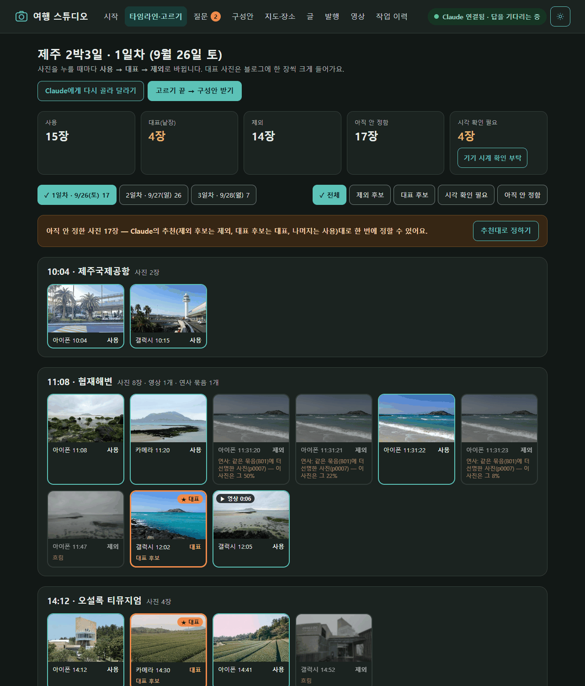
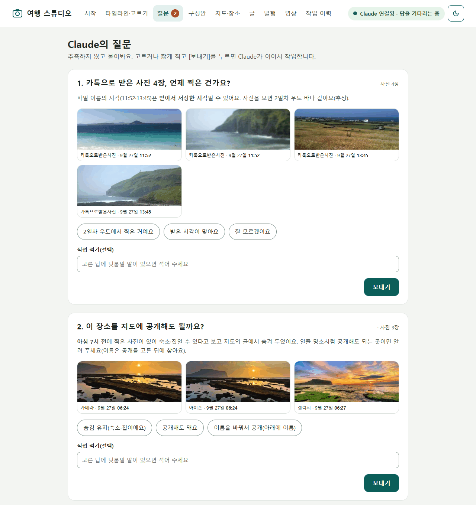

✅ **이렇게 되면 성공**
- 사진·영상 수가 폴더의 파일 수와 같다(설명 파일·출처 파일은 빠짐)
- 기기 수가 폴더 수와 같고, HEIC 사진도 썸네일이 보인다
- 시계 차이를 확정한 뒤, 이상하게 끼어들던 카메라 사진들이 제자리로 갔다
- 영상이 엉뚱한 날짜(예: 전날 밤)에 들어가 있지 않다
- 원본 폴더는 바뀌지 않았다: `원본 사진 폴더의 파일 개수·크기·수정 시각이 작업 전과 같은지 확인해줘.`

🆘 **막히면**
- 시각이 이상한 사진이 있으면: `이 사진(파일 이름)의 시각출처가 무엇인지, 왜 이 시각이 됐는지 설명해줘.`
- 시간대 오류(ZoneInfo…)가 나오면 Windows에 시간대 자료가 없는 것입니다. Claude가 tzdata를 설치하겠다고 하면 허용합니다.
- 질문 카드가 오지 않으면 연결 표시를 확인하고 `스튜디오 요청 처리해줘`.
- **아이폰 사진(HEIC) 때문에 '사진 목록 만들기'가 멈추면**: `pillow-heif` 꾸러미가 없는 것입니다. 터미널(Windows: PowerShell / Mac: 터미널)에서 직접 `python -m pip install pillow-heif`(Mac은 `python3 -m pip install pillow-heif`)를 실행한 뒤 화면에서 다시 누릅니다(2026-10-08 실측).
- **사진이 모두 '기간 밖'으로 나오면** 여행 기간이 거꾸로이거나 틀린 것입니다. 사진 화면 위 **[기간 고치기]** 로 시작·끝 날짜를 고친 뒤 [사진 목록 만들어 달라기]를 다시 누릅니다. `여행정보.json`을 직접 열 필요가 없습니다.

---

## Part 5: 고르기 — 스크립트 후보 → 콘택트 시트 → Claude 판단 → 사람 확정

> 🔧 **이번에 익히는 Claude Code 기능**: 이미지 읽기(콘택트 시트), 서브에이전트 병렬(내 책상을 어지럽히지 않고 나눠 보기)

### 5.1 왜 세 단계로 나눠 고르나

🧩 **비유**: 사진관의 **밀착 인화(콘택트 시트)** 입니다. 필름 한 통을 종이 한 장에 작게 인화해 두고 돋보기로 훑어 고르던 방식이지요. 기계는 초점이 나간 컷을 정확히 찾고, 사람의 눈은 이야기가 되는 컷을 찾습니다.

| 단계 | 누가 | 잘하는 것 |
|---|---|---|
| ① 1차 후보 | **스크립트** | 흐림(고정 기준이 아니라 **상대 비교** — 같은 기기 사진의 보통 선명도와, 연사는 묶음 안에서), 연사 묶음과 베스트 한 장, 눈 감음 |
| ② 눈으로 보기 | **Claude** — 콘택트 시트(20장씩 번호 붙은 격자)를 서브에이전트 여럿이 나눠 봄 | 장면 설명, 비슷한 사진 정리, 대표 후보(구도·빛·이야기) |
| ③ 확정 | **선생님** | 추억의 의미, 누가 나왔는지, 올려도 되는지 |

강사 리허설(샘플 키트, 사진 47장)에서 대표 사진을 고른 결과입니다.

| 방식 | 미리 정해 둔 대표 후보 4장 중 맞춘 수 |
|---|---|
| 스크립트 점수만 | **0 / 4** — '기술적으로 괜찮은 사진'만 골랐습니다 |
| 콘택트 시트 3장을 Claude가 보고 | **4 / 4** — 바다·일출·녹차밭·등대처럼 이야기가 되는 장면을 골랐습니다 |

(4/4는 서브에이전트로 나누지 않고 한 세션에서 시트 3장을 본 결과입니다. 서브에이전트로 나눠 보는 방식은 리허설에서 따로 재지 않았습니다.)

반대로 흐린 사진 5장과 연사 3묶음은 스크립트가 정확히 찾았습니다. 그래서 **둘 다** 씁니다. 47장을 시트 3장으로 보았기 때문에 한 장씩 여는 것보다 사용량도 훨씬 적습니다. 서브에이전트는 자기 책상에서 시트를 보고 결과표만 가져오므로 본 대화(내 책상)에 사진이 쌓이지 않습니다.

- **지우지 않습니다.** 흐린 사진도 '제외 후보' 표시만 하고, 결정은 화면에서 사람이 합니다.
- Claude는 사진 속 사람의 **이름이나 관계를 짐작하지 않습니다.** 다른 사람이나 아이 얼굴이 크게 나온 사진을 대표로 두려면 먼저 질문 카드로 묻습니다.

💭 **확인 질문**: 대표 사진을 정할 때 Claude가 아무리 똑똑해도 알 수 없는 것은 무엇일까요?

### 5.2 실습: 고르기 도구 만들기 → 골라 달라기 → 확정

🎯 **목표**: 제외 후보·대표 후보를 받아 보고, 내 손으로 확정한다.

👣 **단계**

1. 스튜디오 창에 붙여 넣습니다.
   ```
   규약 4절대로 도구/고르기후보.py와 도구/콘택트시트.py를 만들어줘. 흐림은 고정 기준이 아니라 상대 비교로(같은 기기 사진들의 보통 선명도와 비교, 연사 컷은 묶음 안에서), 연사는 묶음마다 가장 선명한 한 장을 베스트로, 눈 감음은 MediaPipe Tasks API(FaceLandmarker)로 해줘. 결과는 목록의 점수·판정에만 쓰고 사용자결정은 절대 바꾸지 마. 콘택트 시트는 20장씩, 칸마다 번호·시각·기기를 크게, 제외 후보는 빨간 테두리로. 다 만들면 알려줘.
   ```
2. 화면 **타임라인·고르기** → **[Claude에게 골라 달라기]**. 스튜디오 창을 보면 Claude가 시트를 만들고 살펴봅니다(시트가 많으면 서브에이전트 여럿에게 나눠 맡기기도 합니다).
3. 거르기 **'제외 후보'**, **'대표 후보'** 를 차례로 누르고 사진마다 붙은 사유를 읽습니다.
4. 사진을 누를 때마다 **사용 → 대표 → 제외**로 바뀝니다. 대표는 4~6장 정도가 좋습니다(블로그에서 한 장씩 크게, 영상에서 길게 나옵니다).
5. 아직 안 정한 사진이 많으면 **[추천대로 정하기]** 로 한 번에 정할 수 있습니다. 안 정한 사진에만 적용되고, 사진은 지워지지 않으며 나중에 한 장씩 다시 바꿀 수 있습니다.

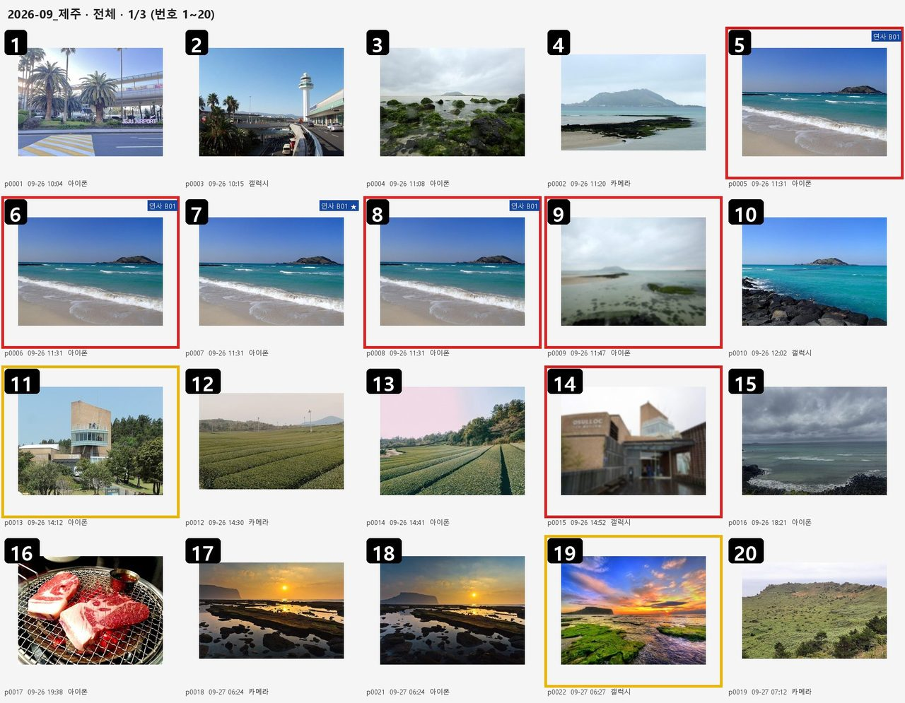
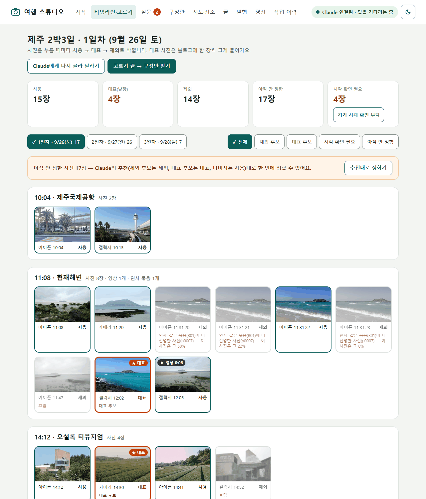

🌿🌳 **해 보면 좋은 비교** (스튜디오 창)
```
스크립트 점수만으로 뽑힌 대표 후보와, 네가 콘택트 시트를 보고 고른 대표 후보를 사진 이름으로 나란히 표로 보여줘. 왜 달랐는지 한 줄씩 설명해줘.
```

✅ **이렇게 되면 성공**
- 흐린 사진과 연사 나머지 컷이 '제외 후보'로 표시됐고, 지워진 사진은 없다
- 연사 묶음마다 베스트 한 장이 남았다
- 대표 4~6장을 **내가** 정했다
- (내 사진이라면) 얼굴이 크게 나온 사진은 대표 전에 질문 카드로 물어봤다

🆘 **막히면**
- MediaPipe가 설치되지 않으면(인텔 Mac 등) `눈 감음 계산은 빼고 진행해줘.` — 눈 감음은 콘택트 시트에서 사람이 봅니다.
- 판정이 이상하면: `12번 사진이 왜 제외 후보야? 시트의 그 칸을 다시 보고 설명해줘.`
- 대표가 너무 비슷하면: `대표 후보 가운데 장소가 겹치는 것은 하나만 남기고 다른 날 사진에서 찾아줘.`

---

## Part 6: 이야기 재료 — 컨셉·구성안 3개·지도와 장소 이름·꿀팁 노트

> 🔧 **이번에 익히는 Claude Code 기능**: 질문 카드 인터뷰, 기억(프로젝트 파일 + CLAUDE.md), 외부 무료 서비스의 이용 규칙 지키기

### 6.1 컨셉 인터뷰와 구성안 세 가지

🧩 **비유**: 앨범을 엮기 전에 정하는 **목차**입니다. 같은 사진도 "하루에 한 권"으로 엮을지, "바다·숲·시장" 테마로 엮을지에 따라 전혀 다른 앨범이 됩니다.

**구성안 받기**를 누르면 Claude가 먼저 질문 카드로 컨셉을 한 줄 묻고(예: "아이와 처음 간 제주, 느리게 걷기"), 고른 사진 수와 날짜를 보고 세 안을 제안합니다. 예를 들면 ① 하루에 한 편씩 ② 하이라이트 1편 + 일자별 ③ 테마별입니다. 안마다 좋은 점·아쉬운 점·추천 표시가 붙습니다. 고른 안의 편 이름(예: `1일차`, `하이라이트`)은 파일 이름이 됩니다.

👣 **단계**: 화면 **구성안** → **[구성안 받기]**(타임라인의 **[고르기 끝 → 구성안 받기]** 도 같음) → 질문 카드에 컨셉 답하기 → 세 안 비교 → 마음에 드는 안의 **[이 안 고르기]** → **[이 안으로 정하기 →]**. 고칠 점이 있으면 아래 **'고칠 점이 있으면 적어 주세요(선택)'** 칸에 적고 **[고칠 점 반영해 다시 받기]**.

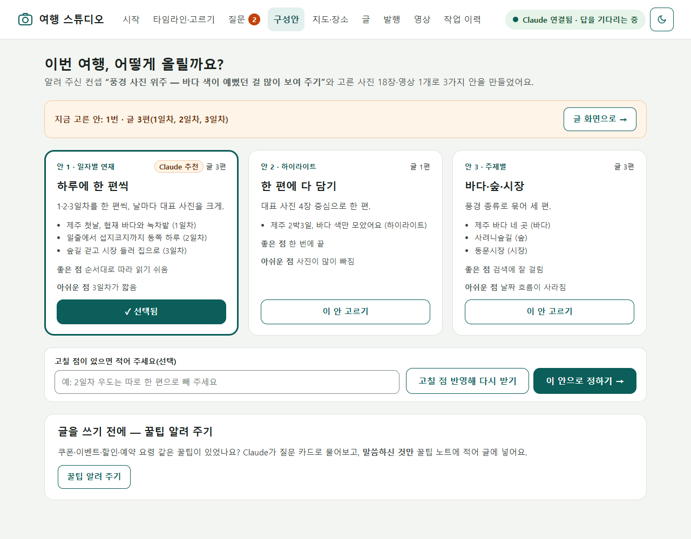

### 6.2 동선 지도와 장소 이름 — 자동 이름은 '추정'

🧩 **비유**: 지도 앱이 알려 주는 주소는 **바로 옆 작은 가게 이름**일 때가 많습니다. 경복궁 앞에서 찍은 사진인데 근처 가게 이름이 나오는 식이지요.

좌표로 이름을 찾는 일(역지오코딩)은 자주 틀립니다. 조사와 강사 리허설에서 실제로 이랬습니다.

| 좌표·검색어 | 자동으로 나온 이름 | 사람이 고친 이름 |
|---|---|---|
| 경복궁 근처 좌표 | 근처 작은 시설 이름 | 경복궁 |
| '전주한옥마을' 검색 | 전주한옥마을 실내공영주차장 | 전주한옥마을 |
| 제주공항 사진(리허설 첫 설정) | 용담2동(동네 이름) | 제주국제공항 |
| 섭지코지 사진(리허설) | Seopjikoji(영어) | 섭지코지 |

그래서 스튜디오는 장소 이름을 **'추정'** 으로 두고 질문 카드로 확인합니다. 지켜야 할 것도 있습니다.

- **장소 이름은 네이버 지도에 나오는 이름 그대로**(띄어쓰기·지점명까지) 답합니다. Part 8에서 확장이 이 이름으로 네이버 장소를 찾기 때문입니다. 예: '성산 일출봉' → '성산일출봉', 지점이 여럿인 카페는 '바다카페 애월점'처럼 지점명까지. 헷갈리면 네이버 지도에서 검색해 보고 답합니다. Claude도 모르는 이름은 지어내지 않고 질문 카드로 묻습니다(2026-10-08~09 강사 실측에서 띄어쓰기·지점명 차이로 장소 단계가 멈춘 일이 있었습니다).
- **무료 지도의 이용 규칙**: OpenStreetMap 지도와 이름 찾기(Nominatim)는 무료인 대신 **초당 1번까지, 결과를 저장해 다시 쓰기, 앱 이름 밝히기, 지도에 '© OpenStreetMap contributors' 표시**를 요구합니다. Nominatim은 AI가 이 서비스를 권할 때 규칙을 함께 알리라고 정해 두었으니, Claude에게 먼저 설명을 듣습니다.
- **숙소·집은 지도에서 뺍니다.** 도구가 아래 장소를 **기본으로 숨기고 이름도 찾지 않습니다**(위치를 밖으로 보내지 않음): 저녁과 다음 날 아침 사진이 몰린 곳(숙소 추정), 밤 8시~아침 7시에 찍힌 곳, 첫날·마지막 날에 다른 곳과 30km 넘게 떨어진 곳(출발 전·돌아온 뒤 집). 이런 곳마다 Claude가 **"이 장소를 지도에 공개해도 될까요?" 질문 카드**를 냅니다. 사람이 '공개해도 돼요'를 고른 곳만 지도에 나옵니다(Claude 혼자서는 숨김을 풀 수 없게 만들어 둠).
- **위치가 없는 사진**(카메라·카톡)은 앞뒤 시각으로 추정하거나 '장소 모름'으로 둡니다. 추측해서 채우지 않습니다.

👣 **단계**

1. 스튜디오 창에 붙여 넣습니다.
   ```
   규약 4절대로 도구/지도.py를 만들어줘. 먼저 OpenStreetMap 지도와 Nominatim의 이용 규칙(초당 1회·캐시·User-Agent·출처 표시)을 나에게 쉬운 말로 설명해줘. 사진 위치를 반경 300m 정도로 묶어 장소를 만들고, 장소마다 이름 후보는 한 번만 찾아 '확인됨: false'로 둬. 저녁·아침 사진이 몰린 곳(숙소 추정), 밤 8시~아침 7시 사진, 첫날·마지막 날에 다른 곳과 30km 넘게 떨어진 곳은 기본으로 숨기고 이름도 찾지 마. 숨긴 곳은 내가 질문 카드에서 '공개'를 고른 경우에만 풀 수 있게 해줘. 일자별 동선 지도 그림에는 '© OpenStreetMap contributors'를 넣어줘.
   ```
2. 화면 **지도·장소** → **[동선 지도 만들어 달라기]**. 처음에는 1분 남짓 걸릴 수 있습니다(리허설 74초, 다시 하면 몇 초).
3. **장소 확인** 목록에서 이름을 네이버 지도 이름 그대로 고치고 '확인'을 누릅니다. 숙소·집은 **'지도·글에서 숨기기(숙소·집)'** 를 체크합니다. 질문 카드로 온 장소 이름도 답합니다.
4. 지도 그림에서 숙소가 빠졌는지, 출처 문구가 있는지 봅니다.

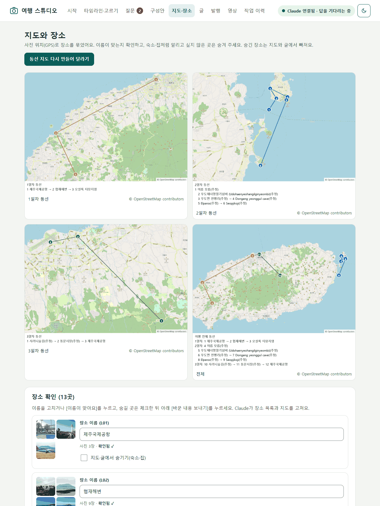

### 6.3 꿀팁 인터뷰 — 기억은 눈에 보이는 파일로

🧩 **비유**: 단골 가게 **수첩**입니다. "이 집은 평일 오전에 가면 덜 붐빈다" 같은 메모는 다음에 갈 때 펼쳐 봐야 쓸모가 있습니다.

구성안 화면 아래 **'글을 쓰기 전에 — 꿀팁 알려 주기'** 의 **[꿀팁 알려 주기]** 를 누르면 Claude가 쿠폰·이벤트·할인·예약 요령을 질문 카드로 묻고, **선생님이 말한 것만** `꿀팁노트.md`에 날짜·여행 이름과 함께 한 줄씩 적습니다. 그리고 이 폴더의 CLAUDE.md에 "새 여행 글을 쓸 때 관련 꿀팁을 먼저 제안한다"는 규칙이 있어 다음 여행에서 다시 꺼내 줍니다. Claude의 자동 기억에 맡기지 않고 **눈에 보이는 파일**에 두는 이유는, 무엇이 기억되는지 내가 읽고 고칠 수 있기 때문입니다.

샘플 키트라면 꿀팁을 하나 지어서 답해도 됩니다. 연습용이라는 것만 기억해 두세요.

✅ **이렇게 되면 성공**
- 컨셉 한 줄이 정해졌고, 구성안 하나를 골라 편 이름이 생겼다
- 동선 지도 그림에 '© OpenStreetMap contributors'가 있고 숙소가 없다
- 지도에 나오는 장소 이름을 모두 확인했다(또는 숨겼다)
- `꿀팁노트.md`에 내가 말한 꿀팁이 1줄 이상 있다
- 튜터 창에서 `/handoff`로 묶음 2를 마무리했다

🆘 **막히면**
- 장소 이름이 영어·시설 이름이면 장소 확인 칸에서 직접 고칩니다.
- 지도에 숙소가 보이면 그 장소의 '숨기기'를 체크하고 `동선 지도만 다시 그려줘.`
- 이름 찾기가 오래 멈추면 초당 1회 규칙 때문입니다. 기다리거나 `이름 조회 없이 저장된 것만으로 지도를 그려줘.`

---

## Part 7: 글과 배치 — 미리보기, [고쳐줘], [이 글 승인]

> 🔧 **이번에 익히는 Claude Code 기능**: 미리보기로 반복 수정, 지적한 곳만 고치기(전체 다시 쓰기 금지)

### 7.1 배치 규칙

🧩 **비유**: 앨범의 **한 쪽 편집**입니다. 가장 좋은 사진은 한 장을 크게, 나머지는 작게 모아 붙이고, 사진 옆에 짧은 메모를 답니다.

| 규칙 | 내용 | 까닭 |
|---|---|---|
| 일자별 분할 | 편 = 구성안에서 고른 단위(예: 1일차·2일차·3일차) | 한 편이 너무 길면 모바일에서 끝까지 안 읽힘 |
| 대표 사진 | **사진 블록 1장씩**(낱장, 크게) | 검색 썸네일·눈길을 끄는 자리 |
| 나머지 사진 | **그룹 사진**(콜라주·슬라이드), **한 묶음 10장 이하** | 네이버 그룹 사진은 한 번에 10장까지(블로그 앱 도움말 기준) |
| 장소 | 장소 블록 하나에 **5곳 이하**, 이름은 **네이버 지도 이름 그대로**(지점명까지) | 네이버 장소 첨부는 한 번에 5곳, 확장이 이 이름으로 찾음 |
| 영상 | 영상마다 **제목 40자 이하**, 그 장면을 다룬 소제목 아래 | 네이버가 영상 제목을 꼭 받음(없으면 확장이 글 제목을 넣음 — 발행 패키지가 경고) |
| 카테고리 | ⑦ 발행 화면 설정의 **'블로그 카테고리'** 그대로 — Claude가 이름을 지어내지 않음. 글쓰기 전에 8.3 2번처럼 적어 두기 | 블로그에 없는 이름이면 발행할 때 사람이 다시 골라야 함 |
| 지도 | 동선 지도 그림(숨긴 장소 없음) | 출처 표시 포함 |
| 꿀팁 | 꿀팁 블록(인용구 모양) | 꿀팁노트에서 |
| 글 끝 | **참고자료 블록 하나** — 사진 출처, 지도 출처, AI 사용 표기 한 줄 | 출처·AI 사용 밝히기 |

- 글의 근거는 **선생님의 답, 확인된 장소 이름, 꿀팁 노트뿐**입니다. 맛·느낌·가격·사람 이야기는 지어내지 않고, 모르면 질문 카드로 묻습니다.
- 글을 쓴 뒤에는 **검수 서브에이전트**가 한 번 더 읽습니다. 2026-10-08~09 강사 실측에서 검수가 제목 없는 영상(21개), 다른 소제목 아래 놓여 엉뚱한 장면처럼 읽히는 영상, 알려 준 말보다 넓게 쓴 문장을 잡아냈습니다. 미리보기에서 이 세 가지는 선생님도 한 번 더 봅니다.
- 네이버의 'AI 활용 설정'은 AI로 만들거나 바꾼 **이미지·영상**에 붙이는 표시라서, 직접 찍은 사진만 있는 여행 글은 **기본으로 꺼져 있습니다**(규약 2.4). AI로 만들거나 바꾼 그림·영상을 넣었을 때만 ⑥ 글 화면의 **'AI로 만들거나 바꾼 사진·영상이 있음'** 을 선생님이 직접 체크합니다. 네이버의 이 설정은 글 전체가 아니라 **사진·영상마다** 있는 스위치라서(2026-10-08 실측), 블로그 도우미는 스위치를 누르지 않고 임시저장 뒤 "AI 사진·영상마다 켜세요"라고 알려 줍니다. 그러면 Part 8에서 그 사진을 눌러 사진 위의 'AI 활용 설정'을 켭니다. 글을 AI 도움으로 쓴 사실은 **글 끝 AI 사용 문구**로 늘 알립니다.
- 미리보기는 네이버 모양을 흉내 낸 **'모양 참고용'** 입니다. 실제 모습은 Part 8에서 네이버 화면으로 확인합니다.

### 7.2 실습: 한 편 쓰고 승인하기

🎯 **목표**: 편 하나를 배치·미리보기까지 만들고, 고쳐 달라고 한 뒤 승인한다.

👣 **단계**

1. 화면 **글** → 편(예: `1일차`) → **[이 편 글쓰기]**. 질문 카드가 오면 답합니다(예: "협재에서 가장 기억에 남는 순간은?").
2. 미리보기가 뜨면 **PC / 모바일**을 번갈아 봅니다.
3. 고칠 블록 옆 **[고쳐줘]** 를 눌러 "이 문단을 두 문장으로 줄여줘"처럼 적고 보냅니다. 여러 곳을 한꺼번에 말하려면 **[Claude에게 고쳐 달라기]**.
4. 고친 글은 승인이 '미승인'으로 돌아갑니다. 다시 보고 괜찮으면 **[이 글 승인]**. AI로 만들거나 바꾼 그림을 넣었다면 같은 화면의 'AI로 만들거나 바꾼 사진·영상이 있음'도 체크합니다(직접 찍은 사진만이면 그대로 둠).
5. 샘플 키트 사진을 쓴다면 스튜디오 창에 붙여 넣습니다.
   ```
   샘플 키트 사진을 쓰고 있어. 1일차 글 끝 참고자료 블록에, 이 글에 쓴 사진들의 작가와 라이선스를 원본 사진 폴더의 출처.csv에서 찾아 넣어줘. CC BY-SA 사진은 라이선스 이름을 정확히 적어줘. 다른 블록은 건드리지 마.
   ```

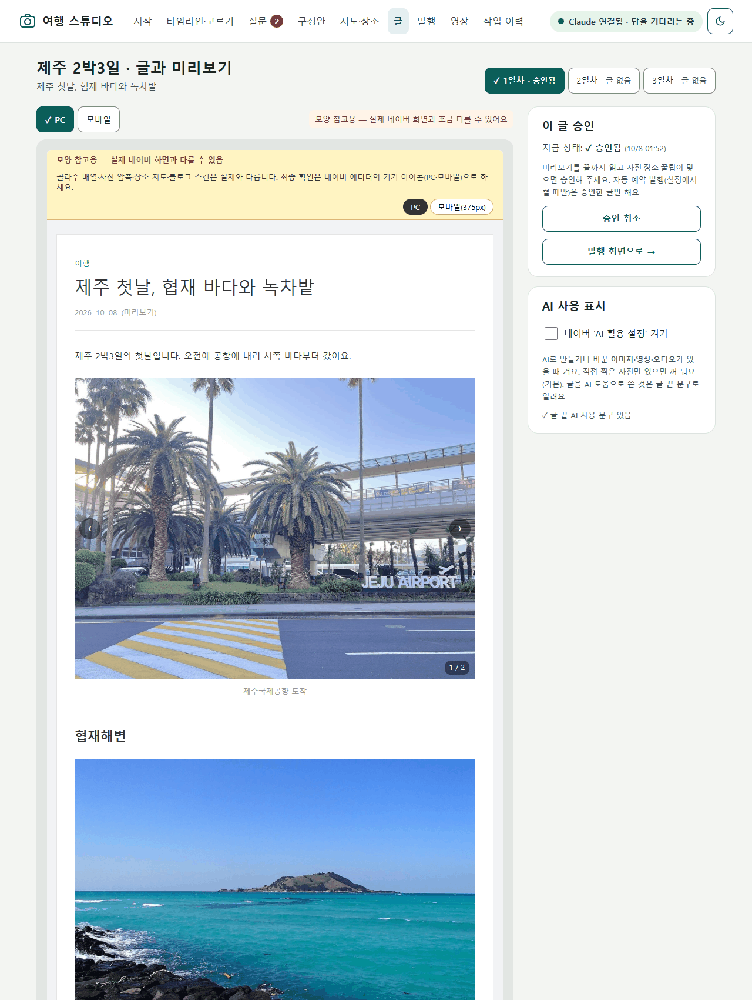

✅ **이렇게 되면 성공**
- 대표는 낱장, 나머지는 10장 이하 묶음, 장소 5곳 이하
- 숙소·집이 글과 지도 어디에도 없다
- 내가 말하지 않은 사실(맛·가격·느낌)이 없다
- 글 끝에 참고자료(사진·지도 출처, AI 사용 표기)가 있다
- **[이 글 승인]** 을 눌렀다

🆘 **막히면**
- 미리보기에 그림이 안 보이면 스튜디오 화면을 **Chrome·Edge 같은 기본 브라우저**로 엽니다(Code 탭 안의 Browser 창은 그림 없이 열릴 때가 있습니다).
- 미리보기가 '간단 미리보기'로 나오면: `공용가져오기.py를 다시 실행해줘.`
- 글 전체를 다시 써 버렸다면: `방금 고친 것은 되돌리고, 내가 지적한 블록만 고쳐줘.`

---

## Part 8: 네이버 임시저장 → 사람이 확인하고 발행

> 🔧 **이번에 익히는 Claude Code 기능**: 사람·Claude·확장의 역할 나누기, 작업 이력과 '멈춘 단계부터 다시'

### 8.1 택배 대리 접수처럼

🧩 **비유**: **택배 대리 접수**입니다. 동료(Claude)가 물건을 포장하고(위치 정보를 지운 사진 사본, 발행 패키지), 창구 직원(블로그 도우미 확장)이 접수표를 채워 **보관함(임시저장)** 까지 넣어 둡니다. 마지막 **발송 도장('발행')은 본인**이 찍습니다.

네이버에는 공식 글쓰기 API가 없고(2020-05-06 종료), 약관은 허락 없는 자동화 게시를 금지합니다. 그래서 **로그인·연결 코드 입력·모바일 확인·'발행'은 선생님**, **사본·발행 패키지·결과 읽기는 Claude**, **글쓰기 화면 채우기와 '저장'은 선생님이 직접 설치한 확장**이 맡습니다. Claude는 네이버 화면을 직접 누르지 않습니다. 자세한 이유·역할 표·설치는 [공통_네이버연동_블로그도우미.md](공통_네이버연동_블로그도우미.md)에 있습니다.

### 8.2 실습: 발행 준비 도구와 naver-draft 가져오기

스튜디오 창에 붙여 넣습니다.
```
규약 2.5절과 4절대로 도구/업로드사본.py와 도구/발행패키지.py를 만들어줘. 업로드 사본은 회전 반영 → 장변 2048px JPG(품질 85) → GPS·기기 정보 제거 → 다시 읽어서 정말 지워졌는지 확인하는 순서로. 사진 묶음 계산은 공용 발행 모듈의 build_bundles를 가져다 쓰고, 원고에 내부 표시가 남았거나 10장 넘는 그룹이 있으면 멈춰줘.
그다음 튜터 폴더의 일상실습/01_네이버블로그/참고구현/여행스튜디오/.claude/skills/naver-draft 를 이 폴더의 .claude/skills/ 로 복사해줘(참고 구현 가운데 이 스킬만 공용 도구라 예외로 가져다 씀, 다른 파일은 보지 마). 그 스킬이 부르는 명령이 내 스튜디오에 있는지 대조해서, 없으면 스킬은 고치지 말고 내 스튜디오 쪽을 맞춰줘.
```

### 8.3 실습: 확장 연결 (처음 한 번)

1. [공통 문서](공통_네이버연동_블로그도우미.md) ③·④대로 **블로그 도우미 확장을 Chrome 또는 Edge에 설치**하고, **그 브라우저에서** 네이버에 직접 로그인합니다(로그인 상태 유지).
2. 스튜디오 화면 **발행** → **설정**: 글쓰기 화면을 열 브라우저(Chrome / Edge / 기본 브라우저)를 **확장을 설치한 그 브라우저**로, 블로그 아이디(blog.naver.com/ 뒤의 영문), **블로그 카테고리**(내 블로그에 보이는 카테고리 이름 그대로, 띄어쓰기까지 / 비우면 발행할 때 직접 고름)를 적고 [저장]. Claude는 글에 이 카테고리 이름을 그대로 쓰고 지어내지 않습니다.
3. **[확장 연결(연결 코드 받기)]** → 6자리 코드(5분 안에, 한 번만) → 브라우저 오른쪽 위 확장 아이콘 → **블로그 도우미** → 코드 입력 → [연결] → '연결됨'.

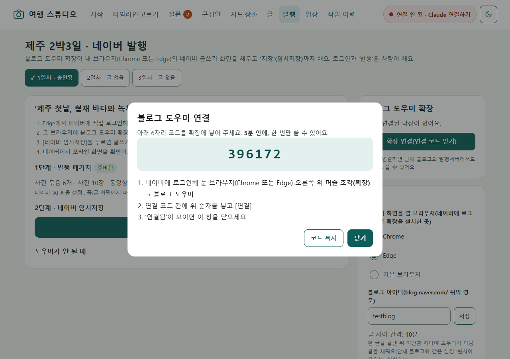

### 8.4 실습: 임시저장 → 사람이 마무리

🎯 **목표**: 승인한 글 한 편을 임시저장까지 보내고, 네이버 화면에서 직접 확인한다.

👣 **단계**

1. **1단계(Claude)**: **발행** 화면에서 편을 고르고 **[발행 패키지 만들어 달라기]** → Claude가 위치를 지운 사진·영상 사본과 발행 패키지**만** 만듭니다(네이버 쪽은 아무것도 안 함). 사진 묶음과 경고를 봅니다. 'GPS·촬영기기 정보가 남음' 경고가 있으면 넘어가지 않습니다. 제목 없는 영상 경고가 있으면 스튜디오 창에 `제목 없는 영상마다 40자 이하 제목을 넣어줘`. 영상이 많으면 사본 만들기가 오래 걸립니다(아래 '시간 감각').
2. **2단계(사람)**: **[네이버 임시저장]** 은 선생님이 직접 누릅니다 → 설정한 브라우저에 글쓰기 화면이 열립니다. 오른쪽 아래에 **블로그 도우미** 패널이 뜨고 **5초 뒤** 채우기를 시작합니다(그 사이 [멈춤] 가능). **채우는 동안 화면을 만지지 않습니다.**
3. 단계 목록(준비 → 제목 → 블록들 → 태그 → 카테고리 → 공개설정 → AI활용 → 저장)이 하나씩 '완료'로 바뀝니다. 스튜디오 **발행** 화면에도 같은 진행이 보입니다. 동영상은 확장이 네이버 '동영상'으로 올리며, 업로드·인코딩 동안 '처리 중'으로 보입니다(최대 30분까지 기다림 — 아래 '시간 감각').
4. "임시저장까지 끝났습니다"가 나오면 **선생님이 마무리**합니다. 패널과 **발행** 화면에 남은 **'주의'** 문장이 할 일 목록입니다.
   - 오른쪽 위 **'저장'** 옆 숫자 → 임시저장 목록에서 이 글 열기
   - 오른쪽 아래 **기기 아이콘**으로 PC → 모바일 화면 확인
   - [ ] **사진 설명**: "사진 설명을 넣지 못함(…) — 사람이 넣기: “…”"가 있으면 그 사진을 누르고 설명 칸을 한 번 클릭한 뒤 따옴표 안 문장을 붙여 넣습니다(사진 하나에 몇 초). 콜라주는 확장이 넣고, **한 장 사진**은 지금 확장이 넣지 못해 사람이 하는 단계
   - [ ] **장소**: 들어간 장소가 맞는 지점인지 봅니다(띄어쓰기만 다른 이름을 확장이 붙였으면 '주의'로 알려 줌)
   - [ ] **동영상**: 들어갔는지, 영상 제목이 알맞은지 봅니다(확장이 이미 올렸다면 다시 올리지 않음)
   - [ ] **AI 활용 설정**: AI로 만들거나 바꾼 사진·영상이 있을 때만, 그 사진·영상마다 켭니다(7.1)
   - [ ] **카테고리**: **'발행'** 설정 창에서 확인합니다. 블로그에 없는 이름이라 '주의'와 함께 기본 카테고리에 저장됐다면 여기서 직접 고릅니다. 태그·공개 범위도 봅니다
   - 다 됐으면 사람이 **'발행'**
5. **샘플 키트 글은 발행하지 않습니다**(모바일 확인까지가 연습, 임시저장 글은 선생님이 직접 정리). 내 여행 글은 처음 몇 편을 **비공개**로 발행해 보고, 발행했다면 스튜디오 창에 `방금 발행했어. 주소는 https://blog.naver.com/… 야. 기록해줘.`

**시간 감각**(2026-10-08~09 강사 실측, 실제 여행 사진·영상 38개로 3편): 업로드 사본 만들기는 사진 13장(3.8MB) 금방, 영상 6개(157MB) 약 7분, 영상 15개(655MB) 약 18분 — Claude가 뒤에서 한 번에 하나씩 처리하니 기다리면 됩니다. 임시저장은 사진 편(15블록) 약 1분, 영상은 하나에 10초~1분 30초(네이버 처리 기다림). 사진 목록부터 3편 발행까지 모두 약 2시간 15분(도구 설치·기간 고치기 포함)이었습니다.

**한 번에 한 편**: 다음 편은 앞 글을 확인한 뒤에 보냅니다. 서버도 끝난 작업 뒤 일정 시간(기본 10분) 동안은 다음 작업을 내주지 않습니다.

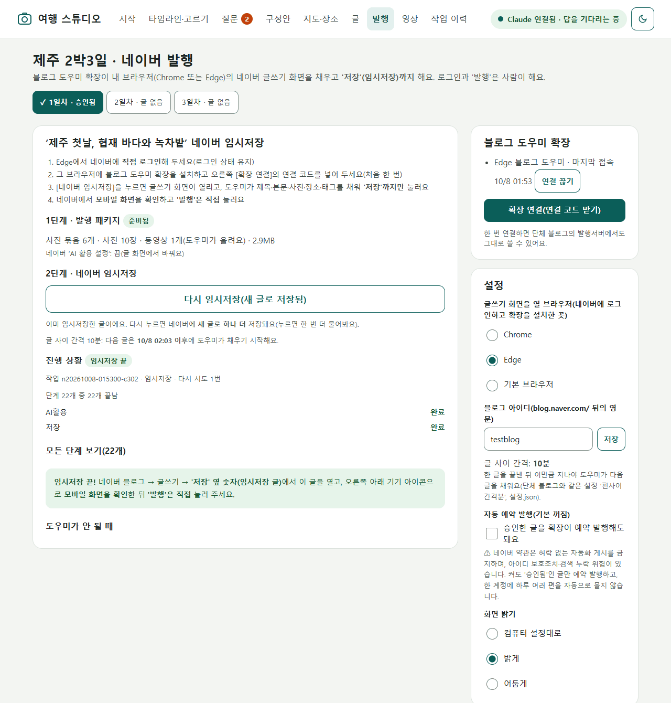

### 8.5 멈췄을 때 — 처음부터가 아니라 그 단계부터

확장은 모르는 화면에서 추측으로 누르지 않고 **그 단계에서 멈춥니다.** 스튜디오 **발행** 화면에 빨간 상자로 이유와 고치는 방법, **[다시 시도(○○부터)]** 가 나옵니다. **작업 이력** 화면에는 모든 작업이 성공·실패·재시도 완료·재시도 불가로 남고, [다시 시도]·[처음부터]·[로그 보기]·**[수리 프롬프트 복사]** 가 있습니다. 수리 프롬프트를 복사해 스튜디오 창에 붙여 넣으면 Claude가 로그의 마지막 오류를 읽고 고친 뒤 그 단계부터 다시 합니다.

| 화면에 나온 이유 | 할 일 |
|---|---|
| 로그인 필요 | 그 브라우저에서 네이버에 직접 로그인 → [다시 시도] |
| 버튼을 못 찾음(화면이 바뀜) | 먼저 강사에게 알리고, 급하면 **튜터 창**에서 `확장 선택자를 지금 화면에 맞게 고쳐줘`(확장은 튜터 폴더에 있음, 공통 문서 ⑩) |
| 카테고리가 블로그에 없음 | 임시저장은 멈추지 않고 '주의'와 함께 기본 카테고리에 저장 → 발행 전에 '발행' 설정 창에서 직접 고르기. **예약 발행**은 카테고리가 비었거나 블로그에 없으면 거절·`카테고리없음` → 발행 설정의 '블로그 카테고리'를 블로그에 보이는 이름 그대로 고치고 `이 글의 카테고리를 설정의 블로그 카테고리로 맞춰줘`(고친 뒤 다시 [이 글 승인]) |
| `장소없음` — 이름이 같은 장소를 못 찾음(지점이 여럿이거나 이름이 다름) | 네이버 화면에 열린 장소 창에서 후보 중 맞는 곳을 직접 골라 **[추가]·[확인]** → 패널의 **[이 단계는 내가 했음 → 다음]**. 띄어쓰기만 다른 이름이 하나뿐이면 확장이 붙이고 '주의'로 알려 줍니다 |
| 동영상 단계에서 멈춤(`영상없음`·`영상전달`·`시간초과`) | 네이버 화면에 동영상이 들어갔는지 봅니다. 없으면 패키지 폴더(`발행/사진묶음_<편ID>/…_video/`)의 mp4를 '동영상' 버튼으로 직접 올리고 패널의 **[이 단계는 내가 했음 → 다음]** |

나머지 이유와 대응은 [공통 문서 ⑨ 실패 코드별 대응](공통_네이버연동_블로그도우미.md)에 모았습니다. 다시 하기 전에는 에디터에 이미 들어간 블록이 겹치지 않는지 눈으로 확인합니다.

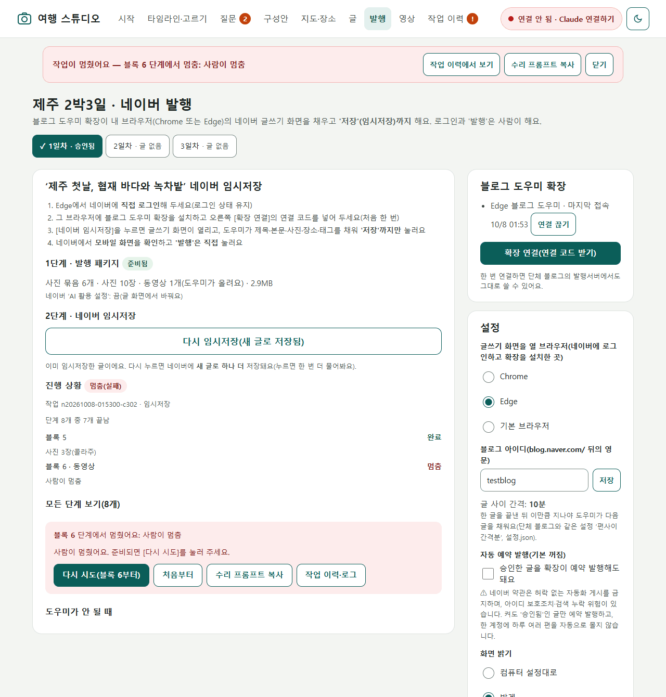
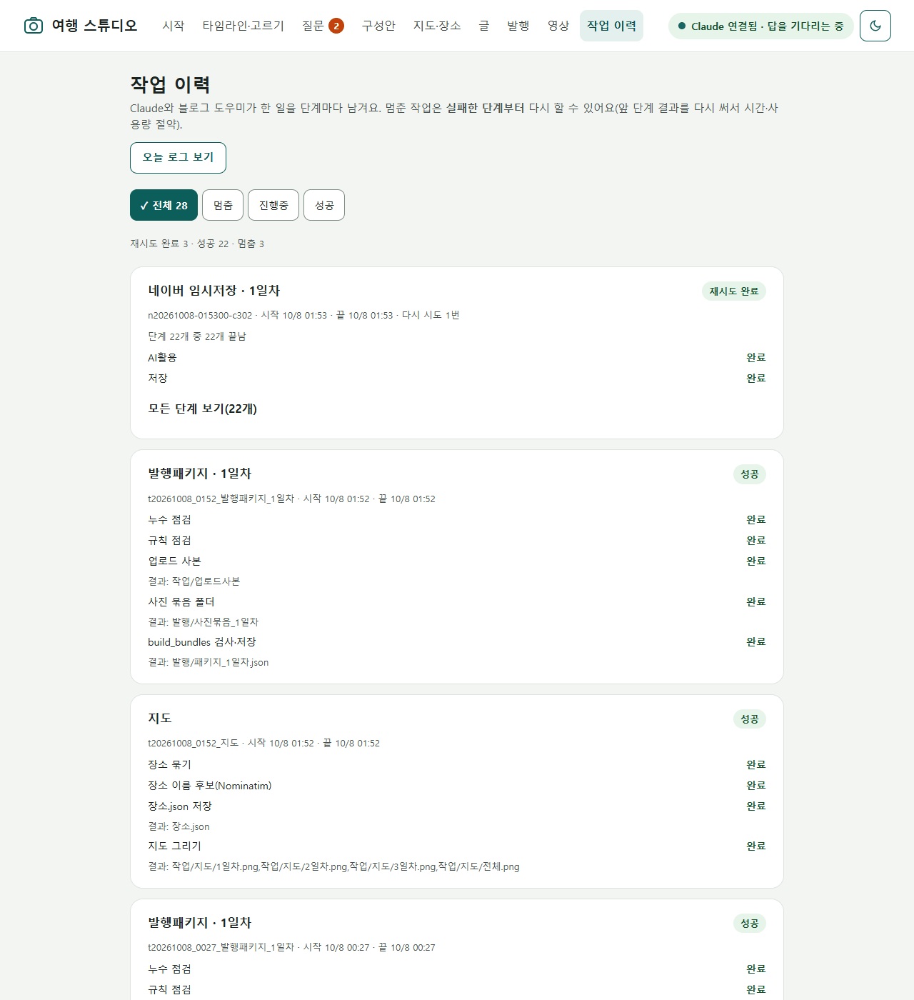

### 8.6 (선택) 자동 예약 발행

> ⚠️ **기본은 꺼져 있습니다.** 네이버 약관은 허락 없는 자동화 게시를 금지하고, 아이디 보호조치·검색 누락 위험이 있습니다. 켜려면 세 가지가 **모두** 필요합니다: ① 발행 설정의 **'자동 예약 발행'** 을 켬(켤 때 위험 안내 확인) ② 그 글을 미리보기에서 **[이 글 승인]** 함(승인 뒤 고쳤으면 다시 승인) ③ 이번에 사람이 예약 시각을 정해 예약 발행을 고름. 글에 **카테고리**(비어 있지 않고 블로그에 있는 이름 그대로 — 발행 설정의 '블로그 카테고리')도 있어야 합니다. AI로 만든 사진·영상이 있다고 표시한 글은 예약 발행되지 않습니다(사진마다 'AI 활용 설정'을 직접 켠 뒤 발행). 예약 시각은 10분 단위(네이버 화면 기준)이고, 우리 도구는 안전을 위해 지금부터 15분 이후만 받습니다(설정 `예약최소여유분`). 한 계정에 하루 여러 편을 몰지 않습니다. 확신이 없으면 켜지 마세요.

### 8.7 끝난 뒤 — 내 사진과 기록은 어디에 남나요

**내 사진으로 했다면 꼭 읽어 두세요.** `실습공간/`은 git에서 빠져 있어서(`.gitignore`의 `실습공간/*`) 튜터 저장소(GitHub)에는 들어가지 않습니다. 하지만 **내 PC에는 그대로 남습니다.**

| 어디에 | 무엇이 남나 |
|---|---|
| 스튜디오 `여행/<여행ID>/발행/` | 업로드 사본(위치·기기 정보를 지운 사본)과 발행 패키지 |
| `여행/<여행ID>/작업/` | 썸네일, 콘택트 시트, 검수 기록 |
| `여행/<여행ID>/원고/` | 글 |
| `여행/<여행ID>/목록.json` | 원본 사진 경로, 촬영 시각, 장면 설명 |
| 스튜디오 `작업함/처리완료/` | 질문 카드에 적은 답 |
| 스튜디오 `로그/` | 날짜별 작업 기록 |
| (폴더 밖) Claude 대화 기록 | 내 PC 사용자 폴더의 Claude 기록(튜터 폴더와 따로). 앱 사이드바에서 세션을 지울 수 있음 |
| (폴더 밖) 블로그 도우미 폴더 | 사용자 폴더의 `.gea-blog-helper` — 연결 정보, 승인 서명 열쇠, 진단 파일(화면 구조만) |
| (폴더 밖) 네이버 | 올린 글 |
| (폴더 밖) Claude 쪽 | 사진 고르기 때 보낸 콘택트 시트 — 보관은 Claude 계정의 개인정보 설정을 따름(5회차) |

- **지우는 법**: 스튜디오 규칙상 Claude는 파일을 지우지 않습니다. 지우고 싶은 것은 선생님이 **파일 탐색기**에서 휴지통으로 옮깁니다(예: 그 여행의 `여행/<여행ID>/` 폴더). 원본 사진 폴더는 스튜디오가 읽기만 했으므로 바뀐 것이 없습니다.
- **튜터 저장소에 안 들어가는지 확인**: 튜터 창에 `git status로 실습공간이 git에서 빠져 있는지 확인해줘.`

✅ **이렇게 되면 성공**
- 확장 연결이 되어 있고, 발행 패키지에 GPS 경고가 없다
- 글 한 편이 임시저장되어, 네이버 화면에서 모바일 모습까지 확인했다
- (내 사진) 비공개로 발행했거나, (샘플) 발행하지 않고 멈췄다
- 실패가 있었다면 [다시 시도]로 그 단계부터 이어서 끝냈다

🆘 **막히면**
- 작업이 오래 '블로그 도우미 기다리는 중'이면: 설정의 브라우저가 확장을 설치한 브라우저와 같은지, 그 브라우저가 로그인 화면에 있지 않은지, [확장 연결]이 되어 있는지 봅니다.
- 블로그 도우미가 아예 안 되면 **발행** 화면 '도우미가 안 될 때' → [글쓰기 화면 열기] 후 확장 패널의 사진 묶음 넣기로 사진만 넣고 글은 직접 넣습니다.
- 확장은 2026-10-08~09 강사 실측으로 실제 네이버에서 임시저장부터 사람 발행까지 확인했지만, 네이버가 화면을 바꾸면 다시 멈출 수 있습니다. 실패는 선생님 탓이 아니니, 멈춘 단계와 화면을 메모해 강사에게 알려 주세요.

---

## Part 9: 다음 여행을 위해

> 🔧 **이번에 익히는 Claude Code 기능**: skill-creator로 스킬 만들기(9회차), 훅(반드시 지키는 자동 규칙, 8회차 개념), 기억 재사용

### 9.1 `travel-blog` 스킬 — 다음 여행용 수첩

🧩 **비유**: 이번 여행에서 깨달은 것을 적어 둔 **다음 여행용 체크리스트 수첩**입니다. 다음에는 처음부터 설명하지 않고 수첩만 건네면 됩니다.

스튜디오 창에 붙여 넣습니다(8회차에 skill-creator를 설치했다면 그대로, 없으면 9회차 Part 2처럼 먼저 설치).
```
skill-creator로 이번 여행기를 만든 과정을 travel-blog 스킬로 만들어줘. 먼저 나를 인터뷰해서 내 여행기 스타일(말투, 한 편 길이, 대표 사진 수, 꼭 넣는 꿀팁 칸, 하루 경계)을 정해줘.
스킬에는 ① 스튜디오 버튼 순서(사진 목록 → 시계 확인 → 고르기 → 구성안 → 지도·장소 → 꿀팁 → 글 → 발행 패키지 → 임시저장) ② 사람이 확인할 곳 ③ 글을 쓰기 전에 꿀팁노트.md를 먼저 읽고 관련 꿀팁 제안 ④ 숙소·집 숨기기, 아이·다른 사람 얼굴은 대표 전에 묻기, 내가 말하지 않은 사실 금지 ⑤ 이번에 막혔던 곳과 해결법을 넣어줘. 이름은 travel-blog 그대로, 설명은 한국어로.
```
만든 뒤에는 입력창에 `/travel-blog`를 쳐서 보이는지 확인하고, 같은 키트를 다른 컨셉(예: 테마별)으로 **구성안까지만** 돌려 봅니다.

### 9.2 GPS 확인 훅 — 공항 보안 검색대

🧩 **비유**: **공항 보안 검색대**입니다. 그 문으로 비행기를 타려면 아무리 급해도 반드시 통과합니다. CLAUDE.md의 규칙은 '지키려고 노력하는 부탁'이지만, 훅은 정해진 순간마다 프로그램이 **매번** 실행하는 장치입니다. 8회차에서 개념만 본 훅을 여기서 처음 직접 만듭니다.

단, 이 훅은 **Claude가 실행하는 명령**만 막습니다. 화면의 [네이버 임시저장]은 선생님이 누르면 서버가 바로 처리해 훅을 거치지 않고, 서버는 GPS가 남아도 경고만 붙입니다. 그 길에서는 8.4 1번의 'GPS·촬영기기 정보가 남음' 경고를 사람이 확인합니다.

스튜디오 창에 붙여 넣습니다.
```
임시저장 작업을 만들기 직전(naver-draft가 발행 작업을 만드는 명령을 실행하기 전)에, 그 편의 사진 묶음 JPG에 GPS·촬영기기 정보가 하나라도 남아 있으면 막는 훅을 이 폴더 설정에 만들어줘. 검사 스크립트는 도구/에 두고, 막을 때는 어느 파일인지 쉬운 말로 알려 주게 해줘. 마지막으로 원본은 건드리지 말고 시험용 사본(GPS가 남은 사진 한 장)으로 정말 막히는지 보여줘.
```
훅은 이 폴더의 `.claude/settings.json`에 들어갑니다. 설정 파일을 바꾸므로 Claude가 무엇을 넣는지 보여 주면 읽고 승인합니다.

### 9.3 꿀팁 노트 다시 쓰기

다음 여행을 시작할 때 스튜디오 창에서 이렇게 시작합니다.
```
새 여행(부산 1박2일) 글을 쓰기 전에 꿀팁노트.md에서 이번 여행에 쓸 만한 꿀팁을 먼저 보여줘. 쓸지 말지는 내가 고를게.
```

### 9.4 스튜디오를 내 문서로 옮기기

`실습공간/`은 튜터를 업데이트해도 지워지지 않지만, 오래 쓸 도구는 **내 문서 폴더**에 두는 편이 찾기 쉽습니다.

1. 스튜디오 창을 닫고 튜터 창에 붙여 넣습니다.
   ```
   실습공간/여행스튜디오 를 내 문서 폴더의 여행스튜디오 로 옮기려고 해. 먼저 켜져 있는 스튜디오 서버를 꺼 주고(무엇을 끄는지 먼저 알려줘), 폴더 전체를 복사해줘. 여행/·로그/·작업함/ 도 함께 옮길지 물어봐줘. 복사가 끝나면 두 폴더의 파일 수를 비교해서 보여줘. 원래 폴더는 내가 확인한 뒤 직접 지울게.
   ```
2. **Select folder**로 새 위치(`문서/여행스튜디오`)의 스튜디오 창을 열고 붙여 넣습니다.
   ```
   이 폴더로 옮겨 왔어. 공용가져오기.py의 원본을 튜터 폴더의 일상실습/01_네이버블로그/참고구현/공용 절대경로로 지정해 다시 실행하고, 바탕화면 아이콘을 이 위치로 다시 만들어줘. 그다음 여행 스튜디오 연결해줘.
   ```
3. 바탕화면 아이콘 → 화면 → 연결됨 → 여행 카드가 그대로인지 확인합니다. 블로그 도우미 확장은 튜터 폴더 안(`참고구현/크롬도우미`)에서 불러온 것이라 **튜터 폴더는 그대로** 둡니다(옮기거나 지우면 확장도 사라짐).

### 9.5 (선택) 참고 구현과 비교

다 만든 **뒤에만** 합니다. 통째로 바꾸지 말고 내 것에 없는 안전장치만 골라 가져옵니다. 스튜디오 창에 붙여 넣습니다.
```
내 스튜디오를 튜터 폴더의 일상실습/01_네이버블로그/참고구현/여행스튜디오 와 비교해줘. 내 것에 없는 단계·안전장치만 표로 보여 주고, 무엇을 가져올지는 내가 고를게. 덮어쓰지 마.
```

✅ **이렇게 되면 성공 (묶음 3 끝)**
- `/travel-blog`가 보이고, 다른 컨셉으로 구성안까지 돌려 봤다
- GPS가 남은 시험용 사본으로 Claude의 임시저장 명령이 막히는 것을 봤다(화면 버튼 길은 경고로 확인)
- 꿀팁 노트를 다음 여행에 꺼내 쓰는 문장을 안다
- (선택) 스튜디오가 내 문서로 옮겨져 아이콘으로 열린다
- 튜터 창에서 `/handoff`로 B를 마무리하고 진행 기록에 "B 완료"를 남겼다

🆘 **막히면**
- 스킬이 안 불리면 description에 내가 실제로 하는 말("여행기 만들자", "다음 여행 글")이 들어 있는지 봅니다.
- 훅이 아무것도 막지 않으면: `훅이 어느 명령에 걸리게 되어 있는지와, 시험 때 실제로 실행된 명령을 나란히 보여줘.`
- 옮긴 뒤 화면이 안 열리면 예전 아이콘을 눌렀을 수 있습니다. 아이콘을 다시 만들어 달라고 합니다.

---

## 💬 딸깍 프롬프트 카드

**스튜디오를 다시 켤 때** (스튜디오 창)
```
여행 스튜디오 연결해줘.
```
**버튼이 반응하지 않을 때** (스튜디오 창)
```
스튜디오 요청 처리해줘. 쌓인 요청이 있으면 보낸 순서대로 처리하고, 끝나면 다시 기다려줘.
```
**작업이 멈췄을 때** (작업 이력의 [수리 프롬프트 복사]와 같은 일)
```
로그/오늘 날짜.log의 마지막 오류를 분석해서 원인을 찾고 고친 다음, 작업 이력의 실패한 단계부터 다시 실행해줘. 앞 단계 산출물은 다시 만들지 마.
```
**어떤 사진의 판정이 궁금할 때**
```
이 사진(파일 이름)이 왜 제외 후보(또는 대표 후보)인지, 시각출처와 장소는 무엇인지 쉬운 말로 설명해줘. 결정은 바꾸지 마.
```
**지적한 곳만 고칠 때**
```
1일차 글의 5번 블록만 고쳐줘: 문장을 두 개로 줄이고 '정말'을 빼줘. 다른 블록은 한 글자도 바꾸지 마.
```

## 🧩 단체에서 쓰려면

여행뿐 아니라 **행사·탐방 사진으로 일자별 소식 글**을 만들 때 같은 스튜디오를 씁니다. 단체 블로그에 올린다면 A 교재의 운영 규칙(CLAUDE.md)·사진 동의 대장과 함께 씁니다.

| 단체 | 이렇게 써 보기 | 꼭 지킬 것 |
|---|---|---|
| 다음세대교육연합 | 연합 행사·케냐(K-EDU) 학교 방문 사진 → 일자별 방문기 | 아동 얼굴은 보호자 동의 확인 전 대표·외부 업로드 금지, 학교 위치는 지도에서 숨기기 |
| 다니엘칼리지 | 캠프·수련회 사진 → 일자별 캠프 소식 | 학생 얼굴 동의(A 5회차 사진 동의 대장) |
| 엘리온에듀학원 | 현장학습·STR 탐방 → 학부모용 후기 | 학생 얼굴이 없는 사진을 대표로 |
| 교과서진화론개정추진회 | 탐사·박물관 견학·심포지엄 현장 → 현장 기록 글 | 전시 설명문은 사진 속 글자 그대로, 사실 문장은 A 교재의 팩트체크 기준 |
| 미션펀드 | 일반 국가 선교지 방문 사진 → 방문기 | **보안국가 관련 사진은 넣지 않음**(위치·얼굴·교회명) |
| SHINE행복한학교 | 촬영 현장·행사 사진 → 소식 글과 돌아보기 영상 | 출연자 동의, 영상은 [선택 문서](B_선택_돌아보기영상.md) |
| 내 생활 | 가족 여행 | 아이 얼굴, 숙소·집 위치 |

## 📝 이해 점검 퀴즈

1. (객관식) 여행 스튜디오가 **원본 사진**에 하는 일은? ① 시계 차이만큼 촬영 시각을 고쳐 저장 ② 흐린 사진 삭제 ③ 읽기만 하고 사본으로 작업 ④ GPS를 지워 덮어쓰기
2. (OX) 콘택트 시트를 보고 Claude가 고른 대표 사진은 그대로 확정된다.
3. (상황) 카메라로 찍은 사진들이 '공항 도착 9분 뒤 바닷가'처럼 이상하게 정렬됐습니다. 가장 먼저 할 일은 무엇일까요?
4. (짧은 서술) 지도에서 자동으로 찾은 장소 이름을 그대로 쓰지 않고 질문 카드로 확인하는 까닭은?
5. (객관식) 화면 오른쪽 위가 '● Claude 연결 안 됨'입니다. 맞는 대응은? ① 화면 새로고침만 계속 ② [Claude 연결하기] → 폴더 확인 → 미리 채워진 문장을 보고 Enter ③ 원본 폴더를 다시 고르기 ④ 확장을 지우고 다시 설치

## 📌 요약

- 원본은 읽기만, 작업은 사본으로. 시계 차이도 목록에서만 맞춥니다.
- 정확한 계산은 스크립트, 장면을 보는 눈은 Claude(콘택트 시트·서브에이전트), 의미와 결정은 사람.
- 장소 이름은 '추정'으로 두고 확인하며, 숙소·집은 지도와 글에서 뺍니다.
- 글은 내가 말한 사실로만, 고칠 땐 지적한 곳만. 승인은 사람이 [이 글 승인].
- 확장은 임시저장까지, 모바일 확인과 '발행'은 사람. 멈추면 그 단계부터 다시.

## ✅ 완료 체크리스트

- [ ] 기기별 사진 폴더를 준비하고(내 사진이면 개인정보 점검까지) 스튜디오 창을 열었다
- [ ] `/design` 시안을 고치고 Hand off → Plan 모드로 뼈대를 만들었고, 디자인 왕복을 한 번 했다
- [ ] 바탕화면 아이콘으로 화면이 열리고, [Claude 연결하기]로 다시 연결해 봤다
- [ ] 사진 목록을 만들고 시계 차이를 질문 카드로 확정했다
- [ ] 제외 후보·대표 후보를 받아 보고 내 손으로 확정했다(지운 사진 없음)
- [ ] 구성안을 고르고, 장소 이름을 확인하고, 숙소를 숨기고, `꿀팁노트.md`를 남겼다
- [ ] 글 한 편을 미리보기로 고치고 승인했다
- [ ] 블로그 도우미로 임시저장 → 모바일 확인까지 했다(샘플은 발행 안 함)
- [ ] (내 사진) 끝난 뒤 내 PC에 남는 것(8.7)을 확인하고, 지울 것은 직접 휴지통으로 옮겼다
- [ ] `travel-blog` 스킬과 GPS 확인 훅을 만들었다
- [ ] 묶음마다 `/handoff`를 남기고 진행 기록을 적었다

## 🔜 다음에 해 볼 것

- 고른 사진과 지도로 몇 분짜리 **돌아보기 영상**을 만들어 보세요: [B_선택_돌아보기영상.md](B_선택_돌아보기영상.md)
- 단체 블로그도 같은 블로그 도우미 연결을 씁니다: [A_단체블로그_정기발행.md](A_단체블로그_정기발행.md)

---

## 🧑‍🏫 튜터용 노트

> 이 절은 튜터(Claude)가 참고하는 내용입니다. 학습자에게 통째로 보여주지 말고 필요할 때 풀어서 쓰세요.

### 진행 규칙
- 진입: "여행 블로그 만들자" → 00 문서 ①(블로그 확인 카드가 없을 때만, 짧게) → Part 1. 위치 표시는 `🗺️ 일상 실습 ① · B Part 4/9 · 사진 목록`.
- **두 창 운영**: 튜터 창은 안내·확인·기록, 스튜디오 창은 구현·처리. Part 2부터 각 실습의 프롬프트는 학습자가 스튜디오 창에 붙여 넣습니다. 튜터는 결과를 학습자에게 묻거나(캡처를 끌어다 놓게 해서) 확인하고, 스튜디오 폴더 파일을 읽어 검증할 수 있습니다(쓰지는 않음 — 쓰는 일은 스튜디오 창의 몫).
- Part마다 끝에 `내_학습기록/일상실습_블로그.md` 진행 기록 표에 한 줄(`| 날짜 | B Part N | 한 일 | 다음 할 일 |`). 묶음 1·2·3 끝에는 `/handoff`를 권합니다.
- 한 Part 안에서도 "도구 만들기(스튜디오 창) → 화면 버튼으로 돌리기 → 질문 카드 답하기" 순서를 지킵니다. 도구를 대화로 바로 돌리게 하지 말고 버튼으로 돌려 GUI 흐름을 경험하게 합니다.
- 버튼 이름은 교재에 참고 구현의 이름을 썼고, 같은 이름을 2.2 시안 프롬프트와 규약 6절 목록에 넣었습니다. 그래도 학습자 스튜디오의 이름이 조금 다르면 같은 기능의 버튼을 짚어 주고 그대로 진행합니다.

### 수준별 설명 가이드
- 🌱 입문: 샘플 키트만 씁니다. Part 2는 고치기 한 곳이어도 통과, 'Design이 안 될 때'(시안 없이) 경로도 허용. Part 3 계획 검토는 3.2의 4번 다섯 가지만 함께 확인합니다. Part 5 비교 실험·8.6 자동 예약·9.2 훅·9.4 옮기기는 건너뛰어도 됩니다. 비유 하나(사진관 현상실·쪽지함)로 끝까지 갑니다.
- 🌿 기초: 샘플로 한 바퀴 뒤 내 사진으로 Part 4~8을 다시 권합니다. 5.2 비교 실험과 9.2 훅을 합니다.
- 🌳 중급: 규약(`여행스튜디오_규약.md`)의 데이터 파일 형식(2절)과 다리(3절)를 직접 읽게 하고, 작업함 쪽지 파일을 열어 흐름을 따라가 보게 합니다. 9.5 비교와 영상 문서의 ①+ HyperFrames를 권합니다.

### 샘플 키트 정답 요지 (학습자에게 답부터 주지 말고 힌트로)
- 구성: 사진 47장(아이폰 19·갤럭시 13·카메라 11·카톡 4) + 영상 3개 = 50, 기기 폴더 4개. HEIC 5장(아이폰 `IMG_4819·4820·4826·4829·4831`).
- **카메라 시계는 실제보다 1:07:00 늦음.** 쌍은 2일차 광치기해변 일출 `아이폰/IMG_4824.JPG` ↔ `카메라/DSC01525.JPG`. 단서: 보정 전 카메라 `DSC01523`이 공항 도착 9분 뒤 협재로 정렬됨, 카메라 일출 사진이 05:17로 기록됨. 보정 후 일차별 17·26·7.
- **흐림 5장**: `IMG_4818`, `20260926_145240`, `IMG_4828`, `KakaoTalk_20260927_115230544`, `DSC01533`.
- **연사 3세트**: `IMG_4814~4817`(베스트 `IMG_4816`), `20260927_110520_001~004`(베스트 `_002`), `DSC01528~01531`(베스트 `DSC01529`). 나머지 9장은 제외 후보.
- **숙소 3장**: `IMG_4821`(1일차 18:21), `IMG_4822`(1일차 19:38), `IMG_4830`(3일차 08:12) — 한 장소, '숙소 추정' → 지도에서 숨김(질문 카드에서 '숨김 유지'가 정답).
- **광치기해변 일출**(2일차 06:1x~06:2x, 아침 7시 전)도 기본 숨김 → 질문 카드에서 '공개해도 돼요'를 고르는 예. 공공장소라 공개해도 되지만, 도구는 시간만 보고 일단 숨깁니다(안전한 쪽).
- **카톡 4장**: 촬영 정보 없음. 파일 이름 시각(11:52:30·13:45:12)은 받은 시각이고 실제 촬영은 그보다 이른(10:58·11:20·13:05·13:22). 사진 내용으로 '2일차 우도'라고 짚으면 정답.
- **영상 3개는 UTC 저장**: 갤럭시 mp4 `03:05:30Z` → 1일차 12:05:30. 아이폰 `IMG_4823.MOV`는 UTC로 읽으면 9/26 21:12(1일차 밤 숙소처럼 보임)지만 실제는 **2일차 06:12 여명** — 대표 함정.
- **대표 후보 4장**(정답표 기준): `DSC01525`(광치기 일출), `DSC01524`(오설록 녹차밭 이랑), `IMG_4829.HEIC`(섭지코지 선돌·등대), `20260926_120211`(협재 에메랄드 바다·비양도). 스크립트 점수만의 후보는 `IMG_4819`·`20260927_062755`·`DSC01532`·`20260928_101012`(0/4). 연사 베스트를 대표로 골라도 정답으로 인정.
- **장소 모름 7장**: 카메라 `DSC01526`(성산 정상)·`DSC01527`(우도봉)·`DSC01532`(섭지) + 카톡 4. 나머지 카메라 사진은 앞뒤 시각으로 장소 추정 가능.
- 키트 사진은 CC BY-SA 등 공개 라이선스(NC·ND 없음). 변형물은 BY-SA 조건, 글에 쓰면 출처 표기. 키트 README가 "실습 결과를 인터넷에 올리지 말라"고 하므로 임시저장까지만.

### 자주 막히는 지점과 대응 (강사 리허설 2026-10-07 · 끝까지 실측 2026-10-08~09)

| 상황 | 원인 | 대응 |
|---|---|---|
| 대기.py를 앞쪽(포그라운드)으로 돌리면 대화가 막힘 | 대기.py는 쪽지가 없으면 설계상 최대 50분 기다림(규약 3절 — 리허설 관찰이 아니라 설계값) | 반드시 백그라운드. studio-connect 스킬의 '처리 후 다시 대기'가 빠졌는지 확인 |
| 승인 창이 매번 뜸 | '항상 허용'을 안 고름, 또는 허용 규칙과 실제 명령 모양이 다름(절대경로·따옴표·`&&`, 가상환경 python 경로, **PowerShell 도구**로 낸 명령 — 리허설 남은 문제) | '항상 허용'을 고르게 하고, 명령은 **Bash 도구로** 폴더 기준 상대경로 그대로. 가상환경을 쓰면 허용 규칙도 그 모양으로 |
| 장소 이름이 길 이름·동네 이름 | 역지오코딩 확대 수준이 낮음(리허설: '올레길 14', 공항='용담2동') | 장소·자연물 층(poi·natural)·zoom 18로, 장소당 1번 |
| 한 장소가 둘로 갈림 | 묶음 반경 250m(오설록 건물·녹차밭 270m) | 300m로 |
| 연사 흔들린 컷까지 '흐림' | 기기 기준 흐림 판정 | 연사 나머지는 묶음 안 상대 비교로만 |
| 자동 대표 후보가 엉뚱함 | 점수는 기술적 품질만 봄(0/4) | 콘택트 시트 + Claude 판단 + 사람 확정(4/4) — 5.1 표 그대로 설명 |
| 지도 첫 실행이 김 | 이름 조회 13번 + 지도 타일(리허설 74초) | 다음부터 캐시로 몇 초. 기다리게 함 |
| 여러 장면을 동시에 만들다 `PermissionError` | Windows에서 막 지워지는 잠금 파일 | 잠금이 그 오류도 '사용 중'으로 보고 다시 시도하게. 재시도는 `--작업ID`로 실패 단계부터(리허설 1.8초) |
| 도구와 서버의 약속이 어긋남 | 서버가 설정 파일을 자기 항목만 남기고 다시 씀 / 작업 상태 값·로그 줄 모양이 서로 다름 / 한글 작업ID를 셸로 넘기다 깨짐 | 도구 설정은 별도 파일, 상태 `진행중/성공/실패`·로그 `날짜 시각 [수준] [도구] [여행ID] …`로 통일, 작업ID는 명령에 직접 |
| 스튜디오와 발행서버가 함께 안 켜짐 | 둘 다 8765 사용 | 동시에 켜지 않기(A와 B를 같은 날 할 때 주의) |
| 미리보기 그림이 안 보임 | Code 탭 Browser 창의 로컬 파일 제한(A 리허설 관찰) | 기본 브라우저로 |
| (실측) 장소 단계 `장소없음`(2편) | 질문 카드 답이 네이버 지도 이름과 띄어쓰기·지점명이 다름(예: '성산 일출봉' ↔ '성산일출봉', 지점이 여럿인 카페) | 장소 창에서 후보를 골라 [추가]·[확인] → [이 단계는 내가 했음 → 다음](잘 통함). 0.5.1: 띄어쓰기만 다른 후보가 하나면 확장이 붙이고 '주의'. 6.2처럼 네이버 지도 이름 그대로(지점명까지) 답하게 |
| (실측) 3편 모두 맨 끝에서 `카테고리없음` | 글쓰기 Claude가 블로그에 없는 카테고리 이름(예: '여행')을 지어 넣음 | 발행 설정 '블로그 카테고리'(블로그에 보이는 이름 그대로, 비우면 발행 때 고름)를 Claude가 그대로 씀. 0.5.1 확장은 임시저장이면 '주의' + 기본 카테고리로 저장, 예약 발행만 거절·실패 |
| (실측) 사진 설명이 '주의'(사진 블록 6개 모두) | 확장의 클릭이 에디터 커서를 설명 칸으로 옮기지 못함(2026-10-09 새벽 확인 — 0.5.1은 설명 글이 사진 아래 본문 줄로 들어가 멈춤) | 0.5.2~0.5.4: 커서가 설명 칸에 들어간 것을 확인한 뒤에만 넣음 → 콜라주는 확장이 넣고, 한 장 사진은 아직 '주의'(원인 미확정). 8.4 체크 목록대로 사람이 넣게. '주의' 문장 괄호 안의 이유는 그대로 강사에게 |
| (실측) 영상 제목이 글 제목으로 들어감 | 영상 블록에 제목이 없으면 확장이 글 제목을 넣음(네이버 필수) | 검수 서브에이전트가 찾아 영상 21개에 제목을 넣음. 이제 글쓰기 규칙 '영상마다 40자 이하 제목' + 발행 패키지가 제목 없는 영상 경고 |
| (실측) [발행 패키지 만들어 달라기]가 오래 걸림 | 영상 업로드 사본(위치·기기 정보 지우기) | 영상 15개(655MB) 약 18분, 6개(157MB) 약 7분 — Claude가 뒤에서 하나씩. 멈춘 게 아니니 기다리게 함(8.4 '시간 감각') |
| (실측) 아이폰(HEIC) 사진에서 사진 목록이 멈춤 | `pillow-heif` 없음 | 학습자가 터미널에서 직접 설치 후 다시(4.2 🆘) |

### 확인 질문 답 예시
- 1.1 사본으로만 → 잘못돼도 되돌릴 수 있고, 촬영 시각·위치 꼬리표가 남아 순서를 다시 맞출 수 있으며, 여러 번 다시 해 볼 수 있습니다.
- 2.1 시안 먼저 → 다시 만드는 시간·사용량, 나와 Claude 사이에 말이 엇갈리는 일.
- 3.1 창을 닫고 버튼 → 쪽지만 쌓이고 '기다리는 중'에 머묾. 다시 연결하거나 "스튜디오 요청 처리해줘"라고 하면 쌓인 쪽지를 보낸 순서대로 처리합니다.
- 4.1 공항 9분 뒤 바닷가 → 카메라 시계 차이. [기기 시계 확인 부탁]으로 같은 순간 사진 쌍을 찾습니다.
- 5.1 Claude가 모르는 것 → 추억의 의미, 사진 속 사람이 누구인지와 올려도 되는지(동의).

### 퀴즈 정답과 해설
1. **③.** 원본은 읽기만 합니다. 시계 차이는 목록(`기기보정초`)에서만, GPS 제거는 업로드용 사본에서만, 흐린 사진은 '제외 후보' 표시만 합니다.
2. **X.** Claude의 선택은 '대표 후보'일 뿐입니다. 사용·대표·제외 결정(`사용자결정`)은 화면에서 사람만 바꾸고, Claude는 이 값을 바꾸지 않습니다. 추억의 의미와 올려도 되는지는 사람만 압니다.
3. **[기기 시계 확인 부탁]** 으로 같은 순간을 찍은 다른 기기 사진 쌍을 찾아 차이를 계산하고, 질문 카드로 '같은 순간'임을 확인한 뒤 목록에 반영합니다. 원본 시각을 직접 고치는 것은 오답입니다.
4. 좌표로 찾은 이름은 근처 가게·동네·주차장·영어 이름일 때가 많아(경복궁 → 근처 시설, 한옥마을 → 주차장, 공항 → 동 이름) 그대로 쓰면 글이 틀립니다. 숙소는 이름 조회도 하지 않습니다.
5. **②.** 딥링크는 폴더 확인 창을 띄우고 문장을 미리 채울 뿐 자동으로 보내지 않습니다. 앱이 안 열리면 Code 탭에서 스튜디오 폴더를 직접 열고 "여행 스튜디오 연결해줘".

### 검수 기준 (한 편이 '임시저장해도 됨'인지)
- [ ] 원본 폴더 파일 수·크기·수정 시각이 그대로
- [ ] 시각출처가 약한 사진(카톡·파일 수정 시각)은 사람이 확인했거나 '추정'으로 남음
- [ ] 제외는 사람이 정했고 지운 파일 없음
- [ ] 장소 이름이 모두 확인됨(또는 숨김), 숙소·집이 지도·글·사진 설명에 없음
- [ ] 대표는 낱장, 그룹 사진 10장 이하, 장소 5곳 이하
- [ ] 장소 이름은 네이버 지도 이름 그대로(지점명까지), 영상마다 제목(40자 이하), 카테고리는 설정의 '블로그 카테고리'
- [ ] 글에 학습자가 말하지 않은 사실이 없음, 참고자료 블록(사진·지도 출처, AI 사용 표기)
- [ ] 발행 패키지에 GPS·촬영기기 경고 0, 내부 표시 없음
- [ ] 승인 상태가 '승인됨'(고친 뒤라면 다시 승인)

### 안전·개인정보 주의
- 네이버 비밀번호·인증번호·확장 연결 코드를 Claude가 입력하지 않습니다. 학습자가 대화창에 붙여 넣으려 하면 말립니다.
- 내 사진을 쓸 때 아이·다른 사람 얼굴이 많으면, Claude에게 보여 줄 사진에서 빼는 선택지를 먼저 제안합니다. 보안국가 선교 관련 사진은 스튜디오에 넣지 않습니다.
- 숙소 추정 장소는 확인 전 이름 조회를 하지 않게(위치를 외부에 보내지 않게) 합니다.
- 자동 예약 발행은 🌱에게 권하지 않습니다. 켤 때는 8.6 경고를 학습자가 직접 읽게 합니다.
- 샘플 키트 결과물(글·지도·영상)은 공개하지 않습니다.

### 참고 구현을 보여 주는 시점과 방법
- 위치: `일상실습/01_네이버블로그/참고구현/여행스튜디오/`(서버·화면·도구·studio-connect·naver-draft·아이콘·실행 파일), 공용은 `참고구현/공용/`, 확장은 `참고구현/크롬도우미/`.
- **먼저 보여 주지 않습니다.** 학습자의 Claude가 시안과 규약으로 직접 만듭니다. 보여 주는 때: ① 같은 곳에서 두 번 고쳐도 안 될 때 → 그 파일·그 함수만 비교(예: "지도.py의 장소 묶기만") ② 사용량 한도나 시간 때문에 학습자가 원할 때 → 그 도구 하나만 비교·가져오기 ③ Part 9.5 '비교' 단계.
- 어느 경우든 통째로 복사하지 않고 "내 것에 없는 안전장치" 표 → 학습자가 고름 → 그 부분만. 학습자가 시간이 정말 없어 전부 가져오고 싶다고 하면, 손에 남는 것이 줄어든다는 점을 한 줄로 말하고 학습자 결정에 따릅니다.
- **예외(처음부터 가져다 씀)**: 공용 미리보기·발행 모듈(`공용가져오기.py`로), naver-draft 스킬(Part 8.2), 블로그 도우미 확장. 이것들은 학습자가 고치지 않게 하고, 네이버 화면 변화로 고칠 일이 생기면 강사에게 알리게 합니다.
- 참고 구현은 개발자들이 계속 고치는 중입니다. 기억에 의존하지 말고 실제 파일을 열어 비교합니다.

### 확인 필요로 남긴 것
- Claude Design의 자동 저장·아트보드별 PNG/PDF 내보내기는 code.claude.com 'Draft a design canvas', Export → Hand off to Claude Code와 번들 주소 프롬프트는 Claude Academy 튜토리얼이 근거입니다. 정확한 메뉴 모양과 프롬프트 모양은 강사 실측 전(실측 뒤 캡처로 교체), `/design`이 팀 플랜에서 보이는지(관리자 설정)도 확인 필요.
- 학습자 Claude가 규약만으로 뼈대를 만드는 데 걸리는 시간과 사용량(통합 리허설 결과로 보완 예정).
- 블로그 도우미 확장은 2026-10-08 실제 네이버 화면에서 실측했고, 2026-10-08~09에는 강사의 실제 사진·영상 38개로 여행 스튜디오의 목록 → 고르기 → 구성안 → 3편 글쓰기·검수 → 승인 → 발행 패키지 → 임시저장 → 사람 발행을 Windows·Edge에서 끝까지 돌렸습니다(공통 문서 '실측 결과', 걸린 곳은 확장 0.5.1에서 고침). 한 장 사진의 설명 칸이 확장의 클릭을 받지 않는 원인, 예약 발행, Chrome·Mac은 아직 남았습니다.
- 0.5.1 수정(장소 띄어쓰기 붙이기·임시저장 카테고리 '주의'·설명 실패 이유)은 2026-10-09 새벽 샘플 키트 사진 시험 글(장소 '성산 일출봉')로 실제 네이버에서 확인했습니다. 같은 때 사진 설명은 확장 0.5.2~0.5.4로 고쳐 콜라주는 자동으로 들어가고, 한 장 사진은 아직 사람이 넣습니다(지금 확장 0.5.4).
- 눈 감음 판정은 키트에 얼굴이 없어 실제 얼굴로 검증하지 못했습니다.
- Mac 실기(바탕화면 `.command`, 아이콘, Homebrew Python·mediapipe Apple Silicon)는 확인하지 않았습니다.
- 카카오톡 전송 방식별 촬영 정보 유지 여부(조사 자료끼리 상충).
- 통합 리허설(Part 1~9를 한 흐름으로) 결과는 강사가 이 문서의 시간·화면 캡처·문구에 반영합니다.
