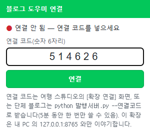
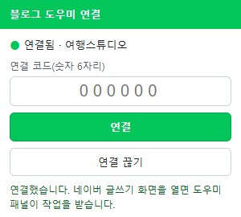
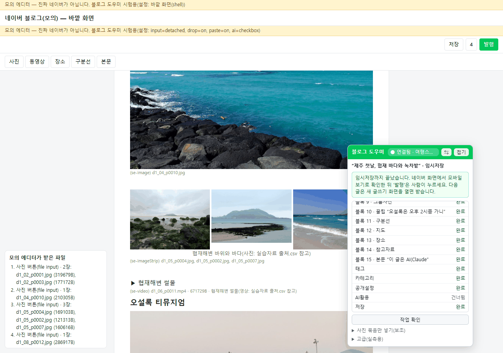

> [!info] 일상 실습 정보
> **실습**: 일상 실습 ① 네이버 블로그 자동화 — **공통: 네이버 연동(블로그 도우미 확장)** · **형식**: A·B가 함께 쓰는 문서
> **걸리는 시간**: 처음 설치·로그인·연결 약 30분 · 그다음부터 글 한 편 임시저장은 몇 분(사진 수에 따라)
> **여는 때**: [A 단체 블로그](A_단체블로그_정기발행.md) 8회차 카드 · [B 여행 스튜디오](B_여행블로그_스튜디오.md) Part 8 · **먼저 할 것**: [00 문서](00_시작_블로그확인.md) ③ 준비물(Chrome 또는 Edge)
> **확장 폴더**: `일상실습/01_네이버블로그/참고구현/크롬도우미/` (공용 도구 — 고치지 않고 그대로 씀)

# 공통: 네이버 연동 — 블로그 도우미 확장 설치·연결·문제 해결

> 동료가 원고와 사진을 꾸려 두면, 내 브라우저에 사는 작은 도우미가 네이버 글쓰기 화면을 채우고 '저장'까지 해 둡니다.
> 로그인과 '발행'은 언제나 선생님 손으로 합니다.

## 🗺️ 이 문서의 자리

```
A 단체 블로그(8회차 카드) ─┐
                         ├→ ▶ 공통: 블로그 도우미 연결(이 문서) → 글마다: 임시저장 → 사람이 확인·발행
B 여행 스튜디오(Part 8) ──┘
```

**어떻게 움직이나**

```
내 PC 안                                                 내 브라우저(Chrome 또는 Edge, 내가 로그인)
발행 패키지 → 서버(127.0.0.1:8765) ⇄ 블로그 도우미 확장 → 네이버 글쓰기 화면: 제목·본문·사진·동영상·장소·태그… → '저장'
             (여행 스튜디오 또는 발행서버)  (연결 코드로 짝지음)
```

글·사진·동영상은 내 PC 안에서만 오가다가 네이버 글쓰기 화면으로 들어갑니다. 확장은 내 PC의 `127.0.0.1:8765` 말고는 아무 데도 보내지 않습니다.

## 🎯 이 문서에서 할 일

- [ ] 왜 Claude가 직접 누르지 않고 확장을 쓰는지 설명할 수 있다
- [ ] Chrome 또는 Edge에 확장을 설치하고, **같은 브라우저에서** 네이버에 직접 로그인한다
- [ ] 연결 코드로 확장과 내 PC 서버를 짝짓고, 연결 목록을 확인한다
- [ ] (단체 블로그) 공용 도구·naver-draft 스킬·`블로그설정.json`을 프로젝트에 준비한다
- [ ] 임시저장 흐름을 따라가고, 사람이 마무리·발행한다
- [ ] 멈췄을 때 실패 코드를 읽고 그 단계부터 다시 한다

---

## ① 왜 블로그 도우미 확장인가

🧩 **비유**: 집 열쇠(로그인)는 내가 갖고 있고, 집 안에 둔 **서류 도우미**가 내가 건넨 서류를 양식에 옮겨 적어 **책상 위(임시저장)** 에 올려 둡니다. 우체통에 넣는 일(발행)은 내가 합니다.

| 길 | 사실 | 이 실습에서 |
|---|---|---|
| 네이버 공식 글쓰기 API | **2020-05-06에 종료**, 대신할 공식 발행 수단이 없음 | 쓸 수 없음 |
| 프로그램이 브라우저를 대신 조작(Playwright·Selenium) | 네이버 이용약관(2026-10-01 시행)은 허락 없는 자동화 수단으로 로그인·게시하는 것을 금지. 보안 캡차, 공개되지 않은 하루 발행 수 제한, 아이디 보호조치가 걸림. 한 유튜브 사례(개인 경험담)는 Playwright 전용 브라우저에서 보호조치·봇 확인이 자주 떠서, 평소 쓰는 Chrome에서 직접 로그인하고 자체 확장을 쓰는 방식으로 바꿨더니 뜨지 않았다고 소개 | 쓰지 않음 |
| Claude in Chrome(Claude가 내 Chrome을 조작) | 2026-08 국내 후기에 네이버 검색·블로그·카페가 "safety restrictions"로 막혔다는 보고 | 기본 아님 — 막힌 화면을 살펴보는 **보조**로만 |
| Code 탭 안의 Browser 창 | 강사 PC에서 naver.com 계열이 같은 메시지로 열리지 않음(2026-10-06 관찰) | 쓰지 않음 |
| computer use | 브라우저는 '보기 전용' 등급, Pro·Max 전용(팀 플랜 불가) | 쓰지 않음 |
| 사람이 복사·붙여넣기 | 네이버도 외부 붙여넣기를 권장하지 않음(숨은 서식 오류, 붙여 넣은 사진이 사라질 수 있음) | 쓰지 않음(강사 결정) |
| **블로그 도우미 확장** | 사람의 **평소 브라우저**에서 **사람이 직접 로그인**, 사람이 설치한 확장이 한 편씩 채우고 **'저장'에서 멈춤** | **기본 경로** |

이 방식도 **약관상 회색지대**입니다. 네이버의 공식 입장은 없고, SmartEditor ONE 도움말은 별도 도구 사용을 지원하지 않는다고 적고 있습니다. 그래서 세 가지를 지킵니다: **임시저장까지만, 한 번에 한 편 천천히, '발행'은 사람.**

💭 **확인 질문**: 로그인을 Claude나 확장에 맡기지 않고 사람이 직접 하는 이유를 두 가지 말해 보세요.

## ② 누가 무엇을 하나

| 일 | 선생님 | Claude | 블로그 도우미 확장 |
|---|---|---|---|
| 확장 설치 · 네이버 로그인 · 연결 코드 입력 | ✅ 직접 | 연결 코드를 만들어 보여 줌 | 코드를 받아 연결 |
| 미리보기 승인 | ✅ 직접 | 미리보기 만들기 | — |
| GPS 지운 사진 사본 · 발행 패키지 · 내부 표시 점검 | 확인 | ✅ | — |
| 작업 만들기 · 글쓰기 화면 열기 | (스튜디오 버튼) | ✅ | — |
| 제목·블록·사진·동영상·장소·태그·카테고리·공개·AI 활용 채우기 → **'저장'** | 화면 보기(손대지 않기) | 결과 읽고 보고 | ✅ |
| 모바일 화면 확인 · 확장이 못 넣은 것 채우기 · **'발행'** | ✅ 직접 | — | (선택 기능, 기본 꺼짐) |

| 확장이 하는 일 | 확장이 하지 않는 일 |
|---|---|
| 연결된 내 PC 서버에서 작업·글·사진·동영상 받기 | 네이버 로그인, 비밀번호·캡차 입력 |
| 글쓰기 화면을 채우고 **'저장'** | 기본 모드에서 **발행 확인 버튼 누르기**(작업 중에는 눌리지 않게 막음) |
| 단계마다 결과를 서버에 보고, 실패하면 그 단계에서 멈춤 | 모르는 창·버튼을 짐작해서 누르기 |
| 로그인·보호조치·캡차 화면을 보면 즉시 멈춤 | 여러 편을 연달아 빠르게 넣기 |
| | **외부 서버로 무엇이든 보내기** |

## ③ 설치 (한 번만) — Chrome·Edge

확장을 설치할 브라우저 **하나**를 정합니다. 네이버 로그인도 그 브라우저에서 합니다. 버전 111 이상이면 됩니다. 화면 글자는 브라우저 버전에 따라 **조금 다를 수 있습니다.**

| 순서 | Chrome | Microsoft Edge |
|---|---|---|
| 1 | 주소창에 `chrome://extensions` (또는 점 세 개 메뉴 → 확장 프로그램 → 확장 프로그램 관리) | 주소창에 `edge://extensions` (또는 점 세 개 메뉴 → 확장 → 확장 관리) |
| 2 | 오른쪽 위 **개발자 모드** 켜기 | 왼쪽(또는 아래)의 **개발자 모드** 켜기 |
| 3 | **압축해제된 확장 프로그램을 로드** → 튜터 폴더의 `일상실습/01_네이버블로그/참고구현/크롬도우미` 폴더 고르기 | **압축 풀린 항목 로드**(Load unpacked) → 같은 폴더 고르기 |
| 4 | 목록에 **블로그 도우미 (네이버 글 채우기)** 가 보임 | 같음 |
| 5 | (권장) 주소창 옆 퍼즐 아이콘 → 블로그 도우미 **고정** | (권장) 확장 아이콘 → 블로그 도우미 **도구 모음에 표시** |

> 🖼️ **화면 모습(Chrome)**: 주소창에 `chrome://extensions`를 치면 확장 관리 화면이 열립니다. 오른쪽 위 **개발자 모드** 스위치를 켜면 왼쪽 위에 **압축해제된 확장 프로그램을 로드합니다** 단추가 나타납니다.
> 🖼️ **화면 모습(Edge)**: 주소창 오른쪽 **확장** 단추 → **확장 관리**(또는 `edge://extensions`). **개발자 모드**를 켜면 **압축 풀린 항목 로드**(Load unpacked) 단추가 나타납니다. 화면 문구는 조금 다를 수 있습니다.

- 설치할 때 "blog.naver.com 데이터 읽기·변경" 권한이 보입니다. 글쓰기 화면을 채우는 데 필요하며, 실제로는 **블로그 글쓰기 화면 주소에서만** 동작합니다. 그 밖에는 내 PC의 `127.0.0.1:8765`와 연결 정보 저장만 씁니다.
- '개발자 모드'로 직접 설치하는 확장이므로 8회차 **안전 체크 5가지**를 똑같이 적용합니다. 튜터 창에서 이렇게 확인해 보세요.
  ```
  일상실습/01_네이버블로그/참고구현/크롬도우미 의 manifest.json과 README.md를 읽고, 8회차 안전 체크 5가지로 이 확장이 어떤 화면에서 동작하고 어디에 접속하고 무엇을 저장하는지 쉬운 말로 요약해줘. 파일은 고치지 마.
  ```
- 확장은 **그 폴더에서 불러온 것**이라 튜터 폴더를 옮기거나 지우면 확장도 사라집니다. 튜터를 업데이트해 확장 파일이 바뀌었다면 확장 카드의 **새로고침(⟳)** 을 누르고 네이버 화면도 새로고침합니다.

## ④ 같은 브라우저에서 네이버 직접 로그인

- 확장을 설치한 **그 브라우저**에서 네이버에 로그인합니다. Chrome에 설치하고 Edge에서 로그인하면 확장이 작업을 받지 못합니다.
- 로그인 화면의 **'로그인 상태 유지'** 를 켜 둡니다(정확한 문구는 조금 다를 수 있습니다). 2단계 인증을 쓰면 휴대폰 네이버 앱에서 허용하는 것도 사람이 합니다.
- 비밀번호·인증번호는 Claude에게 알려 주지 않습니다. 확장도 로그인 화면에서는 아무것도 하지 않습니다.
- 단체 블로그는 네이버 '단체회원' 계정을 검토할 수 있습니다(멤버 비밀번호 방식, [00 문서](00_시작_블로그확인.md) 1.3).

## ⑤ 연결 코드 — 확장과 내 PC 서버를 짝짓기

🧩 **비유**: 블루투스 이어폰의 **페어링 번호**입니다. 한 번 짝을 지으면 내 폰만 그 이어폰을 씁니다. 연결 코드도 내 PC 서버가 **내가 설치한 그 확장만** 알아보게 해서, 다른 확장이나 웹사이트가 내 글·사진을 가져가지 못하게 합니다.

| 쓰는 곳 | 연결 코드 받는 법 |
|---|---|
| 여행 블로그(B) | 스튜디오 화면 **발행** → **[확장 연결(연결 코드 받기)]** |
| 단체 블로그(A) | Claude에게 `확장 연결하게 발행서버를 연결만 모드로 켜 줘` → Claude가 프로젝트의 `도구/발행서버.py`를 **연결만 모드**(글 없이 연결만 하는 모드)로 켜고 6자리 코드를 보여 줌(처음 승인 창은 '항상 허용'). 공용 도구를 아직 안 가져왔다면 ⑥을 먼저 |

**코드를 넣는 동안 내 PC 서버가 켜져 있어야 합니다.** 여행 스튜디오는 화면이 열려 있으면 켜져 있습니다. 단체 블로그는 아직 글(발행 패키지)이 없는 8회차에도 **연결만 모드**로 켭니다: 서버가 코드를 보여 줌 → 내가 팝업에 넣음 → 서버 쪽에 '연결 목록'이 나옴 → Claude에게 "서버 꺼 줘"(연결되자마자 저절로 꺼지게 해 달라고 해도 됨). 연결 정보는 내 PC에 남아서 9회차에 글이 생긴 뒤 켠 서버에서도 그대로 통합니다. 같은 PC에 여행 스튜디오가 있다면 스튜디오에서 연결해도 단체 블로그에서 그대로 됩니다.

👣 **단계**
1. 위에서 6자리 코드를 받습니다. **5분 안에, 한 번만** 쓸 수 있습니다.
2. 브라우저 오른쪽 위 퍼즐(확장) 아이콘 → **블로그 도우미** → '연결 코드(숫자 6자리)' 칸에 **직접** 입력 → **[연결]**.
3. 팝업에 **'● 연결됨 · 발행서버'**(또는 여행스튜디오)가 보이면 끝입니다.




- 시간이 지났거나 5번 틀리면 그 코드는 못 씁니다. 새 코드를 받으세요.
- **한 번 연결하면 여행 스튜디오와 발행서버 둘 다** 됩니다(같은 PC, 같은 연결 정보). Chrome·Edge에 같은 확장을 함께 넣으면 **나중에 연결한 브라우저만** 통합니다. 평소 쓰는 브라우저 하나로 정하세요.
- 연결 확인: 스튜디오는 발행 화면의 '블로그 도우미 확장' 목록, 단체 블로그는 Claude에게 `블로그 도우미 연결 목록 보여줘`. 끊기는 팝업의 **[연결 끊기]** 또는 `연결 모두 끊어줘`.
- 연결 코드를 Claude에게 입력하게 하지 않습니다. 코드는 화면에 보이면 내가 팝업에 넣습니다.

## ⑥ 단체 블로그 프로젝트에 공용 도구 가져오기 (A 8회차 카드)

여행 스튜디오는 이 절이 필요 없습니다(스튜디오의 `공용가져오기.py`와 발행 화면 설정이 같은 일을 합니다). 단체 블로그는 프로젝트 폴더(`실습공간/과제/내프로젝트/`)에 아래를 **복사해서** 씁니다. 공용 도구라 **고치지 않습니다.**

| 가져올 것 | 원본(튜터 폴더) | 프로젝트에 둘 곳 | 하는 일 |
|---|---|---|---|
| `발행서버.py` | `일상실습/01_네이버블로그/참고구현/공용/` | `도구/발행서버.py` | 내 PC 안 서버(127.0.0.1:8765), 연결 코드, 발행 작업·결과 |
| `미리보기.py` + `템플릿.html` | `참고구현/공용/미리보기/` | `도구/`에 **두 파일을 함께** | 네이버식 미리보기(PC/모바일). 템플릿은 미리보기.py 옆에 있어야 함 |
| `naver-draft` 스킬 | `참고구현/공용/skills/naver-draft/` | `.claude/skills/naver-draft/` | 패키지 → 확장 작업 → 결과 보고 |
| (선택) `AI삽화.py` | `참고구현/공용/` | `도구/` | Codex로 사진 → 삽화(ChatGPT Plus 필요) |
| (참고) `발행API.md` | `참고구현/공용/` | 복사 안 해도 됨 | 서버와 확장 사이의 약속 문서 |

**`블로그설정.json`** (프로젝트 폴더 맨 위)
```json
{"블로그ID": "내블로그아이디", "브라우저": "chrome", "자동예약발행": false, "편사이간격분": 30}
```

| 칸 | 뜻 |
|---|---|
| `블로그ID` | `blog.naver.com/` 뒤의 영문(글쓰기 화면 주소를 만듦) |
| `브라우저` | `chrome` / `edge` / `default`(PC 기본 브라우저) — **확장을 설치한 브라우저와 같아야** 함 |
| `자동예약발행` | 기본 `false`. 켜기 전에 ⑪을 읽음 |
| `편사이간격분` | 한 편 끝난 뒤 다음 편까지 최소 간격(분, 적지 않으면 10) |

나머지 두 키(`예약최소여유분` 15분 · `중단판정분` 10분)는 기본값이 있어 적지 않아도 됩니다. 여행 스튜디오의 `설정.json`도 같은 여섯 키를 씁니다.

A 8회차 카드처럼 **튜터 폴더 세션**에 붙여 넣습니다(몰아서 경로 3회도 같음).
```
일상실습/01_네이버블로그/공통_네이버연동_블로그도우미.md ⑥대로 공용 도구를 실습공간/과제/내프로젝트 로 가져와줘: 일상실습/01_네이버블로그/참고구현/공용 의 발행서버.py, 미리보기/미리보기.py, 미리보기/템플릿.html은 그 프로젝트의 도구/에, skills/naver-draft는 그 프로젝트의 .claude/skills/naver-draft에. 공용 파일은 고치지 마. 그다음 그 프로젝트에 블로그설정.json을 나에게 하나씩 물어보며 만들고(브라우저는 확장을 설치한 것), 아직 글이 없으니 발행서버를 연결만 모드(--연결만)로 켜서 연결 코드를 보여줘. 코드는 내가 확장 팝업에 직접 넣을게. 연결 목록이 나오면 서버는 꺼줘.
```
이미 프로젝트 폴더 세션에 있다면 경로만 바꿔 "튜터 폴더(이 폴더에서 세 단계 위)의 일상실습/01_네이버블로그/참고구현/공용 에서 …"라고 하면 됩니다.

**같은 자리(8765)를 쓰는 서버는 하나만**: 여행 스튜디오와 발행서버를 **동시에 켜지 않습니다.** A와 B를 같은 날 하면 하나를 끈 뒤 다른 하나를 켭니다.

## ⑦ 임시저장 흐름

| # | 누가 | 무엇을 | 어디서 보이나 |
|---|---|---|---|
| 1 | 사람 | 미리보기를 보고 승인 | B: [이 글 승인] / A: "이 글 승인" |
| 2 | Claude | 발행 패키지: GPS·기기 정보 지운 사본, 영문 파일명, 장당 10MB 이하, 내부 표시(`[S3]`·'내부용'·'예상 반론' 등) 점검 | 패키지 경고(GPS 경고가 있으면 멈춤) |
| 3 | A: Claude / B: 사람(버튼) | 작업을 만들고 **설정한 브라우저로** 글쓰기 화면 열기 | B: 사람이 [네이버 임시저장] / A: naver-draft |
| 4 | 확장 | 글쓰기 화면 오른쪽 아래 **블로그 도우미 패널**이 작업을 받고 **5초 뒤** 시작(그 사이 [멈춤]) | 패널 |
| 5 | 확장 | 준비 → 제목 → 블록(소제목·본문·인용구·사진 묶음·동영상·장소·구분선·참고자료) → 태그 → 카테고리 → 공개설정 → AI활용 → **저장** | 패널의 단계 목록, B 발행 화면, A는 Claude 보고 |
| 6 | 확장 | "임시저장까지 끝났습니다" | 패널 |
| 7 | 사람 | 마무리하고 발행(⑧) | 네이버 |



- **채우는 동안 화면을 만지지 않습니다.** 끝나면 패널 문장대로 합니다.
- 사진 여러 장은 네이버 그룹 사진 방식(**개별 사진 / 콜라주 / 슬라이드**)으로, 장소는 한 번에 5곳까지 넣습니다.
- **동영상도 확장이 네이버 '동영상' 버튼으로 올립니다**(위치·기기 정보를 지운 사본, 실측 전). 업로드·인코딩이 끝날 때까지 최대 30분 '처리 중'으로 기다립니다. 안 되면 그 단계에서 멈추니(⑨ `영상없음`·`영상전달`·`시간초과`), 패키지 폴더의 mp4를 '동영상' 버튼으로 직접 올린 뒤 패널의 **[이 단계는 내가 했음 → 다음]** 을 누릅니다.
- 카테고리는 블로그 카테고리와 **글자까지 같은 것**만 고릅니다. 다르면 멈춥니다.
- 태그·카테고리·공개를 넣으려고 '발행' 설정 창을 열지만, 그 창의 **최종 발행 버튼은 누르지 않습니다**(확장 안전장치).
- **한 번에 한 편.** 끝난 작업 뒤 설정 `편사이간격분`(두 곳 모두 같은 키, 기본 10분) 동안 서버가 다음 작업을 내주지 않습니다. 이미 글이 있는 화면은 새 작업을 받지 않으니 다음 글은 **새 글쓰기 화면**에서 합니다.

## ⑧ 사람이 마무리하고 발행

1. 네이버 글쓰기 화면 오른쪽 위 **'저장'** 옆 숫자 → 임시저장 목록에서 이 글 열기
2. 오른쪽 아래 **기기 아이콘**을 눌러 PC → 모바일 → 태블릿 화면 확인(SmartEditor ONE에는 따로 '글 미리 보기'가 없고 이것이 미리보기입니다)
3. '주의'·실패로 남은 단계 직접 채우기: 빠진 사진 설명, 사진 묶음(패키지 폴더의 사진), 확장이 못 올린 동영상(이미 들어갔는지 먼저 보고 **'동영상'** 버튼으로 — 두 번 올리지 않게)
4. **'발행'** 설정 창에서 카테고리·태그(30개 이하)·공개 범위 확인 → 처음 몇 편은 **비공개** → 사람이 **'발행'**
5. Claude에게 `방금 발행했어. 주소는 https://blog.naver.com/… 이야. 기록해줘.`

비공개로 발행한 글을 공개로 바꾸면 검색에 반영되기까지 최대 1일이 걸릴 수 있습니다. **연습 샘플(여행 사진 키트 등)로 만든 글은 발행하지 않고** 모바일 확인까지만 합니다.

## ⑨ 실패 코드별 대응

확장은 모르는 화면에서 추측으로 누르지 않고 **그 단계에서 멈춥니다.** 멈춘 단계·코드·문장이 패널과 B 발행 화면(또는 A의 Claude 보고)에 나옵니다.

| 코드 | 뜻 | 할 일 |
|---|---|---|
| `로그인필요` | 그 브라우저가 로그아웃 상태 | 그 브라우저에서 직접 로그인 → 그 단계부터 다시 |
| `보안확인` | 자동입력 방지·보호조치 화면 | 사람이 처리 → 다시. 자주 뜨면 그날은 멈추고 다음 날 천천히 |
| `팝업` | 모르는 창이 뜸 | 창 내용을 읽고 사람이 닫기 → 다시 |
| `선택자없음` | 버튼·칸을 못 찾음 — 네이버 화면이 바뀌었을 가능성 | ⑩ |
| `확인필요` | 결과가 확실하지 않음 | 네이버 화면을 눈으로 확인한 뒤 다시 또는 [이 단계는 내가 했음 → 다음] |
| `에디터비어있지않음` | 글쓰기 화면에 이미 글이 있음 | 새 글쓰기 화면을 열고 다시 |
| `앞단계없음` | 앞 단계 내용이 화면에 없음(새로고침 등) | **처음부터**(새 글쓰기 화면) |
| `카테고리없음` | 같은 이름의 카테고리가 없음 | 글의 카테고리 이름을 블로그와 글자까지 똑같이 고친 뒤 다시 |
| `장소없음` | 네이버 장소 검색에서 못 찾음 | 장소 이름 확인(정식 이름으로) 또는 그 장소만 사람이 |
| `사진없음` | 넣을 사진 파일이 없음 | 발행 패키지를 다시 만들기 |
| `영상없음` | 동영상 사본을 서버에서 받지 못함 | 발행 패키지를 다시 만들기. 급하면 패키지 폴더의 mp4를 '동영상' 버튼으로 직접 올리고 [이 단계는 내가 했음 → 다음] |
| `영상전달` | 확장 안의 동영상 전달 창이 열리지 않음(네이버 화면 정책 등, 실측 전) | 패키지 폴더의 mp4를 '동영상' 버튼으로 직접 올리고 [이 단계는 내가 했음 → 다음] |
| `시간초과` | 단계가 너무 오래 걸림(동영상은 업로드·인코딩이 30분 안에 안 끝남) | 화면 확인 후 다시. 동영상이 이미 들어갔으면 [이 단계는 내가 했음 → 다음]. '아직 멈추지 않음'이 붙으면 몇십 초 기다린 뒤 다시(급하면 새로고침 → 처음부터) |
| `중단됨` | 확장의 보고가 오래 끊김(서버 판정) | 브라우저 화면 확인 → 다시 |
| `사람이멈춤` | [멈춤]을 눌렀음 | 준비되면 다시 |
| `예약불가` | 예약 발행 조건(설정·승인·시각)이 맞지 않음 | ⑪의 세 조건 확인 |
| `예약확인필요` | 예약 발행 확인 버튼이 **눌렸을 수 있음** | 네이버 '예약 발행' 목록을 **사람이 먼저 확인**. 재시도는 막혀 있음 |
| `연결필요` | 확장이 연결되지 않았거나 연결이 끊김 | ⑤ 연결 코드 다시 |
| `서버꺼짐` ("로컬 서버(127.0.0.1:8765)에 연결할 수 없습니다") | 여행 스튜디오·발행서버가 꺼져 있음 | 스튜디오는 바탕화면 아이콘, 단체 블로그는 Claude에게 "발행서버 켜 줘"(아직 글이 없으면 "연결만 모드로") |
| `진행중작업` | 그 글에 이미 진행 중인 작업이 있음 | 새로 만들지 말고 그 작업을 이어서 |

표에 없는 코드(`설정오류`, `오류` 등)는 패널 문장을 그대로 읽고, 모르겠으면 그 문장과 화면 캡처를 Claude에게 보여 줍니다.

**작업이 2분 넘게 '대기'** 이면: 설정한 브라우저가 확장을 설치한 브라우저와 같은지, 그 브라우저가 로그인 화면에 있지 않은지(확장은 로그인 화면을 보지 못함), 확장이 켜져 있는지, 서버가 켜져 있는지 봅니다.

**다시 하는 법**
- 여행: 발행 화면 **[다시 시도(○○부터)]**, 또는 작업 이력 [다시 시도]·[처음부터]·[수리 프롬프트 복사]
- 단체: `방금 임시저장 작업을 실패한 단계부터 다시 해줘. 다시 하기 전에 에디터에 이미 들어간 블록을 내가 확인할게.`
- 패널: **['○○' 단계부터 다시]**, 사람이 그 단계를 손으로 끝냈다면 **[이 단계는 내가 했음 → 다음]**
- 다시 하기 전에는 이미 들어간 블록이 **겹치지 않는지** 눈으로 확인합니다. 화면을 새로고침했다면 새 글쓰기 화면에서 처음부터.
- **사진 업로드만 실패**하면 묶음을 1~2장으로 나눠 패키지를 다시 만들고, 그래도 안 되면 그 묶음만 사람이 '사진' 버튼으로 넣고(패널의 '사진 묶음만 넣기(보조)'도 있음) 나머지는 계속합니다.

## ⑩ 네이버 화면이 바뀌어 깨질 때

🧩 **비유**: 사무실 배치가 바뀌면 신입 동료에게 **새 자리 배치도**를 줘야 합니다. 확장의 배치도가 `selectors.js` 한 파일입니다. 모든 버튼·칸 이름과 기다리는 시간이 여기에 모여 있어서, 화면이 바뀌면 **이 파일만** 고칩니다.

같은 단계가 계속 `선택자없음`으로 멈추면 화면이 바뀐 것입니다.
1. 먼저 **강사에게 알립니다.** 이미 고친 판이 있으면 튜터 업데이트("튜터 최신 버전으로 업데이트해줘")로 받습니다.
2. 기다릴 수 없으면 패널의 **고급(실측용) → [진단 보내기]** 를 누른 뒤 튜터 창에서 고칩니다. 진단은 화면 구조만 내 PC 서버에 저장하고(밖으로 보내지 않음) 글 내용은 넣지 않습니다. 닉네임 같은 짧은 버튼 글자는 들어갈 수 있습니다. 진단이 안 되면 글쓰기 화면 캡처를 끌어다 놓습니다.
   ```
   블로그 도우미가 '블록 3(사진 묶음)' 단계에서 '선택자없음'으로 멈췄어. 패널에서 [진단 보내기]를 눌렀어(안 되면 화면 캡처를 붙일게). 최근 진단 개요를 읽고(단체 블로그는 발행서버 --진단보기, 여행 스튜디오는 스튜디오 폴더의 작업함/진단/) 일상실습/01_네이버블로그/참고구현/크롬도우미 의 selectors.js만 지금 화면에 맞게 고쳐줘. 다른 파일은 고치지 말고, 바꾼 값과 이유를 표로 보여줘.
   ```
3. 확장 카드의 **새로고침(⟳)** → 네이버 화면 새로고침 → 그 단계부터 다시.
4. 바꾼 표를 강사에게 보냅니다(튜터를 업데이트할 때 내가 고친 내용과 겹칠 수 있음).

Claude in Chrome을 쓸 수 있는 환경이면, 막힌 화면을 보고 원인을 설명하는 데만 씁니다. 그 도구로 글을 채우지는 않습니다.

## ⑪ (선택) 자동 예약 발행

> ⚠️ **기본은 꺼져 있습니다.** 네이버 약관은 허락 없는 자동화 게시를 금지하며, 아이디 보호조치·검색 누락 위험이 있습니다. 한 계정에 하루 여러 편을 자동으로 몰지 않고, 정확히 같은 간격도 고집하지 않습니다. 확신이 없으면 켜지 마세요.

세 조건이 **모두** 맞을 때만 확장이 예약 발행 확인 버튼을 누릅니다. 하나라도 아니면 임시저장까지만 합니다.

| 조건 | 여행 스튜디오 | 단체 블로그 |
|---|---|---|
| ① 설정 켜짐 | 발행 화면 설정의 '자동 예약 발행' 체크(켤 때 위험 안내 확인) | `블로그설정.json`의 `자동예약발행: true` |
| ② 사람이 승인한 글 | 미리보기 [이 글 승인] — 고친 뒤에는 다시 승인 | 담당자가 미리보기를 보고 "이 글 승인" |
| ③ 이번에 사람이 지시 | 예약 시각을 정해 예약 발행을 고름 | "○일 ○시에 예약 발행해"라고 말함 |

- 예약 시각은 **10분 단위**(네이버 화면 기준)이고, 우리 도구는 안전을 위해 지금부터 **15분 이후**만 받습니다(설정 `예약최소여유분`).
- 서버는 작업을 만들 때와 확장이 받을 때 두 번, 확장이 버튼을 누르기 직전에 한 번 더 조건을 확인합니다. 도중에 설정을 끄거나 승인을 거두면 누르지 않습니다.
- `예약확인필요`로 멈추면 버튼이 눌렸을 수 있으니 네이버 '예약 발행' 목록을 먼저 확인합니다. 같은 글을 두 번 예약하지 않도록 서버가 재시도를 막습니다.

## ⑫ 개인정보와 보안 — 무엇을 어디에 두나

| 걱정 | 이렇게 막습니다 |
|---|---|
| 내 글·사진이 밖으로 나가나? | 확장은 내 PC의 `127.0.0.1:8765`와만 이야기합니다. 서버도 내 컴퓨터 안에서만 열립니다 |
| 연결 코드·토큰이 새면? | 코드와 토큰 **원문은 저장하지 않고 SHA-256 값(해시)만** 내 PC의 `~/.gea-blog-helper/`에 둡니다. 토큰은 **그 확장에만 묶여** 다른 확장이 같은 토큰을 내도 거절합니다. 확장 쪽 토큰은 그 브라우저 안에만 있습니다 |
| 다른 웹사이트가 내 서버에 요청하면? | 서버는 Claude·스튜디오 화면과 '연결된 확장'의 요청만 받고, 다른 사이트에서 온 요청은 거절합니다 |
| 네이버 페이지가 내 사진을 읽을 수 있나? | 서버가 응답을 허락하는 출처를 **확장으로만** 한정하고 네이버 페이지 출처는 허락하지 않습니다. 허락하면 네이버 페이지 안의 스크립트가 내 PC 서버의 사진·글을 읽을 수 있게 되기 때문입니다 |
| 사진에 위치가 남으면? | 업로드 사본은 GPS·촬영기기 정보를 지웁니다. 남아 있으면 서버가 경고하니 사본을 다시 만듭니다 |
| 비밀번호는? | Claude·확장 모두 다루지 않습니다. 사람이 브라우저에 직접 넣습니다 |
| 공용 PC라면? | 쓰고 나서 팝업 **[연결 끊기]**, 네이버 로그아웃 |

---

## 💬 딸깍 프롬프트 카드

**연결이 됐는지 볼 때**
```
블로그 도우미 연결 목록을 보여줘. 연결된 브라우저 이름과 마지막 접속 시각도.
```
**임시저장 결과를 읽을 때**
```
방금 임시저장 작업의 결과를 읽고 단계별로 표(단계 | 결과 | 메시지)로 보여줘. '주의'와 실패 단계는 내가 할 일로 따로 정리해줘.
```
**멈춘 단계부터 다시 할 때**
```
임시저장 작업을 실패한 단계부터 다시 해줘. 시작하기 전에 에디터에 이미 들어간 블록이 겹치지 않는지 내가 확인할게.
```
**사진만 안 들어갈 때**
```
사진 묶음 업로드가 계속 실패해. 그 묶음을 1~2장씩 나눠서 발행 패키지를 다시 만들고, 그 단계부터 다시 해줘.
```
**연결을 끊을 때**
```
블로그 도우미 연결을 모두 끊어줘. 다시 쓸 때는 새 연결 코드로 연결할게.
```

## ✅ 완료 체크리스트

- [ ] 왜 확장이 기본 경로인지(공식 API 없음·약관·Claude in Chrome 차단 보고) 설명할 수 있다
- [ ] Chrome 또는 Edge 한 곳에 확장을 설치하고, 그 브라우저에서 네이버에 직접 로그인했다
- [ ] 연결 코드로 연결했고 연결 목록에서 확인했다
- [ ] (단체 블로그) 공용 도구·naver-draft·`블로그설정.json`이 프로젝트에 있다
- [ ] 글 한 편을 임시저장하고, 모바일 화면을 확인한 뒤 사람이 마무리했다
- [ ] 실패 코드를 보고 그 단계부터 다시 하는 법을 안다
- [ ] 여행 스튜디오와 발행서버를 동시에 켜지 않는다

---

## 🧑‍🏫 튜터용 노트

> 이 절은 튜터(Claude)가 참고하는 내용입니다. 학습자에게 통째로 보여주지 말고 필요할 때 풀어서 쓰세요.

### 이 문서를 여는 때와 순서
- A 8회차 카드("이 문서를 읽고 그 순서대로 안내해줘"), A 몰아서 경로 3회, B Part 8에서 엽니다. 위치 표시는 `🗺️ 일상 실습 ① · 공통 · ⑤ 연결 코드`.
- 순서: ① 왜(짧게) → ③ 설치 → ④ 로그인 → ⑤ 연결 → 첫 글에서 ⑦⑧ → 문제가 나면 ⑨⑩. **A는 ⑤ 전에 ⑥**(연결 코드를 만드는 `발행서버.py`가 프로젝트에 있어야 함). B는 스튜디오 Part 3에서 공용을 이미 가져왔으므로 ⑥을 건너뜁니다. ⑪은 학습자가 물을 때만, ⑫는 🌿🌳에게 또는 "안전한가요?" 질문에.
- 설치·로그인·연결 코드 입력은 학습자가 직접 합니다. 튜터는 화면 캡처를 받아 무엇을 누를지 설명하는 데까지만 돕습니다.

### 수준별 설명 가이드
- 🌱 입문: 열쇠·서류 도우미 비유 하나로. ③은 Chrome 열만, 단계마다 캡처를 받아 확인. ⑨는 실제로 멈춘 코드 한 줄만 찾아 읽어 줍니다. ⑪ 자동 예약 발행은 권하지 않습니다.
- 🌿 기초: ① 표 전체, ⑦ 단계 표를 첫 임시저장 때 함께 따라갑니다. ⑫를 한 번 읽게 합니다.
- 🌳 중급: `발행API.md`(연결·작업 API, 단계 보고)와 `selectors.js` 구조를 읽어 보게 합니다. ⑩의 선택자 고치기를 맡겨도 됩니다(바꾼 표를 강사에게).

### 자주 막히는 지점과 대응

| 상황 | 원인 | 대응 |
|---|---|---|
| 작업이 계속 '대기' | 확장 설치 브라우저 ≠ 설정한 브라우저, 로그인 화면, 확장 꺼짐 | ④·⑨ '2분 넘게 대기' 순서대로 |
| 연결 코드가 안 먹음 | 5분 지남·이미 씀·5번 틀림, 또는 서버가 꺼져 있음(`--연결코드`는 코드만 만들고 끝남) | 새 코드 + 서버 켠 상태에서 입력(글이 없으면 `--연결만`은 서버를 켠 채 코드를 보여 주고, 만료되면 새 코드를 다시 보여 줌) |
| A 8회차에 "패키지를 하나도 읽지 못했습니다" | 글(발행 패키지)이 없는데 보통 모드로 켬 | `python 도구/발행서버.py --연결만`(연결되자마자 끄려면 `--연결되면종료`) → 코드 출력 → 학습자가 팝업에 입력 → 서버 창에 연결 목록 → Ctrl+C로 끄기. 토큰이 `~/.gea-blog-helper`에 남아 9회차 보통 서버에서도 통함 |
| 승인 창이 계속 뜸 | 처음 승인 창에서 '항상 허용'(Yes, and don't ask again)을 고르지 않음, 또는 Claude가 **PowerShell 도구**로 명령을 내 허용 규칙과 모양이 다름(여행 리허설 남은 문제) | '항상 허용'을 고르게 하고, Claude에게 "명령은 Bash 도구로, 허용 규칙과 같은 글자 모양(상대 경로·따옴표 없이)으로 실행해줘" |
| 스튜디오나 발행서버가 안 켜짐 | 둘 다 8765 사용 | 하나를 끄고 다른 하나를 켬 |
| 패널이 안 보임 | 글쓰기 화면이 아님, 확장 꺼짐, 주소·에디터 모양이 바뀜 | 화면 새로고침. 개발자 도구의 `<html data-blog-helper="…">`가 `shell-no-panel`/`no-editor`면 주소·에디터가 바뀐 것 → `manifest.json`의 `matches`, `selectors.js`의 `writeUrl`·`editorRoot`(🌳 또는 강사) |
| 새 글을 안 받음 | 이미 글이 있는 화면(끝났거나 실패) | 새 글쓰기 화면. 같은 작업을 다시 할 때만 패널 [작업 확인] |
| 사진이 엉뚱한 곳에 | 커서가 문서 끝이 아님 → 확장이 멈춤 | 화면 정리 후 그 단계부터. 반복되면 강사에게(커서 위치 방법 실측 필요) |
| 참고자료가 두 번 나옴(A 리허설) | 참고자료 블록이 여럿 | 참고자료 블록은 글 끝 하나 |
| Claude in Chrome으로 하고 싶어 함 | 네이버 차단 보고 | 진단 보조로만. 글 채우기는 확장 |

### 실측 전 항목 (강사 실측 체크리스트 24항목, 크롬도우미 README 11절 — 결과로 이 문서를 고칩니다)
- 글쓰기 주소 형식, 에디터 프레임, 패널 위치 / 도움말·'작성 중인 글' 창 처리
- 제목·본문 넣기(붙여넣기 이벤트), 새 문단·커서 위치, 글 유형(본문·소제목·인용구), 구분선
- 사진 업로드(파일 칸 가로채기 / 끌어다 놓기), 그룹 사진 방식 창, 사진 설명·대표 지정
- 장소 검색·추가(멀티 첨부), 발행 설정 창(창만 열리고 발행되지 않는지), 태그·카테고리·공개
- **'AI 활용 설정' 위치**, '저장' 후 다시 열었을 때 태그·카테고리·공개·AI 활용이 남는지
- 예약 발행 칸 모양, 로그인·보호조치 감지, 작업 중 발행 버튼 막기, 한 번에 한 편·간격
- **동영상**(확장 0.3.0부터): 동영상 다리(글쓰기 화면 안 숨은 확장 창)가 네이버 화면 정책에 막히지 않는지, '동영상' 버튼·업로드 창·파일 칸 가로채기·인코딩 표시, 제목·설명 창과 '완료' 버튼(체크리스트 22~24)
- Edge에서 확장 출처 값과 글쓰기 화면 열기, 확장 관리 화면의 버튼 이름(Edge '압축 풀린 항목 로드' 등)
- 막히면 강사가 패널 **[진단 보내기]** → Claude가 `--진단보기`(스튜디오는 `작업함/진단/`)로 개요를 읽고 `selectors.js`를 고칩니다(크롬도우미 README 11절 흐름)

### 안전·약관 주의
- 네이버 비밀번호·인증번호·확장 연결 코드를 Claude가 입력하지 않습니다. 학습자가 대화창에 붙여 넣으려 하면 말리고, 화면에 직접 넣게 합니다.
- 로그인·캡차·보호조치 화면은 우회하지 않습니다. `보안확인`이 반복되면 그날은 멈추게 합니다.
- 한 번에 한 편. 여러 편을 한꺼번에 임시저장하자는 부탁은 간격 규칙을 설명하고 나눕니다.
- 확장·공용 도구는 학습자가 고치지 않는 것이 원칙입니다. 화면이 바뀐 경우에만 ⑩ 절차로, 바꾼 내용은 강사에게.
- 확장의 실제 네이버 동작은 강사 실측 전입니다. 실패는 학습자 탓이 아니라고 안심시키고, 멈춘 단계·코드·화면 캡처를 메모로 정리해 강사에게 전달하게 합니다.

### 확인 필요로 남긴 것
- 위 실측 전 항목 전체, 특히 'AI 활용 설정' 위치와 임시저장에 설정값이 함께 남는지, 동영상 업로드.
- 로그인 화면 '로그인 상태 유지'의 정확한 문구, 확장 관리 화면의 버튼 이름(브라우저 버전에 따라 다름).
- 하루 발행 수 제한의 구체적인 숫자와 비공개 발행이 포함되는지(네이버 비공개).
- Claude in Chrome의 네이버 차단은 2차 후기와 Code 탭 Browser 창 관찰이 근거입니다(학습자 환경에서 다를 수 있음).
